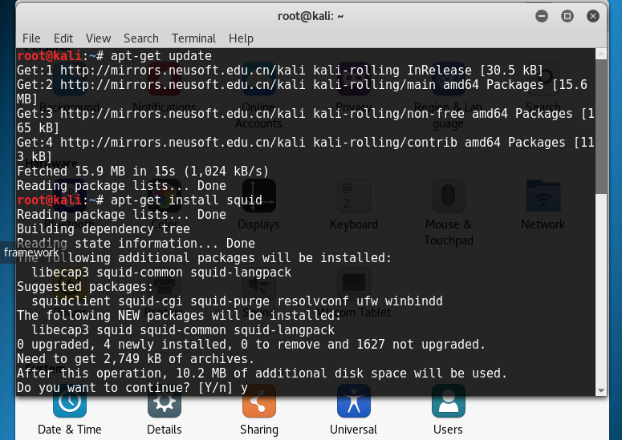
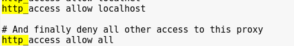
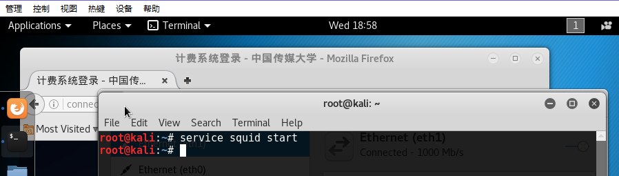
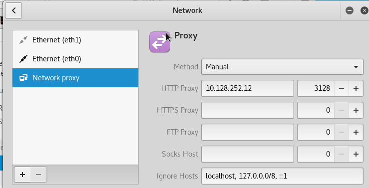
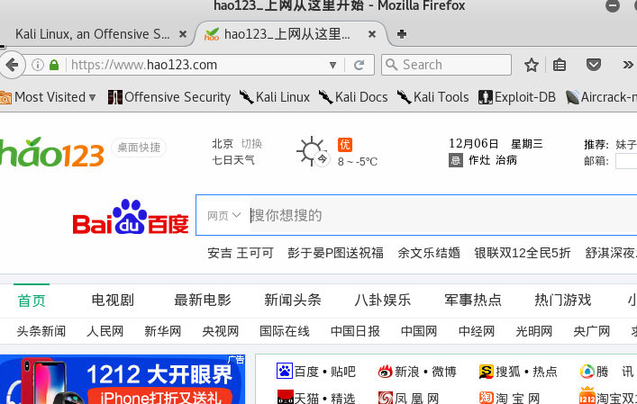
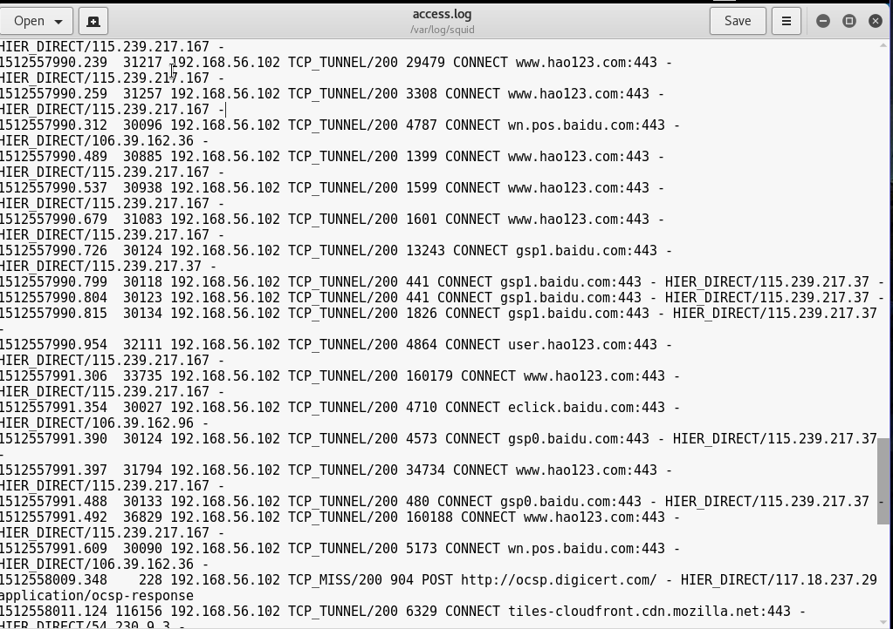

## 代理服务器搭建

- 准备环境

  | 主机角色 | IP  |       网络类型            |
  | ----- | -----------------------------| ----------------- |
  | 测试机| 192.168.56.102|host—only | 
  | 代理服务器搭建机 | 10.128.252.12(内部192.168.56.101)| 内部host—only，外部网络桥接宿主机网卡连接外网 | 

- 配置步骤

  - 代理机安装squid3

    

  - 修改squid.conf配置文件
    http_access deny all
    改成 http_access allow all，以

    

  - 代理机启动squid服务

    

  - 测试机测试外网

    - 设置代理

      

    - 访问外网   
    
      

- 查看访问日志access.log

   -所有客户端访问信息被记录于此,包括访问和持续时间，ip地址，状态码，请求方式等
   
    