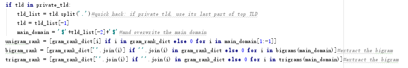

# 基于机器学习的访问日志威胁分析

## 一.DGA 域名检测

### DGA威胁分析

- 攻击者就可以利用DGA域名算法来生成用作域名的伪随机字符串，这样就可以有效的避开黑名单列表的检测。伪随机意味着字符串序列似乎是随机的，但由于其结构可以预先确定，因此可以重复产生和复制。该算法常被运用于恶意软件以及远程控制软件上

- 首先攻击者运行算法并随机选择少量的域(可能只有一个)，然后攻击者将该域注册并指向其C2服务器在受害者端恶意软件运行DGA并检查输出的域是否存在，如果检测为该域已注册，那么恶意软件将选择使用该域作为其命令和控制(C2)服务器。如果当前域检测为未注册，那么程序将继续检查其它域

### 模型及代码生成

1.  准备训练数据集

- 使用Alexa提供的前100万个网站统计作为我们的原始训练数据,存放于一个txt文件中;

- 预处理：解析每个域名的ccTLD;
[code](code/1.py) 

2.  抽取特征

- 基于马尔可夫链:判断域名是否是随机字母组合，能否符合人类感知特征，保存pickle模型供引用；

 [code](code/gib_detect_train.py) 

- bigram/trigram平均排名：根据域名分解的bigram/trigram组合频率在已知合法域名表中的排序，高者为合法域名；

[code](code/2.py)
[code](code/3.py) 

- 所有特征提取后，归一化，向量化；

[code](code/4.py) 
[code](code/5.py) 
[code](code/6.py) 

3.  选取模型

- 选用支持向量机（SVM）线性分类算法作为主模型.均衡两个特征对训练数据进行分类预测；

 [code](code/7.py) 

4.  测试实体数据

- 将squid日志的域名请求字段提取在一个txt文件中,作为测试数据；

 

 [code](code/squidmon.py)

5.  以原始数据为基础预测测试数据得到评测结果

