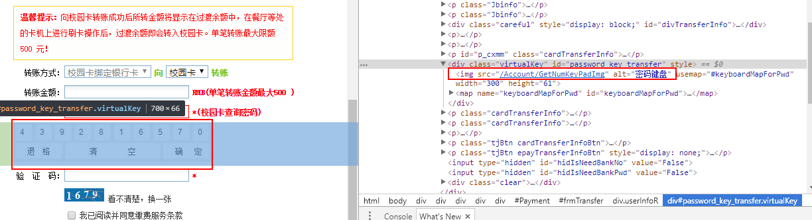
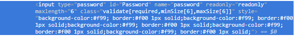
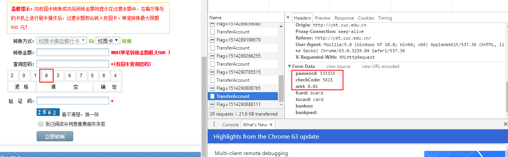
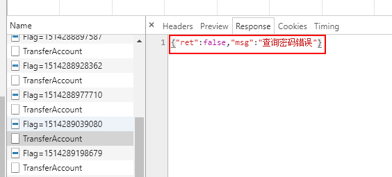

# 中传一卡通在线充值转账系统

## 一卡通网上交费软键盘展示

1.打开充值页面，查看源代码，发现键盘为一张图片

2.打开图片链接，发现每次打开都会生成新的随机密码键盘图片

 [http://ykt.cuc.edu.cn/Account/GetNumKeyPadImg](http://ykt.cuc.edu.cn/Account/GetNumKeyPadImg)

3.密码输入框代码如下图所示

## 一卡通交费漏洞测试

- 在没有刷新页面时，不断输入测试密码，发现输入密码的“加密方式”仅为置换以及逆序排列，便得到所谓的“密文”。而大部分网站登录界面，传输口令时都会对口令进行密钥加密。校园一卡通的密码“加密”很有规律，使破解非常容易。

- 分析与实现方法：
  - 输入六个相同的数字，得到数字置换的对应关系（例如输入密码为111111时，发现请求数据中password为222222）。

  - 经过大量测试发现，这种置换关系其实就是数字在屏幕键盘上的排列位置的下标（从左向右，从0开始）。如下图，输入888888，因为数字8在屏幕键盘第3位上，所以会被置换为3

  

  - 输入不同数字组成的密码，发现传输的密码是将置换后的数字逆序排列得到的，因此只需得到当前屏幕键盘图片以及传输密码，经过逆序、置换，就可以破解输入的原密码。

  - 根据Response信息确定是否为正确密码

  

- 此方法可用于以下情形  
某小白在用一卡通交费，偷拍其电脑屏幕上当前屏幕键盘图片，并快速开启抓包。则根据请求数据中的password及屏幕键盘图片，使用上述方法可以破解出该同学的校园卡交费密码，默默保存下来。
