# 两个Github开源OSK项目与中传一卡通的对比分析

# Onscreen Keyboard I

- [https://github.com/chriscook/on-screen-keyboard](https://github.com/chriscook/on-screen-keyboard)

## 效果展示

- 下图所示为JS代码运行效果。四个输入框的`data-osk-options`属性分别为：
  - `disable return`，即在OSK上无法输入回车键
  - `disable symbols`，即在OSK上无法输入符号
  - `enable everything`，即在OSK上可以输入任何键
  - 与第三个输入框相同，只不过HTML标签为`textarea`（前三个输入框为`input`）

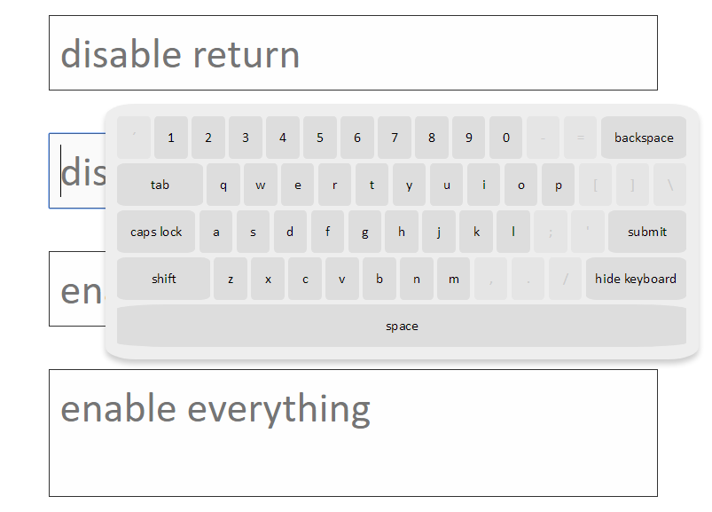

## 构造OSK

- 使用`<li>`标签定义键盘上的每个键，分别用`osk-number`,`osk-symbol`,`osk-letter`等class属性区分数字、符号、字母等，便于区别显示

- 若已存在keyboard对象，则直接返回；否则构造keyboard，加入到body中

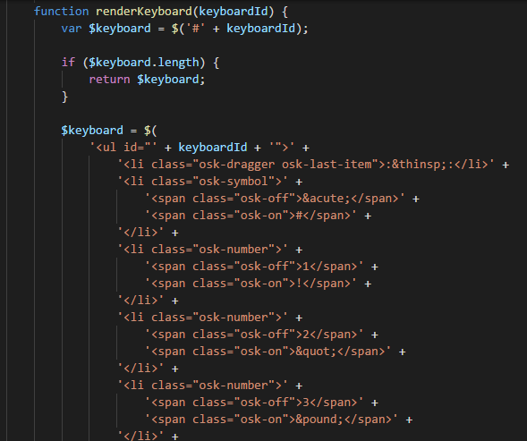  
**...**  
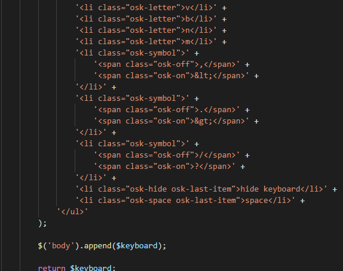

## 点击响应

- 点击输入框，keyboard出现

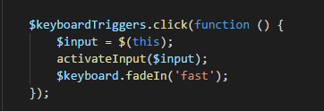

- 根据输入框属性，对各个键(keys)添加或删除属性

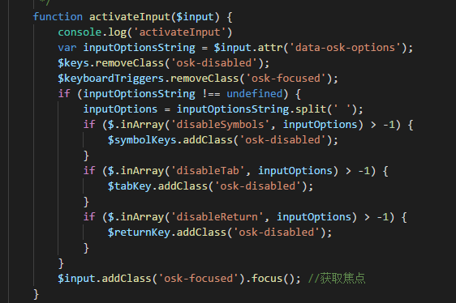

- 点击键盘中的键时，根据键的属性做不同的响应，如
  - 点击`hide`键时隐藏keyboard
  - 点击`backspace`键时，截取当前输入框中的字符串，去掉最后一个字符

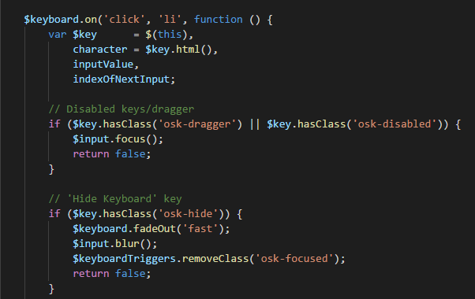  
**...**    
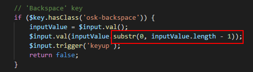  

- 最后，将原先输入框中的字符串与新加入的字符拼接，返回输入框，并保持当前输入框焦点

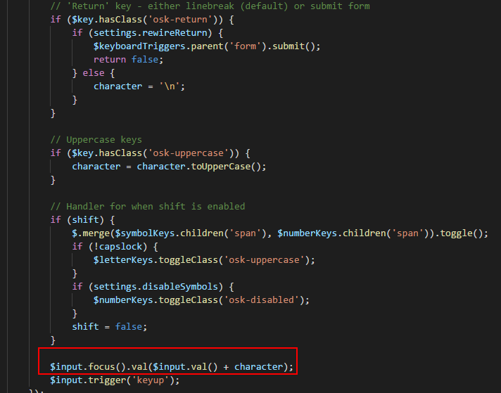

# Onscreen Keyboard  II

- [https://github.com/HeliosInteractive/JS-OnScreen-Keyboard](https://github.com/HeliosInteractive/JS-OnScreen-Keyboard)

## 效果展示

- 点击前两个输入框(name,address)时会出现字母数字键盘，点击第三个输入框(age)时只会出现数字输入框

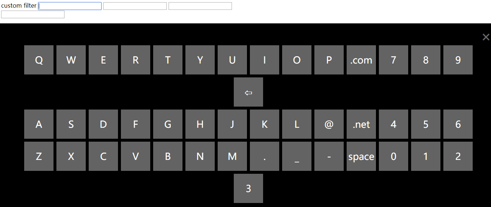

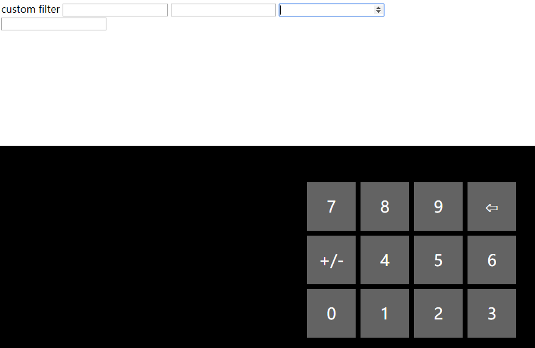

## 构造OSK

- osk有两种类型，分别对应两种type属性(text,number)，均采用二维数组定义

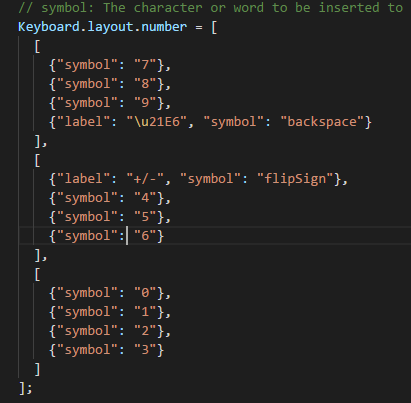

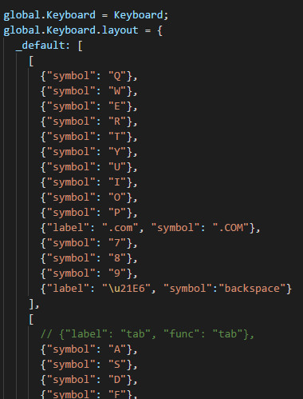

## 点击响应

- 第二种OSK充分利用了JS的事件机制。与第一种OSK不同的是，此种OSK将鼠标点击的动作映射为JS中键盘按下、抬起的事件，从而实现输入

- 如图，将鼠标点击的key的信息以及`keydown`,`keypress`,`keyup`信息传递给`dispatchEvent`函数，手动构造一个事件，并把此事件传递给响应函数

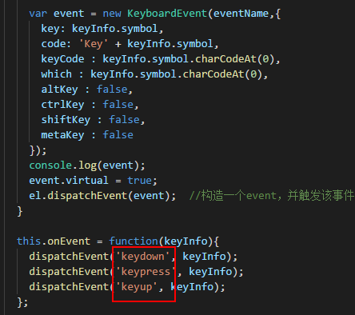

- 这样就不用像第一种OSK一样手动定义对不同输入键的响应，只需添加一些特定的功能，例如删除选中内容

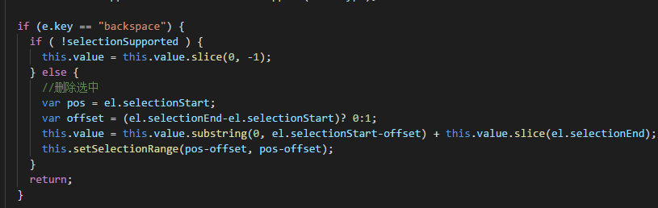

# 对比分析

- OSK I 和 OSK II 都可以实现物理键盘和屏幕键盘共同输入，则用户使用两种方式交替输入可以增加木马的攻击难度，提高安全性。而校园一卡通只能通过屏幕键盘点击输入

- 抵抗键盘记录木马
  - OSK I 通过捕获鼠标点击的键，独立定制输入框的变化，可以完全实现物理键盘的隔离
  - OSK II 将鼠标点击和触屏按钮转化为JS中键的按下及抬起事件，以便利的实现输入。但是key-loggers完全可以捕获对应的事件('key press')，从而获取被点击的键信息，并不能充分抵抗键盘记录木马

- 抵抗鼠标点击位置的捕获
  - OSK II 的开发文档中写明："layout allows customization","Layouts are defined by config json file and can be swapped"，表明键盘布局可以更改，这样可以有效的防止木马对鼠标固定点击位置的获取
  - 校园一卡通的OSK中的键盘布局每次点开时也是随机的
  - OSK I 的键盘布局灵活性较小，只能手动更改，可扩展性差
  - 局限：这几种OSK只能实现“每刷新一次页面，布局就变化一次”。攻击者可以通过穷举得到所有软键盘样式，再根据记录到的鼠标点击位置暴力破解。如果可以实现“用户每点击一次，布局就发生一次变化”，就可以使攻击者尝试次数呈幂次增长，大大增加穷举攻击的难度
