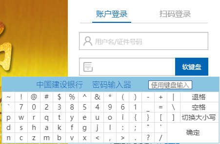
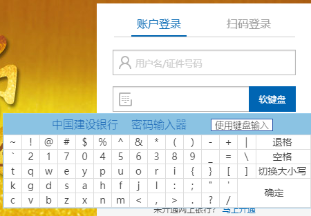
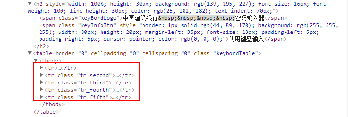
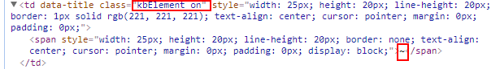
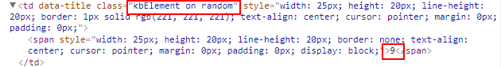
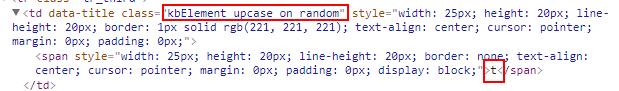
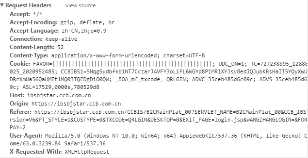
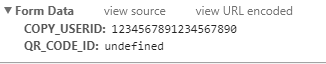

# 建设银行个人网银登录

## 软键盘展示

- 打开个人网银登录界面，可以看到输入密码栏有软键盘按键（也支持物理键盘输入）。每次点击软键盘按钮，出现的软键盘的字母数字的排列布局都是随机的

 

- 安全保障：每次出现的按键键位都不一样，增加了恶意软件获取真实密码的难度。使用动态软键盘输入密码时，是使用鼠标直接在电脑屏幕上点击密码，木马程序无法监测到用户的密码输入;而且软键盘上的数字是动态显示的，每次登录时字母数字在软键盘上的位置显示是不同的，可以避免输入时密码被旁边的人看到。

## 分析

- 查看网页源代码，可以看到软键盘布局为五行。其中不同字符有不同的class属性，推测后端JS代码会根据class属性决定字符位置是否可以变化，以及字母的大小写问题

- 符号的class属性为`kbElement on`，符号在软键盘上的位置是固定的

- 数字的class属性为`kbElement on random`，数字的位置随机

- 字母的class属性为`kbElement upcase on random`，字母的位置随机，且可以切换大小写

- 输入密码以及cookie值会进行编码或替换处理，以提高安全性。但是用户名为明文传输

- 参考链接

  - [11类网银安全交易工具之大盘点](http://ebank.ccb.com/cn/ebank/20090522_1243001958.html)
  - [仿建行网银登陆软键盘](http://www.cnblogs.com/cmpEducation/archive/2013/06/09/3129572.html)
