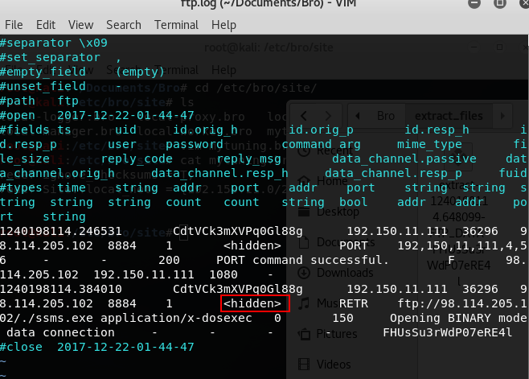

# 实战Bro网络入侵取证

## 配置环境

- 安装Bro：`apt-get install bro bro-aux`
- 查看实验环境基本信息

- 编辑Bro配置文件

  - 在`/etc/bro/site/`目录下创建新文件`mytuning.bro`
  
  

  - 在`/etc/bro/site/local.bro`文件尾部追加两行新配置代码，加载新创建的文件
  
  

## 使用Bro自动化分析pcap文件

- 下载`pcap attack trace`实验使用的pcap包

- 使用Bro进行分析，在当前目录下生成一些`.log`文件和`extract_files`目录

- 解决上图中出现的警告信息：在`mytuning.bro`中增加一行变量定义
  - 注意：本地IP地址为pcap包中的被攻击主机IP地址，而非实验所用虚拟机的IP地址

- 再次进行Bro分析，可发现新生成两个`.log`文件，可看到当前pcap包中本地网络IP和该IP关联的已知服务信息

- 在`extract_files`目录下有一个文件

- 将该文件提交到`virustotal`可疑文件分析网站，发现是一个后门程序。则可以基于这个发现进行逆向倒推，寻找入侵线索

- 阅读`/usr/share/bro/base/files/extract/main.bro`的源码，了解到该文件名的最右一个`-`右侧对应的字符串是`files.log`中的文件唯一标识，且来自于FTP会话

- 查看`files.log`,发现该文件的网络会话标识`CymAnR3aDzGEdoZLhj`

- 基于会话标识在`conn.log`中得到IP五元组信息，从而确定该PE文件来自于主机`98.114.205.102`

  - 可使用`bro-cut ts id.orig_h id.orig_p id.resp_h id_resp_p proto < conn.log`仅输出我们关注的信息

- `ftp.log`中默认不会显示捕获的FTP登录口令

- 在`/etc/bro/site/mytuning.bro`中增加`redef FTP::default_capture_password = T;`变量重定义，以显示口令

## 使用Bro的小技巧

- 使用`bro-cut`（在bro-aux软件包中）更“优雅”的查看日志中关注的数据列

  - 查看conn.log中所有可用的“列名”

  

  - 将UNIX时间戳格式转换成人类可读的时间（但该方法对于大日志文件处理性能非常低）

  
