# 基于VirtualBox的网络攻防基础环境搭建 #

----------

## 实验要求 ##
- 已实现的要求标注为‘Done’

	- 靶机可以直接访问攻击者主机 `Done`

	- 攻击者主机无法直接访问靶机 `Done`

	- 网关可以直接访问攻击者主机和靶机	`Done`

	- 靶机的所有对外上下行流量必须经过网关	`Done`

	- 所有节点均可以访问互联网 `Done`
	- 所有节点制作成基础镜像（多重加载的虚拟硬盘）`Done`

## 实验设备 ##
- VirtualBox虚拟场景
	- 靶机
	- 攻击主机
	- 网关
- 以上节点均多重加载于一个虚拟硬盘（Linux Kali）

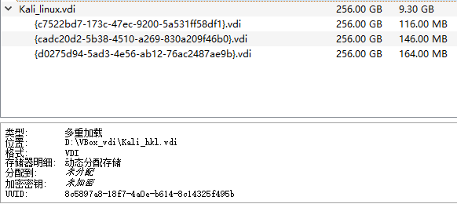

## 实验步骤 ##

### 网络配置 ###

**网络拓扑图**

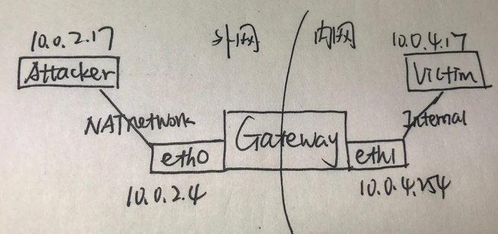

**靶机**

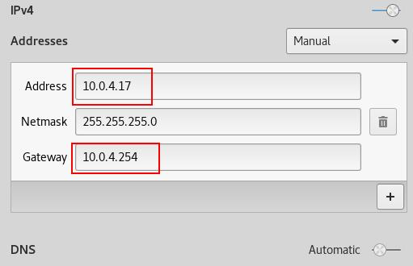

**网关**

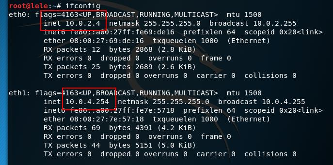

**攻击主机**

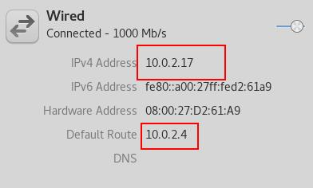

### 设置网关 ###

- 开启IP转发功能

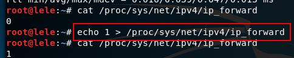

- 设置连接外网的出口，并保存

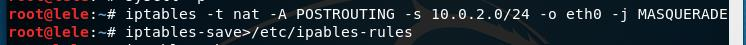

- 禁止外网访问内网

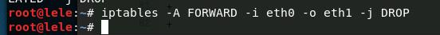

## 实验结果 ##

- 靶机访问攻击者主机

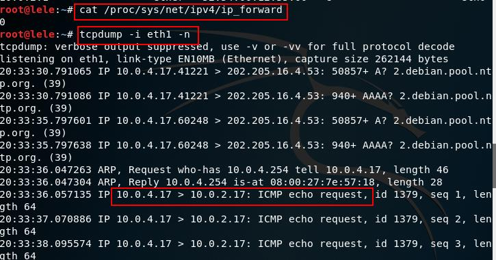

- 攻击者主机无法访问靶机

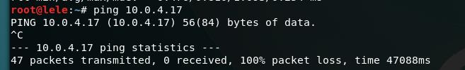

- 网关访问靶机和攻击者主机

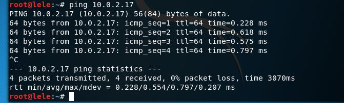

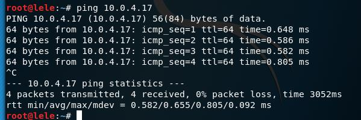

- 所有主机均可访问互联网

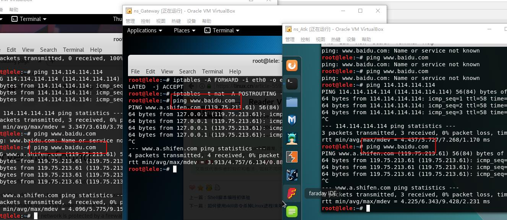

- 靶机的所有对外上下行流量必须经过网关

## 实验总结 ##

1. 配置完成网关防火墙和IP转发功能后，发现攻击机无法上网了。将攻击机的默认网关设置为该网关eth0后才可以上网……但现实生活中攻击机来自任意地带，这样设置并不合理，需要改进。
2. 实现攻击机无法访问靶机时，使用了非常粗暴的防火墙设置，直接禁止一切从eth0发往eth1的包，不太恰当，需改进。
3. 参考链接
	[https://linux.cn/article-5595-1.html](https://linux.cn/article-5595-1.html)