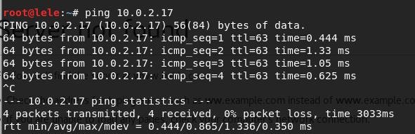

# 基于VirtualBox的网络攻防基础环境搭建 #

----------

## 实验要求 ##
- 已完成的要求标注为‘Done’

	- 靶机可以直接访问攻击者主机

	- 攻击者主机无法直接访问靶机

	- 网关可以直接访问攻击者主机和靶机	`Done`

	- 靶机的所有对外上下行流量必须经过网关	`Done`

	- 所有节点均可以访问互联网
	- 所有节点制作成基础镜像（多重加载的虚拟硬盘）`Done`

## 实验设备 ##
- VirtualBox虚拟场景
	- 靶机
	- 攻击主机
	- 网关
- 以上节点均多重加载于一个虚拟硬盘（Linux Kali）

## 实验步骤 ##

### 网络配置 ###

**靶机**

**网关**

 

**攻击主机**

## 实验结果 ##

- 网关访问靶机和攻击者主机

- 靶机的所有对外上下行流量必须经过网关

## 实验总结 ##

1. 对虚拟机的各种网络模式的工作方式理解的不是很深，还需要进行更多尝试，以及相关资料的学习
2. 因时间不足，实验要求没有完全达到，会继续把实验进行下去