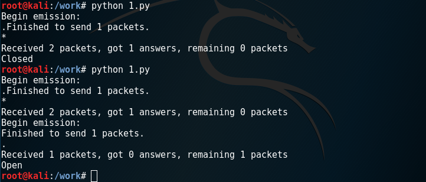

# SCAN 实验#

---
实验环境

客户端 10.0.2.5

服务器 10.0.2.7

---
设置端口开启状态

80：开启

53：没开启

！

通过开启apache2服务开启80端口

没有开启dns服务所以53端口没有开启

---
实验代码中

dst_ip设置均为：10.0.2.7 
dst_port在1,2,3种方式扫描中代码内设置为80，在4方式扫描代码中设置为53

1.tcp_connect_scan

[tcp_connect_scan](c/1.py)

2.tcp_stealth_scan

[tcp_connect_scan](c/1.py)

3.tcp_xmas_scan

[tcp_connect_scan](c/1.py)

4.udp_scan

[tcp_connect_scan](c/1.py)

