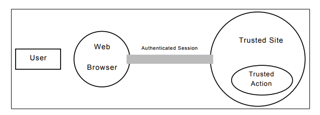
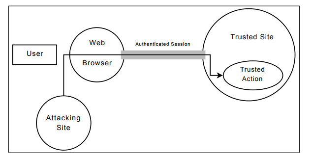
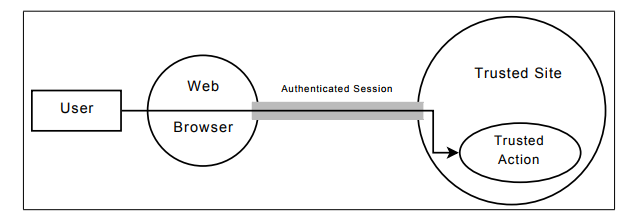

# 跨站请求伪造：利用与预防
## 摘要
跨站请求伪造（CSRF）在进行攻击时，恶意网站通过一些技术手段欺骗让用户的Web浏览器执行信任站点上的一些操作（如发邮件，发消息，甚至财产操作如转账和购买商品）。这类攻击方式被称为基于Web安全漏洞的“沉睡巨人”，由于在Web开发和安全社区中往往会被忽视掉，这就导致互联网中的许多网站因此失去了保护。在此我们提出在四个不同站点上四个严重的CSRF漏洞，其中包括有被我们认为是第一次涉及到金融机构的攻击。这些漏洞的存在，让攻击者从用户银行账户转移资金，获取用户电子邮件地址，侵犯用户隐私，危害用户帐户变成了可能。通过服务器端的一些更改，我们能够保护站点免受CSRF攻击（已经实现）。除此之外，我们还实现了一个客户端的浏览器插件，即使一个站点并没有对CSRF攻击进行防护用户也能够免受某种类型的CSRF攻击。我们希望通过这样的方式提升负责Web开发的程序员对CSRF攻击的防范意识，从而使用户免受这些攻击的伤害。

## 1.介绍
跨站请求伪造（CSRF）在进行攻击时，恶意网站通过一些技术手段欺骗让用户的Web浏览器执行信任站点上的一些操作（如发邮件，发消息，甚至财产操作如转账和购买商品）。这类攻击方式被称为基于Web安全漏洞的“沉睡巨人”，由于在Web开发和安全社区中往往会被忽视掉，这就导致互联网中的许多网站因此失去了保护。CSRF攻击一般不出现在Web安全威胁分类中同时也很少出现在学术和技术文献的讨论中。CSRF攻击通过简单的开发和修复，很容易能被诊断查明。它存在的原因是由于Web开发者对于CSRF攻击缺少相应的知识，对于CSRF攻击所能造成的原理和破坏性缺乏明确的认识，同时也许也是因为Web开发者误以为若能够防御著名的跨站脚本攻击（XSS）同时也就能防御CSRF攻击。

在第三节，我们将展示从四个重要主站上查找出的四个严重CSRF漏洞。攻击者利用这些漏洞可以完成从用户银行账户转移资金，获取用户电子邮件地址，侵犯用户隐私，危害用户帐户等行为。

在4.1节中，为了保护网站免受CSRF攻击我们建议对于服务器端进行更新变化。这个建议相较之前所提出的建议来说更加有效、更加优质，因为这样不需要客户端也不会破坏Web正常的访问，此外，我们实现了一个用于保护某种类型额的CSRF攻击（4.2节）的客户端浏览器插件。服务器端能够实现站点的完全保护,同时客户端同时也提供服务允许用户在网站没有采取相应的措施时保护自己，通过采取一定的措施来保护自己以免受各种类型的CSRF攻击。我们希望借此能够警醒Web开发者开发攻击来保护用户免受CSRF攻击的重要性。
## 2.CSRF的概述
图1、图2和图3表示的是CSRF的一般攻击流程

下面将详细描述使用CSRF攻击的攻击实例。
### 2.1 一个实例
先假设一个易受CSRF攻击的示例网站，该站点是一个基于Web的电子邮件网站，该网站允许用户发送和接收电子邮件。该站点使用隐式身份验证（参见第2.2节）对用户进行用户身份认证。一个页面包含一个HTML表单，允许用户输入收件人的电子邮件地址、主题、消息以及一个写着“发送邮件”的按钮, http://example.com/compose.htm。

```
<form
action="http://example.com/send_email.htm"
method="GET">
Recipient’s Email address: <input
type="text" name="to">
Subject: <input type="text" name="subject">
Message: <textarea name="msg"></textarea>
<input type="submit" value="Send Email">
</form>
```
当example.com的使用者点击“发送邮件”时，它输入的数据将作为一个GET请求发送到http://example.com/send_email.htm。由于GET请求只是简单地将表单数据附加到URL上，该使用者将会发送如下URL(假设“bob@example.com”为收件人，“你好”为主题，“现在有什么建议？”作为信息)：

```
http://example.com/send_email.htm?to=bob% 40example.com&subject=hello&msg=What%27s+the+ status+of+that+proposal%3F 
```

发送email.htm的页面只是通过接受到的数据从用户向收件人发送邮件，值得注意的是email.htm所做的只是获取数据并根据这些数据进行一些操作。该页面不关心请求是如何发出的，它只关心请求是否被发出。这也就是说，如果用户手动将上述URL手动输入到浏览器中，example.com仍然会发送电子邮件。例如，如果用户输入下列URL到浏览器中，email.htm将会发出三封邮件（将分别发送给Bob, Alice, 还有Carol）：

```
http://example.com/send_email.htm?to=bob%40example.com&subject=hi+Bob&msg=test
http://example.com/send_email.htm?to=alice%40example.com&subject=hi+Alice&msg=test
http://example.com/send_email.htm?to=carol%40example.com&subject=hi+Carol&msg=test
```
由于email.htm接收所有数据并且根据这些数据发送电子邮件,并且对于来自compose.htm 上的表单信息并不进行验证，因此CSRF攻击在此网站是可行的。由此攻击者可以让用户向email.htm发送一个请求，该网页能够让example.com

以用户身份发送包含任何攻击者所想要包含的数据，这样攻击者就成功完成了CSRF攻击。

通过利用这个漏洞，攻击者需要强制用户的浏览器向email.com发送一个请求来执行一些邪恶的行为。（我们假设用户访问一个在攻击者控制下的站点且目标站点并不抵御CSRF攻击。）具体来说，攻击者需要通过他自己的站点向example.com伪造一个跨站请求。不幸的是，HTML提供了许多方法来构造这样的请求。例如  标签，它会使浏览器加载所有的URL并将这些URL设置为src属性，即使这个URL并不是一个图片的URL(由于浏览器之后加载了URL之后才能知道这是否是一个图像)，攻击者可以通过如下代码创建一个网页：

```

```
当用户访问这个网页的时候，将会有一个请求发送到email.htm，然后会向Mallory发送一封来自用户的邮件。这与我们在3.1节所举的在纽约时报网站上发现的漏洞几乎相同。

当攻击者成功让用户的浏览器在另一个站点执行一个未预期操作，这就证明CSRF成功了。如果要使该操作能够成功，那么该操作应该是正常用户能够完成的操作。CSRF攻击所能进行的操作通常与一般用户相同，也就是说通过CSRF攻击攻击者能够执行任何一个用户都能执行的操作。也就是说，网站给用户越多权利，CSRF攻击能造成越大的威胁。

CSRF能够成功对几乎任何使用隐式认证（见2.2节）但未对采取具体措施保护自己免受CSRF攻击的网站进行攻击。

同源策略（见附录B）旨在防止攻击者访问第三方站点上的数据，但是该策略并不阻止发送请求，它仅仅是防止攻击者读取从第三方返回的数据。因为CSRF攻击是请求发送的结果，因此同源策略并不能够防止CSRF攻击。




图1：在此经过身份验证Web浏览器已经建立了受信任站点的会话。只有当Web浏览器发送了authenicated session请求后，Web浏览器才能执行可信操作。


图2：有效请求。Web浏览器试图执行受信任操作。受信任站点确认Web浏览器已被认证，并且允许执行该操作。


图3：CSRF攻击。被攻击站点让浏览器向可信站点发送请求。来自Web浏览器的认证请求并执行受信任操作，可信站点看似有效。由于网站验证的是Web浏览器而非用户，因此CSRF攻击有了进行的可能。

### 2.2 认证和CSRF
CSRF攻击通常会利用目标站点的认证机制来完成攻击。问题的根源在于Web身份验证通常能保证一个请求来自用户的浏览器，但它不能确保是否是用户实际请求或授权请求。

例如，假设Alice访问了目标站点T，站点T将向Alice的浏览器提供一个包含伪随机会话标识符SID的Cookie用来跟踪Alice的会话。Alice可能会被站点要求输入自己有效的用户名和密码进行登录，该站点会将Alice已登录记录在包含SID的Session 中。当Alice向站点T发出请求的时候，她的浏览器将自动向站点T发送包含SID的Cookie，用于标识这是来自Alice的会话。

现在假设Alice访问了恶意站点M，该站点包含有能使Alice的浏览器向站点T发送HTTP请求的JavaScript代码或图像标签，Alice的浏览器将会非常乐意地将包含SID的Session附加到该请求上。通过查验该请求，站点T通过Cookie的存在猜测该请求来自Alice，因此T站点将在Alice的帐号下执行该请求的操作。这就是一个成功的CSRF攻击。

其他大多数的Web身份认证机制都存在相似的问题。例如，HTTP BasicAuth机制会要求Alice用户名和密码告知她的浏览器，然后浏览器将会非常乐意地将Alice的用户名和密码附加到将发送给站点T的请求当中。除此之外，站点T可能用到了客户端的SSL证书，但仍然会出现相同的问题——浏览器将会非常乐意地将证书附加到将发送给站点T的请求当中。于之前相同，站点T通过IP地址证明用户是Alice，因此CSRF攻击变成了可能。

一般来说，只要一个站点无条件接收来自可信浏览器的认证请求，那么该站点都存在着被CSRF攻击的危险。从理论上来说，只要要求在向站点发送请求的时候，让用户执行一个确定的、无法被伪造的行为（如重新输入用户名和密码），这种危险就会被击溃；但是在实际运用中，这主要会影响站点的可用性。广泛采用的标准和认证机制都无法避免CSRF攻击，因此我们需要寻找一个可能的解决方案来解决这个问题。

### 2.3 CSRF攻击向量
如果想要成功进行CSRF攻击，用户必须登录到目标站点并且需要同时访问到攻击者的站点或者是攻击者部分控制的站点。

如果一个服务器含有CSRF漏洞同时也接收GET请求（如上一例）CSRF攻击可以不使用JavaScript（例如，一个简单的< IMG >标签可以被用来进行CSRF攻击）。如果服务器只接收POST请求，则需要JavaScript从攻击者站点自动向目标站点发送POST请求。

### 2.4 CSRF vs XSS

最近倍受瞩目的漏洞还有跨站脚本攻击（XSS）。当进行XSS攻击时，攻击者为攻击其他网站，往往会将恶意代码（通常为JavaScript）注入到非目标站点中去。例如，一个网站也许会允许用户发表评论，这些由用户提交的评论将会存储在数据库中，并显示给站点的未来使用该网站的用户。如果攻击者能够将恶意的JavaScript作为评论的一部分，则JavaScript将会嵌入到任何可以进行评论的页面。当其他用户访问到该站点的时候，攻击者的JavaScript将会以目标网站最高权限进行执行。注入到目标站点的恶意JavaScript将能够发送和接收来自该站点任何网页的请求，并且能够访问该站点设置的Cookie。为了保护网站免受XSS攻击，网站需要对于用户的输入进行小心地过滤。

CSRF和XSS攻击之间的区别在于是否需要JavaScript来完成攻击，XSS需要JavaScript而CSRF不一定需要。XSS攻击需要网站能够被注入恶意代码，然而CSRF攻击的代码可以位于第三方网站。通过过滤用户输入就能够防止恶意代码在特定的站点上执行，但是这却并不能够阻止恶意代码在第三方站点上执行。因为恶意代码在第三方站点上执行，因此防范XSS攻击的手段并不能够防范CSRF攻击。如果一个站点易受XSS攻击那么同样该站点也易受CSRF攻击。如果一个站点能够完全防范XSS攻击，但是它也许仍然易受CSRF攻击。

### 3 CSRF漏洞
在本节中，我们将会对我们发现的四个漏洞进行具体的描述。攻击所选择的网站为某排行榜上的十个热门，经分析查证可知，这些网站要么有着CSRF攻击漏洞要么就有过其他漏洞的历史（例如，通过网站搜索可获得该网站所修复过的漏洞）。但是事实上这些网站的管理员缺乏对于CSRF漏洞存在与否和该漏洞所能产生的危险的培训，直到第三方将这些问题披露出来之后这些网站管理员才会了解到。ING Direct、MetaFilter、YouTube和纽约时报已经通过我们在第4.1节提出的相似的方法修复了下面我们所描述的漏洞。

### 3.1 纽约时报(nytimes.com)
> The New York Times是近来最受欢迎的报纸网站

我们在NYTimes.com发现了一个CSRF漏洞，该漏洞能使用户的邮箱地址被泄露。如果你是该网站的注册会员，任意网站都可以利用该漏洞攻击该网站来查找到你的邮箱地址，并且利用获得的邮箱地址来发送垃圾邮件或者通过邮箱作为你的标识。

```
This page was sent to you by: [USER’S EMAIL

ADDRESS]

Message from sender:

Thought you’d be interested in this.

NATIONAL DESK

Researchers Find Way to Steal Encrypted Data

By JOHN MARKOFF

A computer security research group has

developed a way to steal encrypted

information from computer hard disks.
```
利用此漏洞，攻击者可使已登录用户的浏览器发送一个请求到NYTimes.com“发送邮件”页面。该网页未对“发送邮件”的请求进行CSRF攻击保护，因此该用户的浏览器将会向NYTimes.com发送一个向攻击者所期望邮箱发送邮件的请求。如果攻击者将收件人篡改为自己的邮箱地址，他将会收到一封来自包含用户邮箱地址的邮件。

利用该漏洞非常地简单，每一篇NYTimes.com上的文章都包含有“发送邮件”的链接，这些链接都包含有一个用户所填写收件人邮箱地址的表单。该表单同时也包含每一篇文章的隐藏唯一值。下面是一个实例表单：
```
<form

action="http://www.nytimes.com/mem/emailthis.html"

method="POST"

enctype="application/x-www-form-urlencoded">

<input type="checkbox" id="copytoself"

name="copytoself" value="Y">

<input id="recipients" name="recipients"

type="text" maxlength="1320" value="">

<input type="hidden" name="state" value="1">

<textarea id="message" name="personalnote"

maxlength="512"></textarea>

<input type="hidden" name="type" value="1">

<input type="hidden" name="url"

value="[...]">

<input type="hidden" name="title"

value="[...]">

<input type="hidden" name="description"

value="[...]">

...

</form>
```


该攻击是利用了NYTimes.com“发送邮件”的功能。“发送邮件”是一个允许用户发送一个NYTimes.com文章的链接到指定收件人的邮箱，收件人将会收到类似如下的邮件：

利用该漏洞进行攻击也非常简单，每一篇在NYTimes.com上的网站都包含有“发送邮件”这一页面，其中该页面含有一个表单其中含有用户输入的收件人邮箱地址、该文章的隐藏唯一标识。以下为一个表单示例：

```
<form
action="http://www.nytimes.com/mem/emailthis.html"
method="POST"
enctype="application/x-www-form-urlencoded">
<input type="checkbox" id="copytoself"
name="copytoself" value="Y">
<input id="recipients" name="recipients"
type="text" maxlength="1320" value="">
<input type="hidden" name="state" value="1">
<textarea id="message" name="personalnote"
maxlength="512"></textarea>
<input type="hidden" name="type" value="1">
<input type="hidden" name="url"
value="[...]">
<input type="hidden" name="title"
value="[...]">
<input type="hidden" name="description"
value="[...]">
...
</form>
```

利用该漏洞进行攻击也非常简单，每一篇在NYTimes.com上的网站都包含有“发送邮件”这一页面，其中该页面含有一个表单其中含有用户输入的收件人邮箱地址、该文章的隐藏唯一标识。以下为一个表单示例：

```
<form
action="http://www.nytimes.com/mem/emailthis.html"
method="POST"
enctype="application/x-www-form-urlencoded">
<input type="checkbox" id="copytoself"
name="copytoself" value="Y">
<input id="recipients" name="recipients"
type="text" maxlength="1320" value="">
<input type="hidden" name="state" value="1">
<textarea id="message" name="personalnote"
maxlength="512"></textarea>
<input type="hidden" name="type" value="1">
<input type="hidden" name="url"
value="[...]">
<input type="hidden" name="title"
value="[...]">
<input type="hidden" name="description"
value="[...]">
...
</form>
```
由于NYTimes.com该网站不对GET和POST请求进行区分，因此攻击者该表单变化为一个可用于标签的GET请求，将表单变化为一个包含有可以添加URL查询字符串参数的GET请求(NAME=VALUE,用符号&来进行分隔)。

攻击者可将构造后的URL作为标签的src属性，如果用户以登录状态访问到NYTimes.com任何含有标签的页面，浏览器将以攻击者设置的URL参数加载“发送邮件”页面，然后NYTimes.com将会向攻击者发送一封包含有用户邮箱地址的邮件，攻击者可将该邮箱地址记录下来用于之后的为所欲为（例如：发送垃圾邮件）或者利用邮箱地址作为标识来识别该用户是否登录过攻击者自己的网站。这也许会导致非常严重的隐私问题，例如在有争议网站上网站管理员能够识别用户（例如政治或者非法网站上）。

我们在Firefox 2.0.0.6、Opera 9.23和Safari 3.0.3 (522.15.5)验证了该攻击的，但是IE浏览器并不能完成该攻击,具体原因已书写到附录A中。我们在2007年告知了纽约时报该漏洞，然而该漏洞在2008年10月1日才被修复。

### 3.2 ING Direct(ingdirect.com)
> “ING Direct全美第四大储蓄银行，资产超过620亿美元，为超过410万客户提供优质的储蓄和贷款服务。”

我们在ING的网站上发现了CSRF漏洞，攻击者能够利用该漏洞以被攻击用户的身份来打开的账户，将该被攻击用户的资金转移到攻击者的账号中，正如2.2中所述，ING使用SSL并不能够阻止CSRF攻击。我们相信这是首例涉及到金融领机构的CSRF攻击漏洞。

因为ING并未对CSRF攻击采取措施，因此模仿用户正常操作从一个用户的账户向另一个用户转账是非常简单的。这些步骤包括以下操作：


##### 1. 攻击者作为用户创建一个支票账户。

###### （a）攻击者让用户浏览器访问ING“新开户”页面：
发送GET请求：
```
https://secure.ingdirect.com/myaccount/INGDirect.html?command=gotoOpenOCA
```
###### （b）攻击者让用户浏览器选择账户类型为“个人”：
发送POST请求：

```
https://secure. ingdirect.com/myaccount/ INGDirect.html包含以下参数：
command=ocaOpenInitial&YES, I WANT TO CONTINUE..x=44&YES, I WANT TO CONTINUE..y=25
```
###### （c）攻击者最初选择任意金额向攻击者新的假账户发起转账：
发送POST请求：

```
https://secure. ingdirect.com/myaccount/ INGDirect.html包含以下参数：
command=ocaValidateFunding&PRIMARY CARD=true&JOINTCARD=true&Account Nickname=[ACCOUNT NAME]&FROMACCT= 0&TAMT=[INITIAL AMOUNT]&YES, I WANT TO CONTINUE..x=44&YES, I WANT TO CONTINUE..y=25&XTYPE=4000USD &XBCRCD=USD [ACCOUNT NAME] 是用户所见的账户名，[INITIAL AMOUNT]是将向攻击者创建的新账户转账的金额。 账户名称可是任意字符串或者攻击者可以不用预先知道-这是将被转账的账户的昵称。
```
###### （d）攻击者使用户浏览器点击“创建账户”选项，这让ING认为用户创建了一个新的支票账户：
发送POST请求：

```
https://secure. ingdirect.com/myaccount/ INGDirect.html 包含以下参数：
command=ocaOpenAccount&Agree ElectronicDisclosure=yes&AgreeTerms Conditions=yes&YES, I WANT TO CONTINUE..x=44&YES, I WANT TO CONTINUE..y=25&YES, I WANT TO CONTINUE.=Submit
```
##### 2.攻击者将自己作为收款人添加到用户账户中去：
###### （a）攻击者使用户浏览器访问ING的“添加收款人”的页面。
发送GET请求：

```
https://secure.ingdirect.com/myaccount/INGDirect.html?command= goToModifyPersonalPayee&Mode= Add&from=displayEmailMoney
```
###### （b）攻击者使用户浏览器输入攻击者的账户信息：
发送POST请求：

```
https://secure. ingdirect.com/myaccount/ INGDirect.html 包含以下参数：
command=validateModifyPersonalPayee &from=displayEmailMoney&PayeeName =[PAYEE NAME]&PayeeNickname=&chk Email=on&PayeeEmail=[PAYEE EMAIL] &PayeeIsEmailToOrange=true&Payee OrangeAccount=[PAYEE ACCOUNT NUM]& YES, I WANT TO CONTINUE..x=44 &YES, I WANT TO CONTINUE..y=25
[PAYEE NAME]为攻击者的账户名，[PAYEE EMAIL]为攻击者的邮箱地址，[PAYEE ACCOUNT NUM]使攻击者ING的账号。
```
###### （c）攻击者使用户浏览器确定攻击者为有效收款人：
发送POST请求：

```
https://secure. ingdirect.com/myaccount/ INGDirect.html 包含以下参数：
command=modifyPersonalPayee&from= displayEmailMoney&YES, I WANT TO CONTINUE..x=44 &YES, I WANT TO CONTINUE..y=25
```
##### 3.攻击者将用户帐户中的资金转移到自己的帐户上
###### （a）攻击者让用户浏览器输入转账金额
发送POST请求：

```
https://secure. ingdirect.com/myaccount/ INGDirect.html 包含以下参数：

command=validateEmailMoney&CNSPayID =5000&Amount=[TRANSFER AMOUNT] &Comments=[TRANSFER MESSAGE]&YES, I WANT TO CONTINUE..x=44 &YES, I WANT TO CONTINUE..y=25&show=1&button=Send Money

[TRANSFER AMOUNT] 是用户向攻击者账户转账的金额，[TRANSFER MESSAGE] 是交易备注信息。
```
###### （b）攻击者让用户浏览器确认将要进行的交易:
发送POST请求：

```
https://secure. ingdirect.com/myaccount/ INGDirect.html包含以下参数：
command=emailMoney&Amount= [TRANSFER AMOUNT]Comments= [TRANSFER MESSAGE]&YES, I WANT TO CONTINUE..x=44&YES, I WANT TO CONTINUE..y=25

[TRANSFER AMOUNT]和[TRANSFER MESSAGE] 为3（a）中相同的值。
```
利用该漏洞进行攻击，我们需要创建一个使用JavaScript连续发送POST请求的页面，这个页面对于用户来说是不可见的。该攻击假设用户并未将攻击者的账户添加到ING Direct支票收款人中去。该攻击可以修改为不受该限制进行攻击。
我们验证了该攻击可以在Firefox 2.0.0.3和Internet Explorer 7.0.5运行。我们并未在其他浏览器中验证是否可以进行此种攻击。我们通知了ING公司这个漏洞，此后该漏洞很快就被修复了。

### 3.3 MetaFilter (metafilter.com)
> “MetaFilter是一个每个人都可以贡献一个链接或者评论的博客...”它目前拥有超过50000用户和每月超过350万个访问者。

我们在MetaFilter发现了一个CSRF漏洞，这个漏洞让攻击者能够控制用户的账户。
MetaFilter有一个“忘记密码”的页面，它允许用户能够重置它的密码。通过输入用户名让MetaFilter向用户绑定的邮箱地址发送一封包含当前用户密码的邮件。这意味着攻击者有能力通过修改用户的邮箱地址，使用“忘记密码”这个页面来接收用户的密码，并利用该密码来控制用户的账户。
通过CSRF攻击，攻击者能够修改用户绑定的邮箱地址。通过利用这个漏洞进行攻击，攻击者能使用户的浏览器向页面发送请求更新用户的配置文件。该页面将用户的邮箱地址作为参数，但是这是可以用攻击者的地址进行替换。示例攻击将下述HTML嵌入到页面中去：

```

```
这能修改任何已登录用户的绑定邮箱地址，攻击者并不知道用户绑定的邮箱地址。

攻击者发现还可以利用MetaFilter允许用户标记其他用户为“联系人”，攻击者可以利用类似上述CSRF攻击在用户不知情的情况下将攻击者添加到自己的联系人列表中。

我们在验证了在Firefox 2.0.0.6该攻击是可以实现的，由于记录在附录A的原因Internet Explorer并不能实现该攻击。我们并没有在其他浏览器验证是否可以进行该攻击。我们向 MetaFilter报告了该漏洞，该漏洞在两天内就被修复了。
### YouTube (youtube.com)
> YouTube是在线视频的领导者，也是通过网络观看和分享全球原创视频的主要网站。通过2006年6月一项研究发现，“单是YouTube就占有了所有HTTP流量的20%，互联网上所有流量的10%。”

我们发现YouTube用户每一个行为都存在CSRF漏洞。攻击者可以将视频添加到用户的“收藏夹”中，也可将用户自己添加到用户的“好友”或者“家庭”列表中，以用户的名义发送任何消息，将视频标记为不良视频，将视频分享给用户的联系人，订阅	用户的“频道”（一组由一个人或者一个团体发布的视频），将视频添加到“QuickList”（一个用户打算之后观看的视频列表）。以添加视频到用户的“收藏夹”为例，攻击者只要在任何网站上嵌入这个标签：


```

```
攻击者可以利用该漏洞影响视频的热度。例如,将一个视频添加到大量用户的收藏夹中去，让视频显示到“时下最流行”列表中去（一个实时收藏数最高的列表）。除了能够增加视频的知名度外，攻击者还能够让用户不知不觉地将视频标记为不良视频，从而试图让YouTube从站点中删除该视频。

攻击者还能够借此侵犯用户隐私。YouTube允许用户将视频设置为只对朋友或者家人可见。利用该漏洞将攻击者将自己添加到“好友”或者“家庭”列表中去，这使得攻击者能够访问用户上传的所有私人视频，但仅限于这些列表。

攻击者可以给用户的联系人列表分享视频，“分享”仅仅是发送一个附加可选消息的视频链接。此消息可以包含一个链接，这意味着攻击者借此分享恶意链接。收到该信息的用户有可能会点击该链接，借此可以传播病毒。

我们验证了该攻击可以在Firefox 2.0.0.6，但由于附录A记录的原因，Internet Explorer并不能实施该攻击。我们并未在其他浏览器中验证是否可以进行此种攻击。我们通知了YouTube这个漏洞，此后该漏洞很快就被修复了。

## 4.防范CSRF
我们编写了两个工具保护了大量的用户免受CSRF攻击。首先，服务器端工具能够完全保护有攻击可能性的网站免受CSRF攻击。然后，客户端工具能够保护用户免受某些特定类型的CSRF攻击。

表1准确记录了用户何时受到哪些技术的保护，我们还建议作为服务器端解决方案应该包含部分这样的功能。这些解决方案相比较之前提出的解决方案而言，对服务器状态不做要求，同时不破坏典型的Web浏览器行为，这更具有优越性。
### 4.1 服务器端防护
> 注：我们假设攻击者并不能够修改目标站点相关的用户Cookies，浏览器的同源策略保证了除非攻击者是一个主动攻击的攻击者。下面所述的解决方案并不能够防止主动攻击的攻击者对网站进行攻击。

近来为了简化Web开发引入了许多框架。例如Code Igniter [4] (PHP), Ruby on Rails [8\](Ruby), django [5] (Python), Catalyst [3] (Perl) 和 Struts [9] (Java)。

使用这些框架的一个好处是可以直接将CSRF的防护机制引用到框架当中去，就不需要开发者自己开发防护机制。
在框架中采用CSRF防护将能够更加针对地避免由于开发的粗心和对CSRF的误解所造成的漏洞。

个人网站和开发框架可以采取以下措施来避免自己收到CSRF攻击：

##### 1.GET请求只允许检索数据，不能修改服务器上的任何数据。
通过加入这样的限制条件可以避免攻击者利用标签或者其他类型的请求进行CSRF攻击，从而保护网站。此外，本建议遵循RFC 2616(HTTP/1.1):
特别值得注意的是，目前RFC 2616规定了GET和HEAD请求不应执行除数据检索以外的功能。如果这样进行处理的话，在理论上这应是安全的。

这样的防护措施并不能够阻止CSRF攻击（攻击者可以使用POST请求进行攻击），与（2）相结合能够完全避免CSRF攻击。
##### 2.POST请求必须都包含有一个随机值。
当用户在访问一个网站时，该网站应该生成一个（保密性极强）伪随机值并且在用户的计算机上设置一个Cookie。该网站应要求用户提交每个表单时都应该包含随机值作为表单值同时也作为Cookie值。

当提交到网站的POST请求中表单值和Cookie值相同，请求将被认为是有效的。当攻击者冒充用户提交表单时，他只能修改表单的值。由于浏览器的同源策略，攻击者并不能读取服务器发送的任何数据或者修改服务器中的Cookie值。由于Cookie值和表单值必须相同，因此攻击者除非能够猜测出伪随机值否则无法成功提交表单。

##### 3.使用与用户账号无关的伪随机值。
如果伪随机值与用户帐号相关，使用伪随机值就不能用来防止“登录CSRF”攻击。
服务器端防护形式具有以下特点：
- 轻量级。该解决方案并不基于服务器端的状态，网站唯一所需要做的是生成一个伪随机值（如果目前还未生成过），然后通过比较POST请求中的随机值和网站生成的伪随机值，通过这样的简便、轻量级的方式就能够保护网站不受CSRF攻击。
- 兼容并行会话。如果用户在网站上开启了不同的页表，CSRF防护不应阻止用户的正常提交。如果网站每次加载一个页表都生成一个伪随机值的话，旧的伪随机值会被新的伪随机值所覆盖。由于被新的随机值所覆盖，其他表单的随机值无效，用户只能成功提交他最后打开的页表信息。我们需要注意CSRF防护不应破坏用户分页浏览和浏览器加载多个页面。为了解决这个问题，引入全站范围内一定时间的Cookies能够有效地解决这个问题。
- 无需认证。该解决方案不需要进行特殊的身份验证。只需要使用Cookie Sessions、HTTP身份验证、SSL身份验证或者IP地址共同来进行验证，就能验证用户的身份。

 表格| 未受保护用户 | 用户使用我方的Firfox插件
---|---|---
目标服务器未受保护 | 不被保护 | 不被保护
目标服务器仅接收POST请求 | 不被保护 | 被保护
目标客户端使用客户端保护|被保护 |被保护
表1:用户保护
###### 此表展示了何时用户受到CSRF攻击的防护。我们的服务器端解决方案可保护所有时候该站点的用户不受攻击。当服务器需要响应一个POST请求时，我们的浏览器客户端插件就能够保护用户。

---

在之前的一些解决方案中提过在页表中使用伪随机值的方法，但是这些解决方案并没有办法做到上述特性。

例如,Johns and Winter和Schreiber都是基于服务器端的状态，Shiflett虽然对利用例如的标签进行CSRF攻击进行了防护。据我们所知，之前的解决方案并没有考虑到不影响正常浏览器行为。

任何框架只要对POST请求进行拦截并对<form\>标签进行“覆盖”，显然这是可以对CSRF攻击进行防护。

例如，如果一个开发框架要求开发人员调用打开页表函数（...）；为了产生<form...\>标签，开发框架被修改为在产生页表时将会自动生成一个伪随机值。

```
<form ...>
<input type="hidden" name="csrf value"
value="8dcb5e56904d9b7d4bbf333afdd154ca">
```
此外，开发框架能够随机生成设置Cookie值，并将提交的值与Cookie值进行比对。如果一个开发框架中增加了这样的CSRF防护措施，使用该框架的所有用户都将能够免受CSRF攻击。由于这种CSRF攻击防护措施是轻量级的、开发框架和开发人员不需要额外配置编写身份认证机制，我们极力推荐开发框架默认引入POST请求拦截和通过产生<form\>标签引入CSRF保护机制。开发框架也应该允许开发者能够禁用该默认的保护机制，例如开发者采用自开发的CSRF保护机制或者开发者不想使用Cookies。

我们为开发框架Code Igniter提供了这样一个插件。该插件不需要修改已有表单，也不需要对POST请求进行拦截和调用创建<form\>标签。该插件提供了一个功能，允许CSRF防护功能允许添加AJAX请求，虽然这需要开发者参与（Code Igniter并不会标准地执行AJAX请求）。

### 4.2 客户端防护
通过Web浏览器发送请求能成功进行CSRF攻击，客户端工具可以保护用户免受此类攻击。RequestRodeo是目前一个可进行客户端和服务器端代理工作的工具。如果RequestRodeo将接收到的请求无效化，将认证信息从请求分离出来。虽然在许多情况下该插件有一定的局限性。具体来说，当客户端开启SSL认证，或是JavaScript作为网站架构的一部分时，该插件将无法正常工作（由于在浏览器显示之前，RequestRodeo作为代理服务器进行数据分析）。我们开发了一个没有上述缺陷的浏览器插件来保护用户免受某些类型的CSRF攻击，该插件可以作为Firefox浏览器的扩展插件，用户通过下载安装该扩展插件可以有效防御CSRF攻击。我们的插件通过拦截每一个HTTP请求并决定是否允许这个请求来保护用户。利用下列规则对是否允许请求进行判断。首先，非POST请求是被允许的。第二，若请求站点和目标站点为同源（参见附录B），可允许该请求。
第三，如果请求站点使用Adobe的跨域策略向目标站点发出请求（参见附录B），那么允许该请求。如果我们的扩展插件拒绝某个请求，该插件将会以用户所熟悉的页面对用户进行提醒（使用同一个Firefox的弹出窗口拦截器）或给用户添加网络白名单的选项。我们的扩展插件只会拦截POST请求，这意味着我们的扩展插件不能防止采用GET请求的CSRF攻击。若想防范此种方式的CSRF攻击要么不允许跨站GET请求，要么只允许用户一次只登录一个站点，但是这样的话用户会被过多地限制。该Firefox扩展插件可以在我们的网站上下载。

## 5.相关的工作
曝光CSRF攻击很大程度是受到Chris Shiflett的omniti和Jeremiah Grossman 的WhiteHatSecurity所进行工作的影响。Burns和Schreiber全面介绍了CSRF攻击，但是并没有描述漏洞是如何工作的。Johns和Winter开发的RequestRodeo使用HTTP代理来防范CSRF攻击。但是采用浏览器插件的方式在未来会有一定的局限性。他们通过限制局域网来防止CSRF攻击本地资源。对于所采取的服务器端保护与我们所建议的相似，但是由于没有对要求进行标准化造成了不必要的问题。如之前所述，Johns and Winter和Schreiber对服务器的状态有要求，但是Shiflett则打破CSRF的网页标签注入。Jovanovic 等人则提出通过利用CSRF防护遗留下的应用程序在Web服务器和Web应用程序间建立代理的一种方法。这些保护措施都需要所有数据被缓冲，修改应用程序中的链接，可能还需要重定义某些应用程序的调用。这样的解决方案是有效的，但是由于本地的应用程序不能够被重定义，因此如此防护的效果弱于直接使用开发框架中添加的CSRF防护。该解决方案主要的目标受众为要想要防护服务器上的应用程序免受CSRF攻击的管理人员，而我们的解决方案致力于Web应用和开发框架的开发人员能够直接添加CSRF防护到他们的程序上。
## 6.展望未来
CSRF攻击相对来说很容易就能够被诊断、利用和修复。站点可以在几秒内完成对请求的分析；攻击也能在数分钟内完成。对于此种攻击最流行的解释是，Web开发人员并不清楚该问题或者认为（错误地）能够防御广为人知的XSS攻击的防御机制应该也能防范CSRF攻击。我们希望通过我们对CSRF攻击的展示能够让Web开发人员能够意识到CSRF攻击的危险性并提高对于该攻击的重视程度。只要Web开发人员都知道CSRF攻击及该攻击的危险性，他们将会编写如我们所编写的工具类似的防护工具。我们建议开发框架的开发者在他们的开发框架中添加CSRF攻击的防护机制，从而能够对任何采用该框架建立的网站都能够受到保护。在所有网站都对于CSRF攻击建立防护机制之前，用户可以下载安装我们的Firefox浏览器插件来保护自己。该工具也可以移植到其他浏览器上。CSRF和其他相似漏洞产生的主要原因是由于当今网络协议的复杂，还有是Web平台逐渐从一个数据展示工具向交互式服务平台转换。随着浏览器客户端被添加更多的功能，随着越来越多的网站涉及到复杂的和客户端服务器的交互，除非我们主动采取保护措施，CSRF攻击将变得更加普遍。随着Web技术的不断复杂化我们相信还会出现新的攻击方式。

### 附录A Internet Explorer 和 CSRF

Cookie可以被用来跟踪用户在多个网站上的行为。例如，假如广告投放商在他的服务器上存储有一张在多个网站上投放了的图片（广告）。广告投放商可以通过在用户浏览该图片的时候设置一个Cookie，从而作为标识来在用户浏览不同网站时识别用户。也就是说，当用户访问广告投放网站并加载广告图片的时候，用户的Cookie值将会作为唯一标识返回给广告投放商。广告商可以利用这些返回的Cookie对相关用户网络浏览习惯的分析、编辑。但是同时Cookie会侵犯用户的隐私，被用于对Platform for Privacy Preferences（P3P）的优化。P3P提供了一个通用的语法规则和传输机制向Internet Explorer 6（或者其他用户代理）传输用户的使用习惯。从Internet Explorer 6开始，Microsoft要求所有网站在接收第三方Cookie时必须使用P3P策略。

> 来自Microsoft:
通过评估网站的隐私策略，根据站点compact policies和用户使用习惯对Cookie进行高级过滤。在默认设置中，Cookie用于作为标识来收集用户使用信息并且不允许用户使用可疑Cookie。默认情况下，可疑Cookie将会被与第一方进行会话结束后删除并且拒绝来自第三方的会话。（注意，P3P策略不接收验证，但如果某个站点拥有可信策略，那么Internet Explorer允许该站点使用第三方Cookie。）
假设用户在一个包含有第三方站点图片的网页上。P3P策略认为第三方站点有潜在的威胁但是用户却认为第三方站点是安全的。对于CSRF漏洞来说，当第三方站点被认为是安全的时候，用户和使用第三方站点资源的网页都有潜在的威胁（攻击的隐藏目标）。 当Internet Explorer将某第三方站点认定为危险站点的时候，Internet Explorer应该阻止Cookie被发送到该网站去。使用“会话Cookie”能够有效地防范CSRF攻击，因为Internet Explorer能够跨站点提出请求。
Internet Explorer的P3P策略会对CSRF漏洞产生一个有趣的效果。当某网站未配置CSRF防护策略（Internet Explorer认为这些网站是不安全的，应禁用Cookie）即使该站点的P3P策略有效（Internet Explorer认为这些网站是安全的，允许使用Cookie）。注意，防护CSRF攻击的该策略仅影响Cookie的认证。站点使用其他的认证方式也许仍然容易受到CSRF攻击。
综上所述，若Internet Explorer使用P3P策略，当启用“会话Cookie”且当目标站点为配置P3P策略时能保护用户的IE免受CSRF攻击。

### 附录B 同源策略
Web浏览器需要肩负用户进行站点安全的维护、当浏览器允许链接包含不可信代码的不可信站点时进行安全链接。除此之外，网站还需要从不同域名内加载各自资源。例如站点a.com通过和<script\>标签加载来自b.com的图片或者JavaScript	。但是，如果用户登录到一个可信站点的时候，不可信的第三方站定不应能读取到可信站点上的内容。出于不可信站点也有显示外部站点数据的需求，因此创建并使用了同源策略。在访问来源不同的数据的时候，该策略定义了“源”和站点的功能。该策略认为“如果两个页面的协议、端口（如果给定）和主机相同，则两个页面同源”。根据同源策略，站点不能读取或者修改来源不同的资源。但是可向不同站点发送资源请求。因此，evil.com能够利用加载http://trusted.com/image.gif的图片，但是无法读取图像数据。相同地，evil.com可以通过<iframe\>使用http://trusted.com/private.htm 上的数据，但是该网站无法访问或修改浏览器所显示的内容。同源策略只会阻止第三方站点向另一站点读取数据，但是并不会阻止这些第三方站点发送请求。由于CSRF攻击是通过发送请求进行的（让服务器端执行一些操作），因此同源策略并不能防范CSRF攻击。然而，该策略只保护第三方站点数据的私密性。有时跨站通信是有效的或者是必要的。Adobe提出了一种机制，称为跨域策略，它允许Flash插件在某些情况下与不同的域进行通信（发送和接收数据）。该机制通过利用Flash插件进行实现，网站可指定哪些第三方站点对网站进行访问。第三方站点只能访问跨域策略文件中可信站点列表上的可信网站。下面的示例跨域策略文件允许向www.friendlysite.com发送访问请求，*.trusted.com，IP地址为64.233.167.99。这些文件被命名为crossdomain.xml并被放在域的根目录下。


```
<?xml version="1.0"?>
<cross-domain-policy>
<allow-access-from
domain="www.friendlysite.com" />
<allow-access-from domain="*.trusted.com" />
<allow-access-from domain="64.233.167.99" />
</cross-domain-policy>
```
假设上述文件位于http://trusted.com/crossdomain.xml。
如果evil.com用Flash向http://trusted.com/private.htm发送请求，Flash会先加载http://trusted.com/crossdomain.xml来辨别evil.com是否为可信域名。如果它不在列表中，请求将被阻止。另一方面，Flash将允许从www.friendlysite.com同样的要求，因为它存在于允许域名列表。

如果使用得当，Adobe的跨域政策相比同源策略能够保护更多用户免受CSRF攻击（只有当与crossdomain.xml中可信域名相匹配，否则第三方站点的请求无法生效），也有更强的机动性（只有目标站点信任当前站点，才能进行跨域通信）。然而，若目标站点设置了“允许所有”的选项，那么跨域策略经常会被使用不当。 这允许来自任何站点的第三方访问，不管是恶意的还是正常的。这种极其错误和危险使用crossdomain.xml文件的方式被展示在Adobe的副站，crossdomainxml.org上。这个站点提供了这个“允许所有”跨域策略文件的示例，绝对没有解释如此使用该策略文件所涉及的危险。想了解更多使用此种跨域策略文件危害的信息，详见Chris Shiflett。我们分析了前500强网站，发现143个在利用crossdomain.xml策略文件。在这143个站点中，有47个站点允许来自第三方站点的所有连接，这可能导致CSRF漏洞。当小心谨慎地使用Adobe 的跨域策略时，它也许是有效且安全的。然而，使用该策略的网站必须注意“允许所有”解决方案的危险性。
