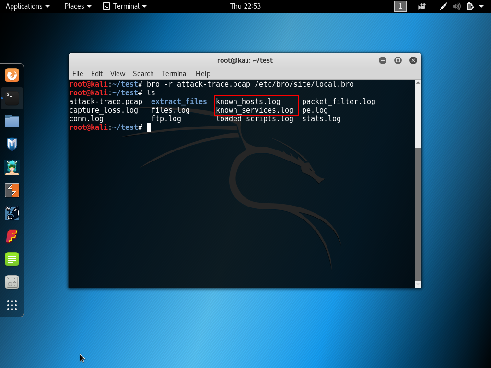
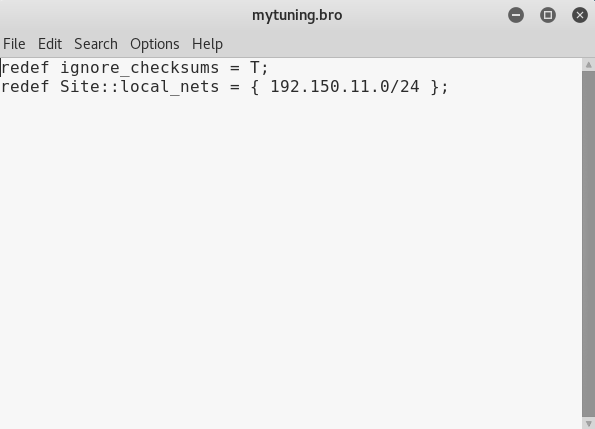
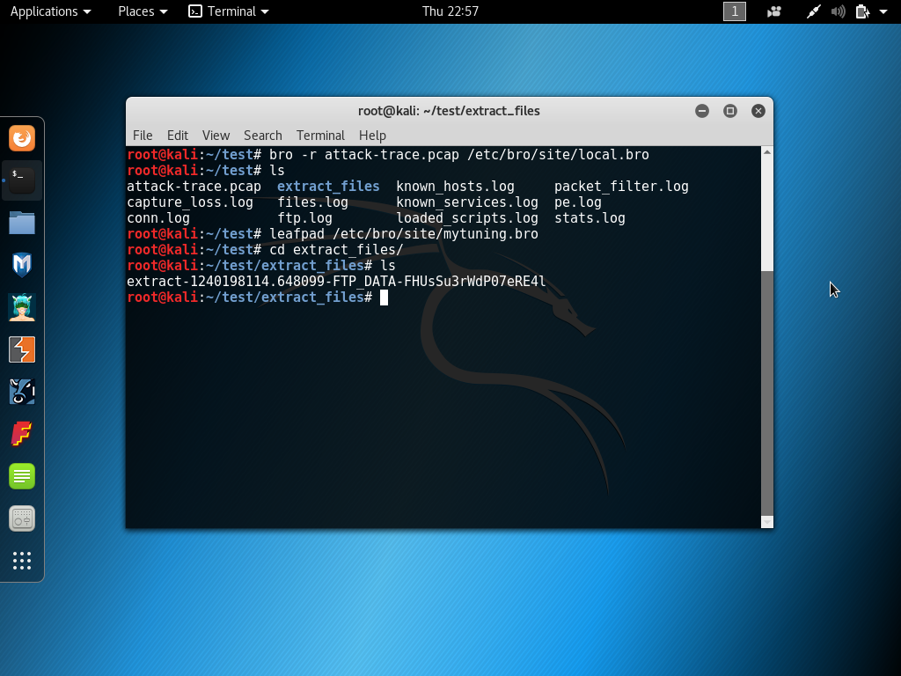
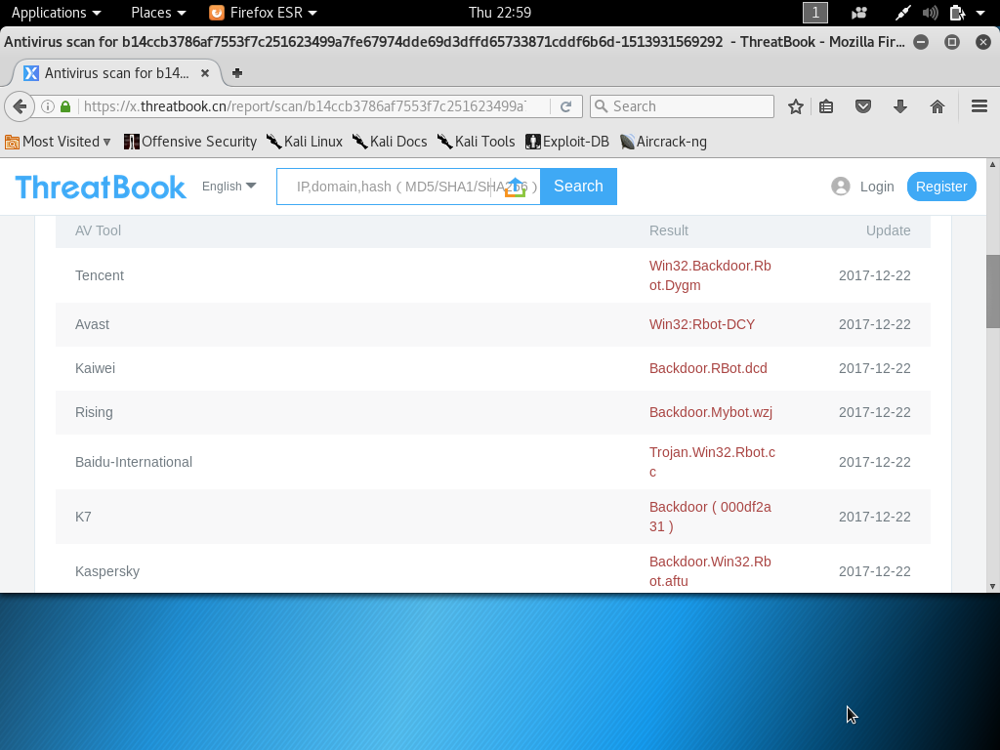
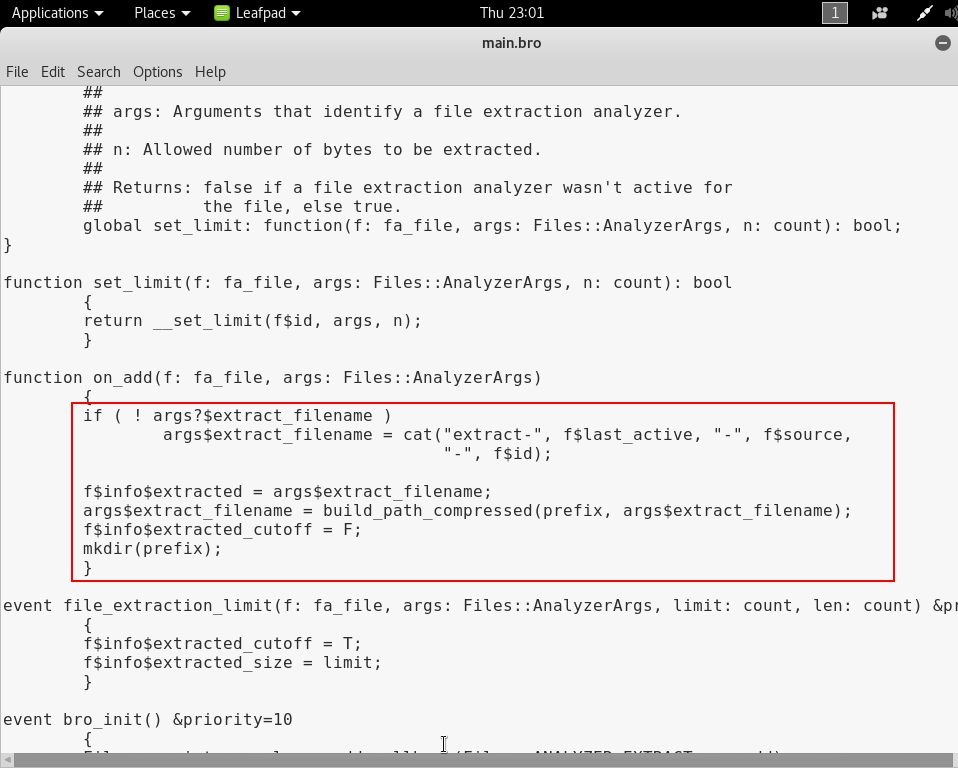
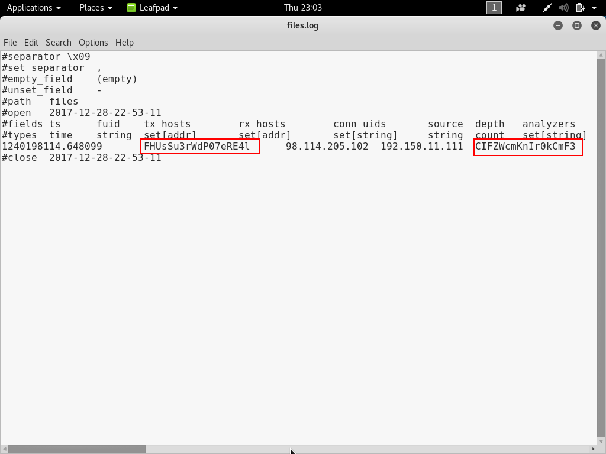
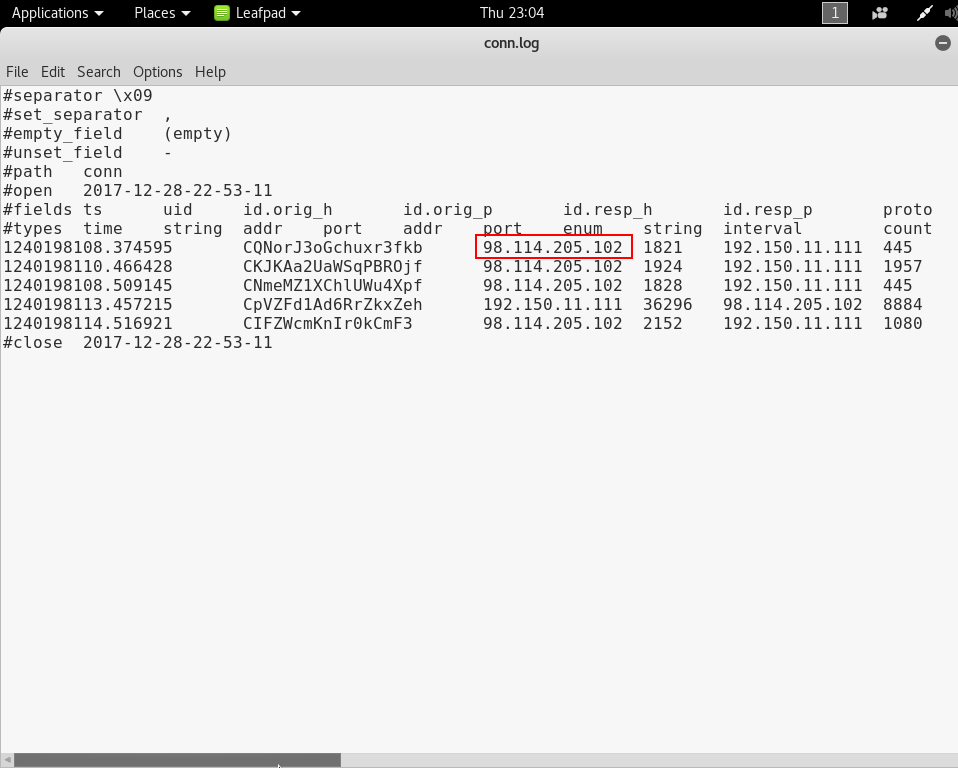

# 使用bro完成网络入侵取证分析
## 实验环境

## 安装bro

```
apt-get install bro bro-aux
```

## 编辑bro配置文件
对/etc/bro/site/local.bro进行编辑，在文件尾部追加两行新配置
```
@load frameworks/files/extract-all-files # 提取所有文件
@load mytuning.bro
```


在/etc/bro/site/目录下创建新文件mytuning.bro，该文件内容如下：

```
redef ignore_checksums = T;
```


## 使用bro自动化分析pcap文件
下载pcap包

```
wget  https://sec.cuc.edu.cn/huangwei/textbook/ns/chap0x12/attack-trace.pcap
```
使用bro进行分析

```
bro -r attack-trace.pcap/etc/bro/site/local.bro
```


出现警告信息WARNING: No Site::local_nets have been defined. It's usually a good idea to define your local networks.

此警告并不会对本次入侵取证实验产生影响。
为解决上述警告信息，对mytuning.bro文件进行编辑，增加如下内容：

```
redef Site::local_nets = {  192.150.11.0/24  };
```

- 注意：添加或不添加上述变量定义，仅会影响bro运行过程中是否会产生警告信息，增加这行关于本地网络IP地址范围的定义对于本次实验来说会新增2个日志文件，会报告在当前流量（数据包文件）中发现了本地网络IP和该IP关联的已知服务信息。 



在attack-trace.pcap文件的当前目录下会生成一些.log文件和一个extract_files目录，在该目录下我们会发现有一个文件。




```
# file extract-1240198114.648099-FTP_DATA-FHUsSu3rWdP07eRE4l 
extract-1240198114.648099-FTP_DATA-FHUsSu3rWdP07eRE4l: PE32 executable (GUI) Intel 80386, for MS Windows
```

将该文件上传到 x.threatbook.cn，发现匹配了一个历史扫描报告



由报告可知这是一个已知的后门程序
至此，基于这个发现就可以进行逆向倒推，寻找入侵线索了。

通过阅读 /usr/share/bro/base/files/extract/main.bro 的源代码



我们了解到该文件名的最右一个-右侧对应的字符串FHUsSu3rWdP07eRE4l是files.log中的文件唯一标识。

通过查看files.log，发现该文件提取自网络会话标识（bro根据IP五元组计算出的一个会话唯一性散列值）为CP0WpmULcjBpkDTQf的FTP会话。



该CP0WpmULcjBpkDTQf会话标识在conn.log中可以找到对应的IP五元组信息。

通过conn.log的会话标识匹配，我们发现该PE文件来自于IPv4地址为：98.114.205.102的主机。

