# 无人值守Linux安装镜像制作

## 功能实现情况

- [x] 定制一个普通用户名和默认密码
- [x] 安装过程禁止自动联网更新软件包
- [x] 定制安装OpenSSH Server

## 实验环境

* virtualbox
* ubuntu16.04.4-server-amd64

## 实验步骤

### 修改光盘实现自动安装

* 使用PSFTP将下载好的ubuntu镜像文件复制到虚拟机内

  * 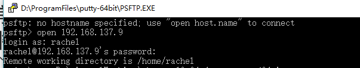
  * 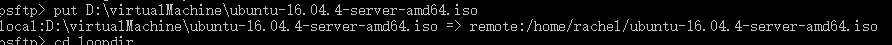

* 创建指定目录并挂载光盘

  * ```shell
    mkdir loopdir
    ```

  * ```bash
    mount -o loop ubuntu-16.04.4-server-amd64.iso loopdir
    ```

* 创建工作目录用于克隆并修改光盘内容

  * ```shell
    # 克隆光盘内容
    mkdir cd
    # 复制光盘内容到指定目录
    rsync -av loopdir/ cd
    # 卸载镜像
    umount loopdir
    ```

  * ````shell
    # 修改光盘内容
    cd cd/
    # 编辑Ubuntu安装引导界面增加一个新菜单项入口
    sudo vim isolinux/txt.cfg
    ````

  * 添加以下内容到文件

    * 注意要添加到文件头部，否则不生效。

    * ```shell
      label autoinstall
        menu label ^Auto Install Ubuntu Server
        kernel /install/vmlinuz
        append  file=/cdrom/preseed/ubuntu-server-autoinstall.seed debian-installer/locale=en_US console-setup/layoutcode=us keyboard-configuration/layoutcode=us console-setup/ask_detect=false localechooser/translation/warn-light=true localechooser/translation/warn-severe=true initrd=/install/initrd.gz root=/dev/ram rw quiet
      ```

* 将修改好的ubuntu-server-autoinstall.seed复制到~/cd/preseed目录下

  * 这里需要暂时提权，否则会提示"permission denied"
    * ```sudo -s  ```

* isolinux/isolinux.cfg，文件默认`timeout 0` 不需要修改

* 重新生成md5sum.txt

  * 这里也需要先```sudo -s```，否则无法操作

  * ```shell
    find . -type f -print0 | xargs -0 md5sum > md5sum.txt
    ```

* 封闭改动后的目录重新生成.iso文件

  * ```shell
    # 封闭改动后的目录到.iso
    IMAGE=custom.iso
    BUILD=~/cd/

    mkisofs -r -V "Custom Ubuntu Install CD" \
                -cache-inodes \
                -J -l -b isolinux/isolinux.bin \
                -c isolinux/boot.cat -no-emul-boot \
                -boot-load-size 4 -boot-info-table \
                -o $IMAGE $BUILD
    ```

  * 在当前目录下导出一个名为"custom.iso"的镜像文件

* 将镜像文件传回windows

  * 设置windows本地路径
    * 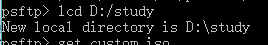
  * 传输
    * 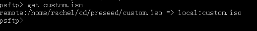

* 测试结果

  * 自动安装成功
  * 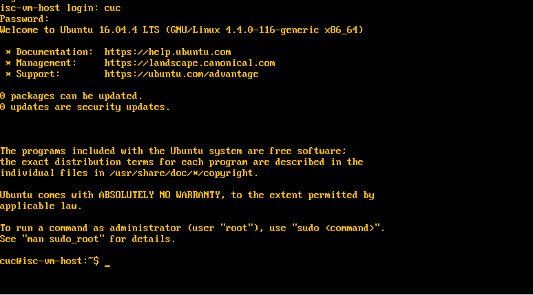

* 使用[文本对比工具](http://mergely.com/editor)对比官方原文件和修改过后的文件区别

  * 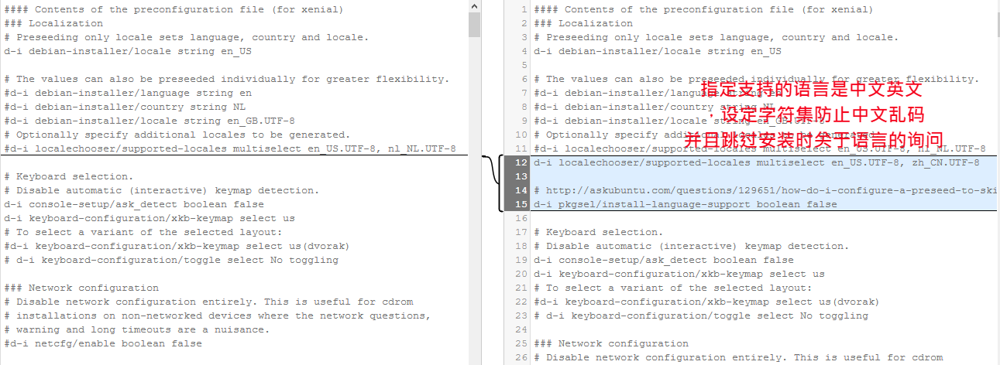
  * 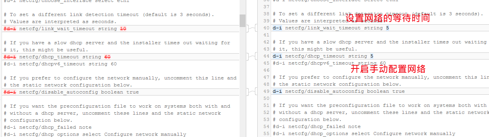
  * 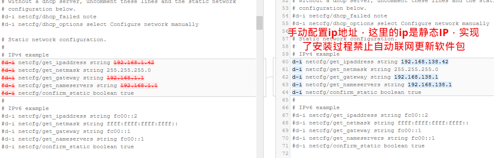
  * 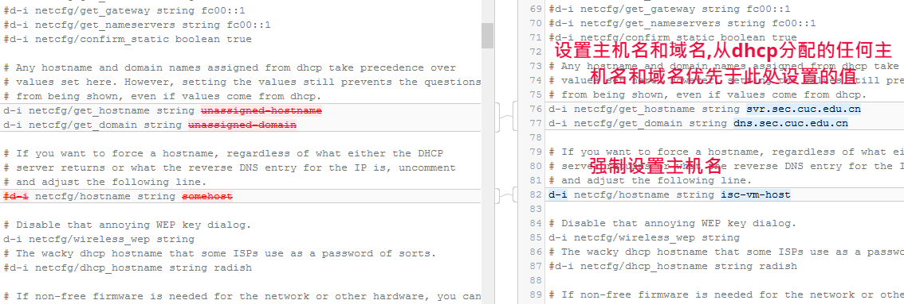
  * 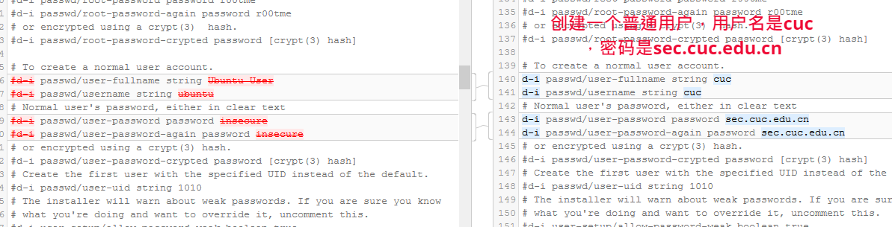
  * 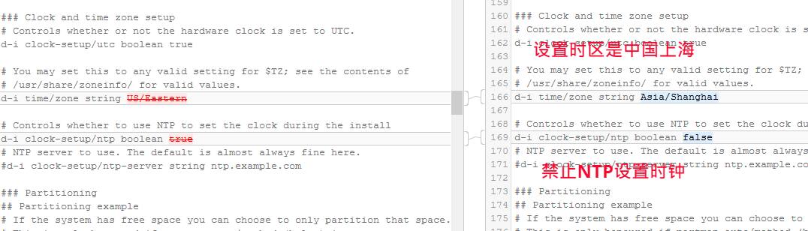
  * 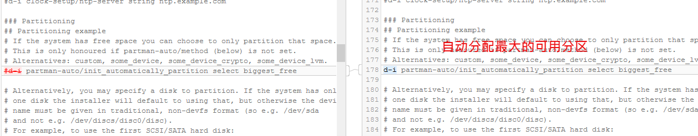
  * 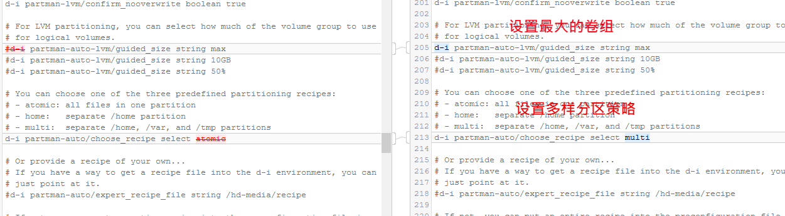
  * 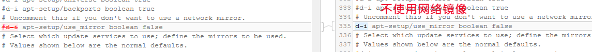
  * 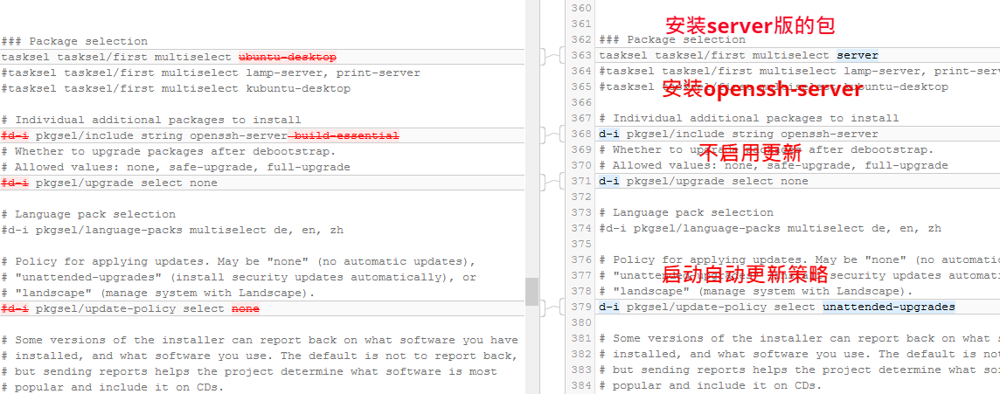

### putty的免密登录

* 设置虚拟机网卡为`host-only`模式，使得其与windows主机在同一局域网内，这样可以直接使用putty连接

* 虚拟机安装并启动ssh

  * ```shell
    # 安装
    sudo apt-get install openssh-server
    # 启动
    sudo /etc/init.d/ssh start
    ```

* 打开PUTTYGEN.EXE，点击'Generate'生成公私钥。

  * 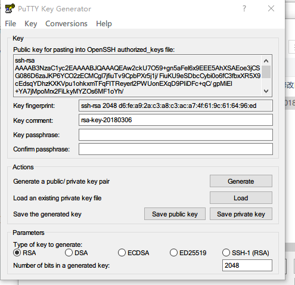
  * 将私钥存储下来

* 进入虚拟机，在根目录下创建'.ssh'文件夹，将刚刚生成的公钥写入该文件夹下的'authorized_keys'

  * 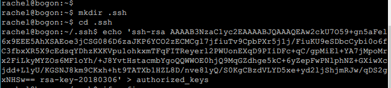

* 打开'PUTTY.exe'

  * 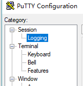
  * 'Session'-->'Logging'输入虚拟机的IP地址
  * 'Connection'-->'Data',输入自动登录的用户名
  * 'Connection'-->'SSH',加载刚刚生成的私钥文件

* 返回'Session'-->'Logging'，给这个连接取名，存储下来

  * 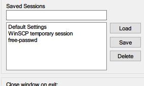

* 成功免密登录

  * 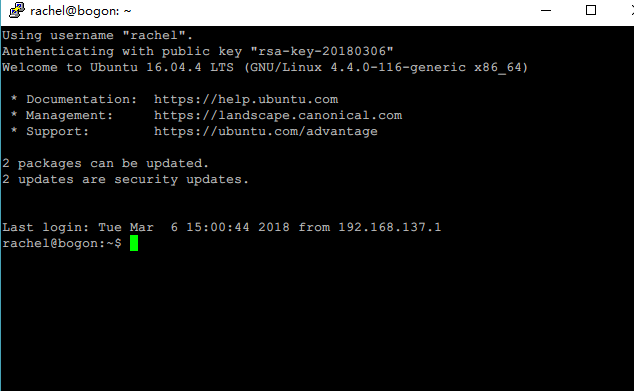

## 遇到的问题

编辑isolinux/txt.cfg的文件时，添加的内容一定要在文件开头，否则不生效

## 参考资料

[psftp实现虚拟机和主机文件互传](http://blog.csdn.net/tim_phper/article/details/51428500)

[师哥作业](https://github.com/CUCCS/linux/blob/master/2017-1/snRNA/ex1/%E6%97%A0%E4%BA%BA%E5%80%BC%E5%AE%88Linux%E5%AE%89%E8%A3%85%E9%95%9C%E5%83%8F%E5%88%B6%E4%BD%9C.md)


