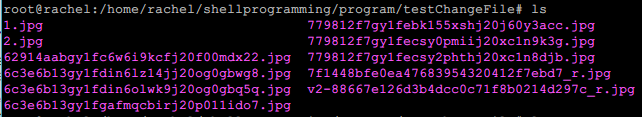
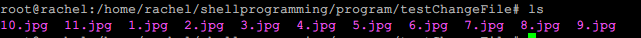

# bash编程

## 任务一

* `compress`jpeg格式图片进行压缩

* `watermark contant`对图片批量添加自定义文本水印

* `changename` 批量重命名
  * `pre`
  * ` postfix`

* ​

* 命令行参数使用不同功能

* 对指定目录下所有固定格式图片文件批处理

* 图片批处理功能
  * 注意：根目录中的'~'是/home/rachel
  * 执行系统命令使用两个反引号``` ``
  * ​

* 文件夹下图片批量重命名

  * ```shell
    #!/bin/bash
    echo $1
    directory=$1
    count=1
    for arg in `ls $directory`
    do
            # 把指定目录下全部jpg文件重命名为1~n.jpg
            echo $directory'/'$arg
            `mv $directory'/'$arg  $directory'/'$count'.jpg'`
            # 注意加号之间有空格 否则不予计算
            count=`expr $count + 1`
    done
    ```

  * 初始文件

    * 

  * 效果

    * 

* 对图片进行质量压缩

  * 使用imagemagick
  * 安装
    * `sudo apt-get install imagemagick`
    * ​