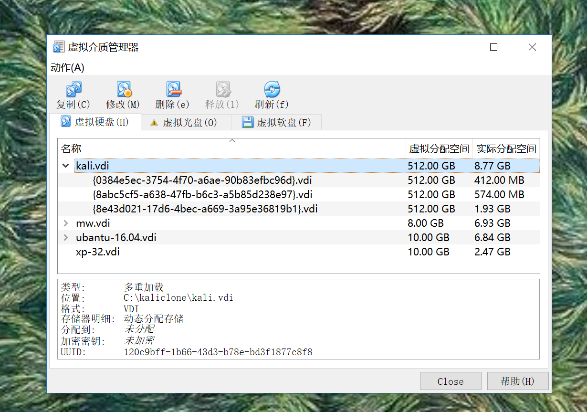

# Ex1 基于VirtualBox的网络攻防基础环境搭建 # 
----------
## 网络配置 ##
### 网关机 ###
 
 
### 攻击机 ###
 
### 靶机 ###

----------
## 完成度及证明截图 ##
### 已完成  ###
####靶机可以直接访问攻击者主机 
 
####攻击者主机无法直接访问靶机
    
####网关可以直接访问攻击机  

####网关可以直接访问靶机  

####靶机的所有对外上下行流量必须经过网关  

####网关机可以访问互联网    

####攻击机可以访问互联网
    
####所有节点制作成基础镜像（多重加载的虚拟硬盘）

### 未完成： ###
####靶机可以访问互联网   

----------
## 重要步骤与疑惑 ##
1. 需要在网关机上启用 IPv4 转发。  

2. 网关机在安装第二块网卡后出现无法上网问题，查到一个博客里写道：linux在加载网卡配置文件时，先加载eth0,再加载eht1，这样，如果eth1设置了gateway项，则会覆盖掉 eth0中的gateway设置。[博客地址](http://www.cnblogs.com/tigertall/archive/2012/01/02/2310253.html)  
因此我将网关机中的eth0作为内网网卡，eth1作为外网网卡，之后网关机可以ping通外网了。  
但是看到有同学将eth0作为外网网卡、eth1作为内网网卡，网关机也可以ping通外网，不明白为什么。
