# Exp7 使用bro来完成取证分析
## 安装bro    
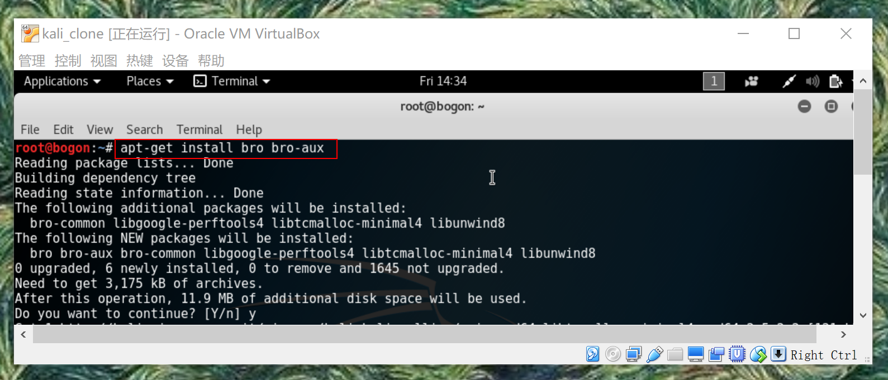

## 实验环境基本信息   
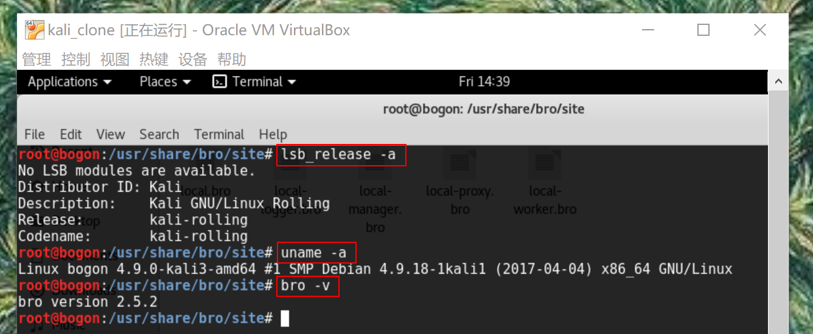

## 编辑bro配置文件
编辑 /etc/bro/site/local.bro，在文件尾部追加两行新配置代码  
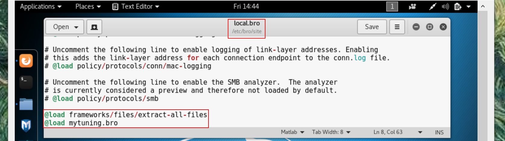
在/etc/bro/site/目录下创建新文件mytuning.bro    
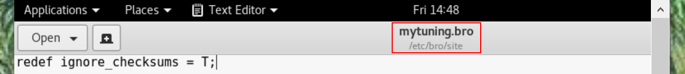

## 使用bro自动化分析pcap文件
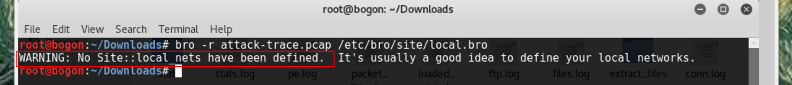
出现警告信息WARNING: No Site::local_nets have been defined. It's usually a good idea to define your local networks.对于本次入侵取证实验来说没有影响。
如果要解决上述警告信息，同样是编辑mytuning.bro，增加一行变量定义即可   
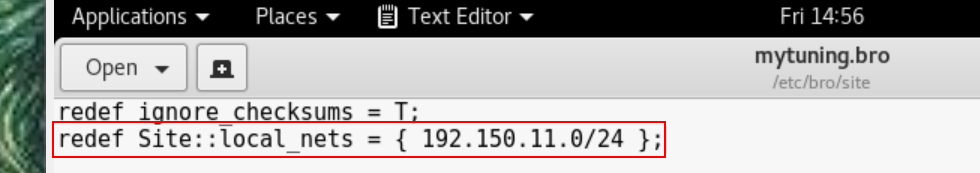   
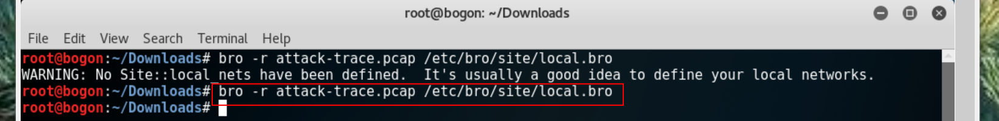

注意添加和不添加上述一行变量定义除了bro运行过程中是否会产生警告信息的差异，增加这行关于本地网络IP地址范围的定义对于本次实验来说会新增2个日志文件，会报告在当前流量（数据包文件）中发现了本地网络IP和该IP关联的已知服务信息。
在attack-trace.pcap文件的当前目录下会生成一些.log文件和一个extract_files目录，在该目录下我们会发现有一个文件。  
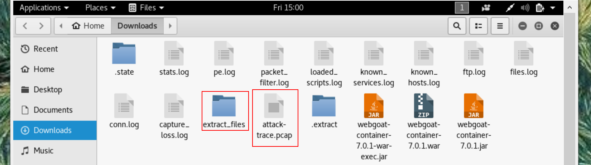
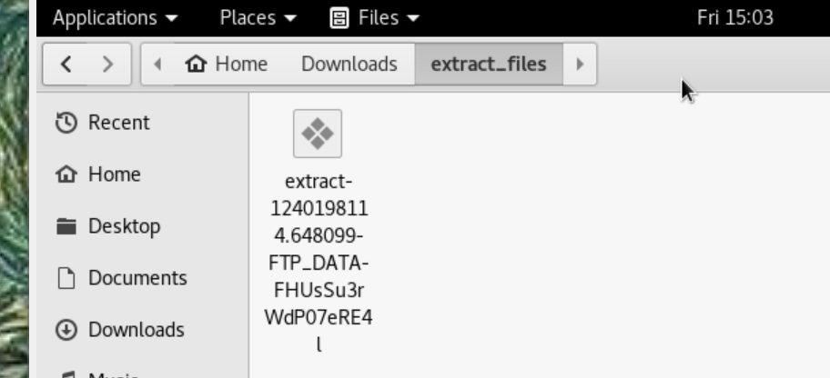
将该文件上传到threatbook和virustotal，我们会发现匹配了一个历史扫描报告，该报告表明这是一个已知的后门程序！

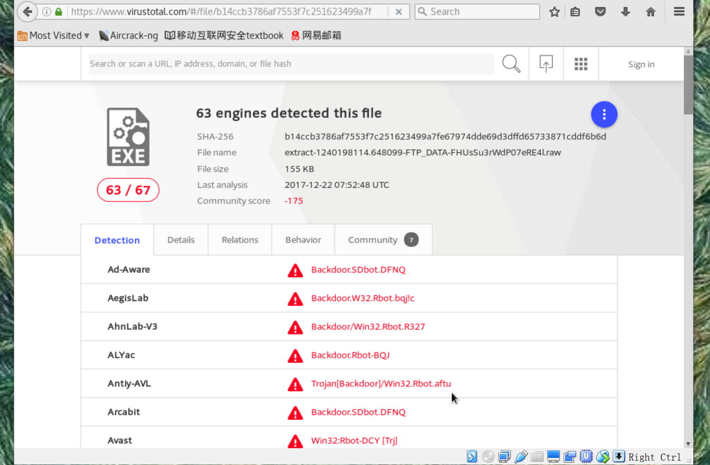
至此，基于这个发现就可以进行逆向倒推，寻找入侵线索了。   

通过阅读/usr/share/bro/base/files/extract/main.bro的源代码，我们了解到该文件名的最右一个-右侧对应的字符串是files.log中的文件唯一标识。  
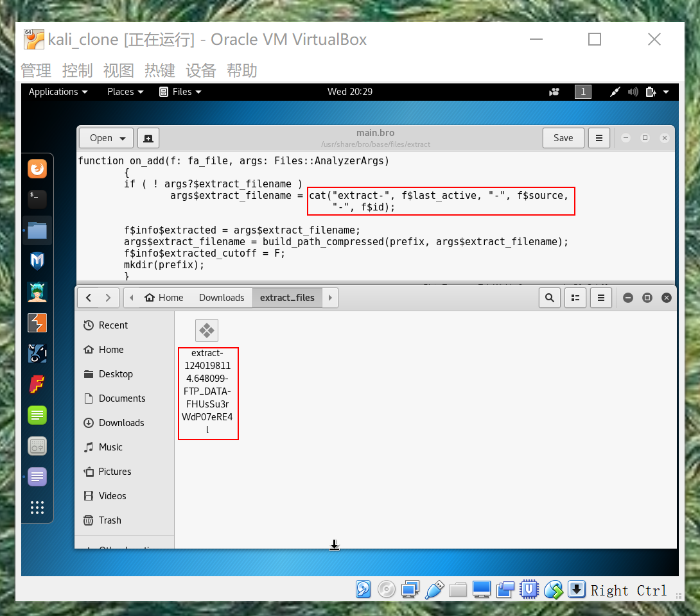  
通过查看files.log，发现该文件提取自网络会话标识（bro根据IP五元组计算出的一个会话唯一性散列值）为的FTP会话。
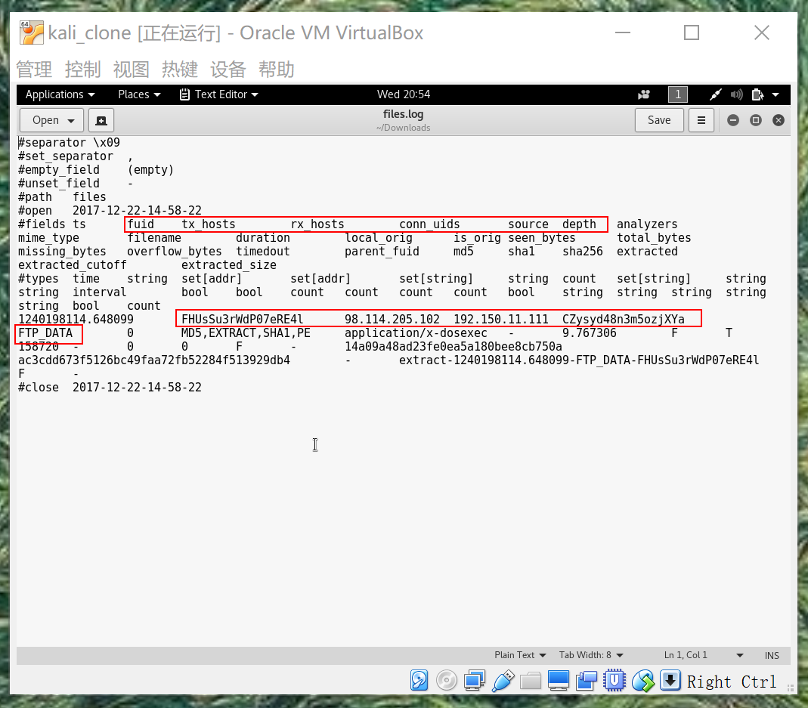  
该会话标识在conn.log中可以找到对应的IP五元组信息。通过conn.log的会话标识匹配，我们发现该PE文件来自于IPv4地址为：98.114.205.102的主机。     
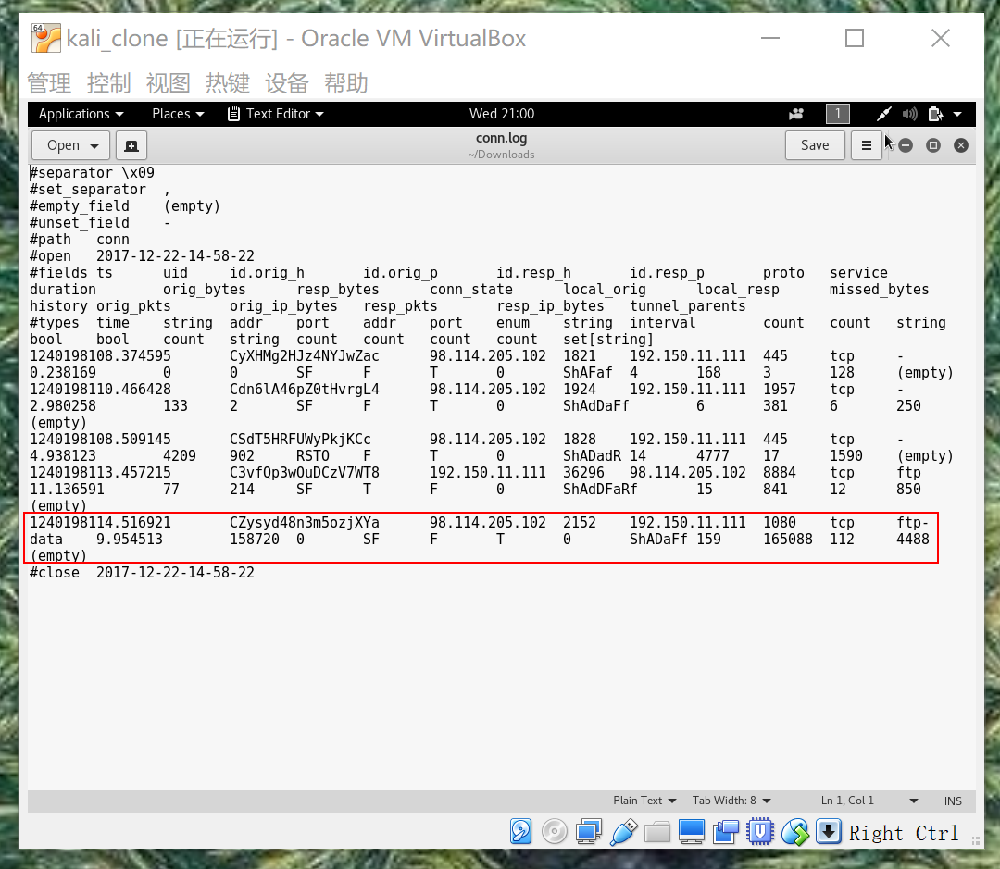  
