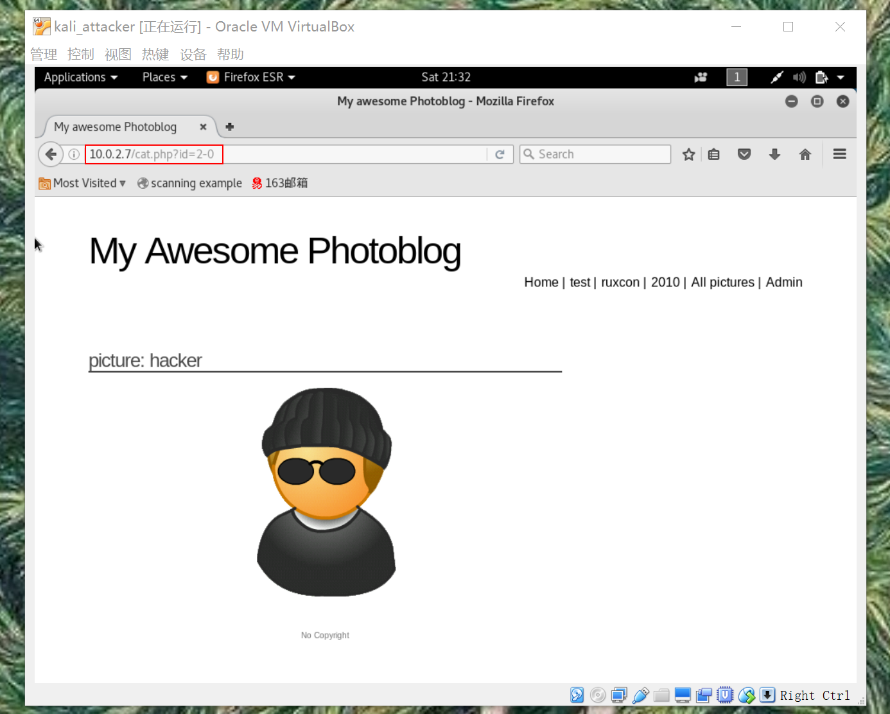
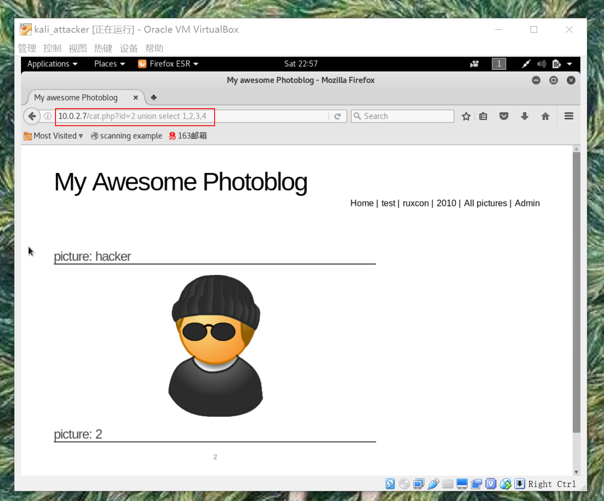
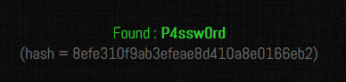

# Exp7
## Preparation
Database   :  kali_clone  NATnetwork  
Attacker  : kali_attacker NATnetwork

## Fingerprinting   
the application is written in PHP

### Inspecting HTTP headers
the application is only available via HTTP
  
nothing is runnning on the port 443

### Using a directory Buster  
detect remote files and directories

detect PHP script on the server

## Detection and exploitation of SQL injection

### Detection of SQL injection

#### Detection based on Integers
accessing /article.php?id=2-0 displays article2
  
accessing /article.php?id=2-1 displays article1

The subtraction is performed by the database, so it's likely that there is a SQL injection.

#### Detection on Strings
If SQL injection is present in the web page, an odd number of single quotes will throw an error, an even number of single quotes won't.  

Now we have found a SQL injection in the page 10.0.2.7/cat.php

## Access to the administration pages and code execution

### The UNION keyword
Using UNION, the attacker can manipulate the end of the query and retrieve information from other tables.  
The most important rule is that both statements should return the same number of columns otherwise the database will trigger an error.

### Exploiting SQL injections with UNION  
- Find the number of columns to perform the UNION
- Find what columns are echoed in the page
  - using UNION SELECT and increase the number of columns   
  
  the database triggers errors until the end of the query returns 4 columns   

  - using ORDER BY statement.    
      

   if the column number in the ORDER BY statement is bigger than the number of columns in the query, an error is thrown    
      

- Retrieve information from the database meta-tables   
    

  Based on the error message we received, we know that the backend database used is MySQL.
  - the user used by the PHP application to connect to the database with current_user()   
       

  - the version of the database using version()     
       

  - the current database    
    

- Retrieve information from other tables/databases  
  MySQL provides tables containing meta-information about the database, tables and columns available since the version 5 of MySQL. These tables are stored in the database information_schema.  
  a raw list of all tables  
    
  a raw list of all columns  
    

  To know what column belongs to what table:
  - put tablename and columnname in different parts of the injection
  - concatenate tablename and columnname in the same part of the injection using the keyword CONCAT  
  
  get the username and password used to access the administration pages  
  

## Access to the administration pages and code execution
### Cracking the password
The password can be easily cracked using 2 different methods:
- A search engine  

- [John-The-Ripper](http://www.openwall.com/john/) can be used to crack this password.  
For web application, a good guess would be MD5.  
### Uploading a Webshell and Code Execution  
Once access to the administration page is obtained, we can see that there is a file upload function allowing a user to upload a picture, we can use this functionality to try to upload a PHP script.   
This PHP script once uploaded on the server will give us a way to run PHP code and commands.

Now, we need to find where the PHP script, managing the upload put the file on the web server.   
We can visit the web page of the newly uploaded image to see where the <img tag is pointing to:   
   
start running commands using the cmd parameter   

- get a full list of the system's users

- get the version of the current kernel

