# 从SQL注入到Shell

## 实验目的
在基于php的网站中进行SQL注入，利用它访问管理界面，在服务器上获得代码执行

## 实验步骤

- 指纹识别:收集有关使用的web应用程序和技术的信息

- SQL注入的检测和开发:了解SQL注入是如何工作的，以及如何利用它们来检索信息

- 访问管理页面和代码执行:访问操作系统和运行命令

## 实验过程

### 配置环境

- 下载镜像，安装虚拟机作为靶机
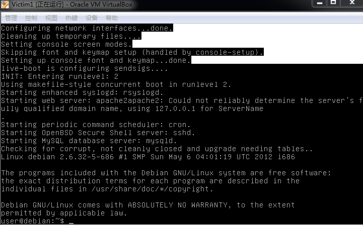

- 靶机NAT网络，ip：10.0.2.15
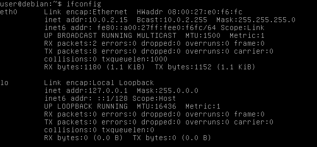

- 攻击者主机NAT网络，ip：10.0.2.16
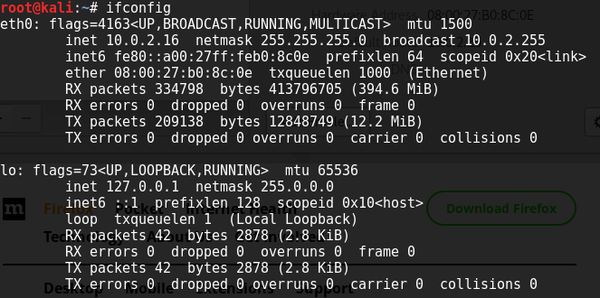

- 攻击者Ping靶机：
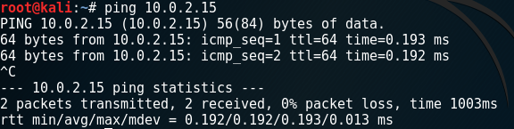

- 靶机ping攻击者：
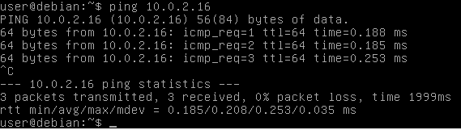

### 实验步骤

#### 收集指纹

- http请求测试

通过观察服务器发回的HTTP头检索php版本和web服务器信息
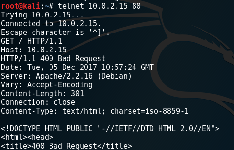

在burpsuite中查看相同的信息
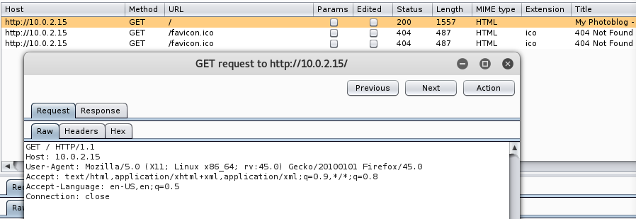

- https（443端口）请求失败，应用程序只能通过http
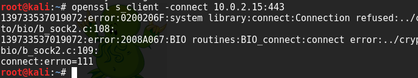

利用工具wfuzz检测web服务器上的目录和页面
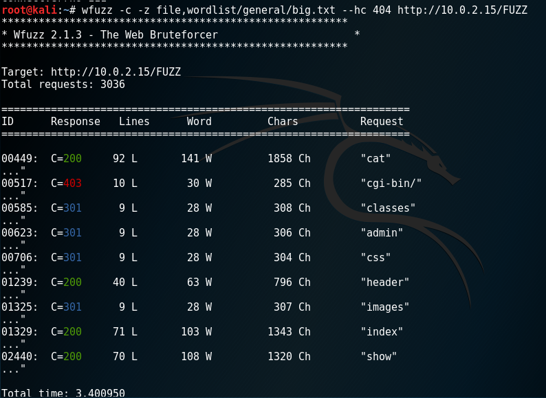

远程目录下的PHP脚本
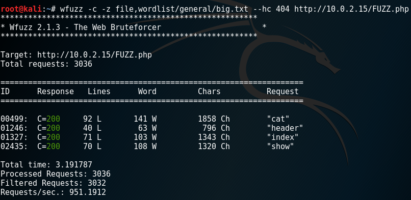

- 攻击者主机浏览器设置代理
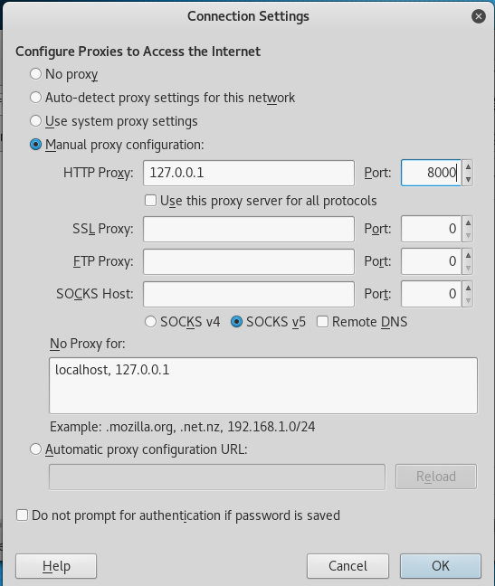

设置burpsuite
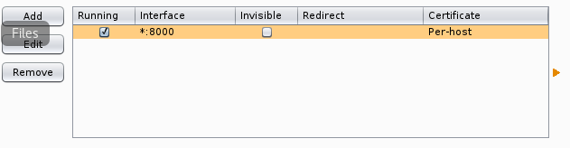
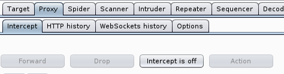

在浏览器中输入靶机ip地址，显示界面

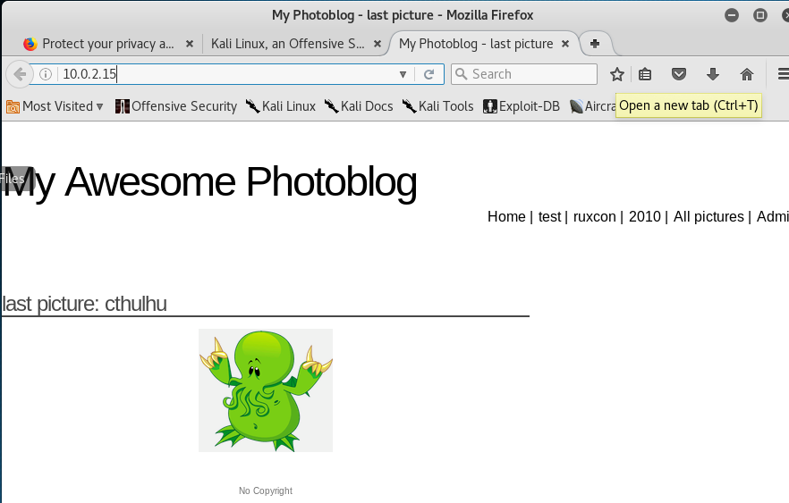

#### SQL注入的检测和利用

- 基于数字的检索（数据库)
  - 用户输入的值在请求中是直接响应的，并被视为一个整数。
  输入id=1和id=2-1结果相同
  
  

- 通过字符串检测SQL注入
  - 单引号引发数据库MySQL错误

- 利用UNION关键字开发SQL注入
  - 利用UNION前后select语句返回的列值必须相同，由此可以递增查询列数，从而检测出数据库在查询该语句时会查多少列
    - 猜测有两列时报错

    - 直到select 1,2,3,4 时才显示正确
   

  - 利用order by 查询列数 
    - 超出列数范围
   
	- 小于或等于列数

   
   

  - 通过SQL注入得到信息
    - 结合查询到的列数，得到数据库版本信息
   
    - 当前用户信息
   
    - 数据库名
   
  - 查看表名、列名以及表和列之间的对应关系
     - 表名10.0.2.15/cat.php?id=3 UNION SELECT 1,table_name,3,4 FROM information_schema.tables
   
     - 列名10.0.2.15/cat.php?id=3 UNION SELECT 1,column_name,3,4 FROM information_schema.columns
   
     - 表和列的对应关系（用户名和密码）10.0.2.15/cat.php?id=3 UNION SELECT 1,concat(table_name,':',column_name),3,4 form information_schema.columns
   

    - 得到用户名及密码
   

#### 进入管理页面并执行代码

- 解密得到的哈希值，密码为P4sswOrd,成功登入管理员账户
  

	- 注：重新打开虚拟机后IP地址变为10.0.2.5
  

- 进入登陆界面
  

- 登陆成功
  

- 找到Add a new picture上传新文件,上传一个php脚本
  
  

- 网站返回提示信息'NO PHP!!'禁止上传PHP文件，通过以下两种方式绕过PHP过滤
	- 改为.php3后缀（要输'title'）

	- 改为.php.test后缀	
  		
- 上传成功后，访问植入的php文件

- 查看页面审查元素

- 通过cmd参数获取大量页面信息
	- cmd=uname返回当前系统内核

	- cmd=ls显示当前目录信息

	- cmd=cat /etc /passwd显示用户列表

	- cmd=cat /etc /passwd显示主机信息

