# 基于virtualbox的网络攻防基础环境搭建

## 实验要求：
- 靶机可以直接访问攻击者主机
- 攻击者主机无法直接访问靶机
- 网关可以直接访问攻击者主机和靶机
- 靶机的所有对外上下行流量必须经过网关
- 所有节点均可访问互联网

## 实验过程
- 网络设置：
靶机网卡：内部网络
攻击者网卡：NAT网络
网关网卡1：NAT网络，网卡2：内部网络

- IP设置(实验室电脑，IP和原来不同)：

网关主机

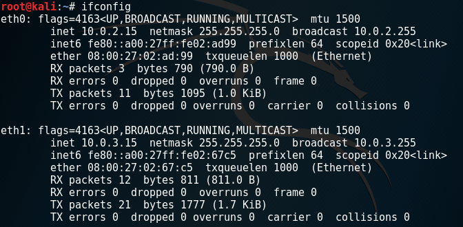

靶机

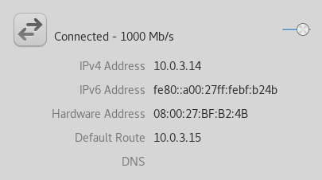

攻击者主机

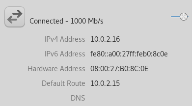

## 功能实现

- 靶机可以直接访问攻击者主机
设置端口转发，使网关主机的其中一块网卡收到数据包后可以根据目的IP地址将包转发到本机的另一块网卡

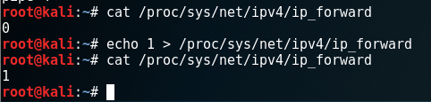

靶机访问攻击者主机

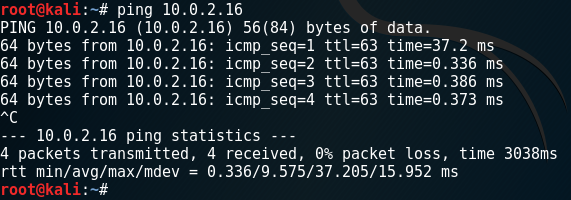

- 攻击者主机无法直接访问靶机

由于网关主机设置了端口转发，攻击者原本可以访问靶机

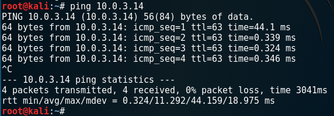

设置iptables规则

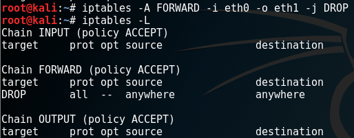

直接舍弃了所有eth0和eth1之间的流量，不符合实际要求，删除并重新设置禁止访问的网段

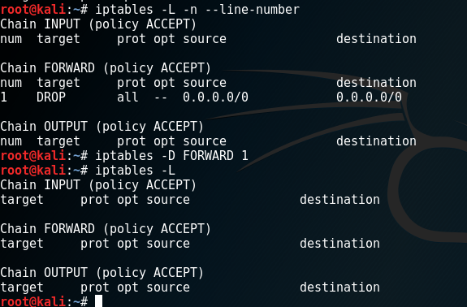

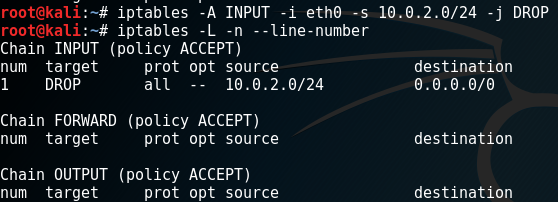

攻击者无法访问靶机

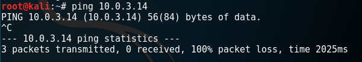

- 网关可以直接访问攻击者主机和靶机

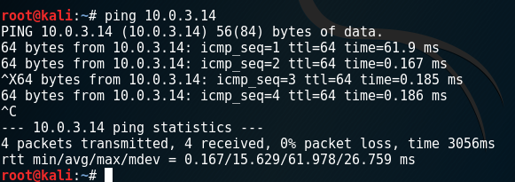

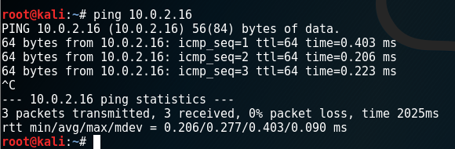

- 靶机的所有对外上下行流量都经过网关

靶机访问外网的流量

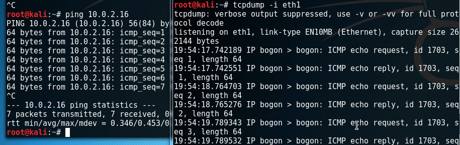

外网访问靶机的流量

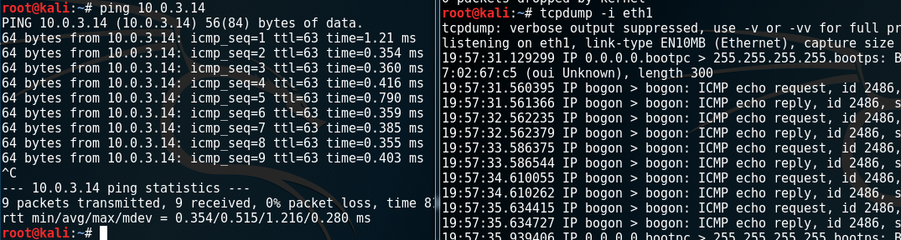

- 所有节点均可以访问互联网

靶机

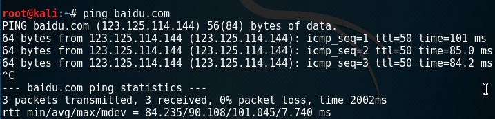

网关

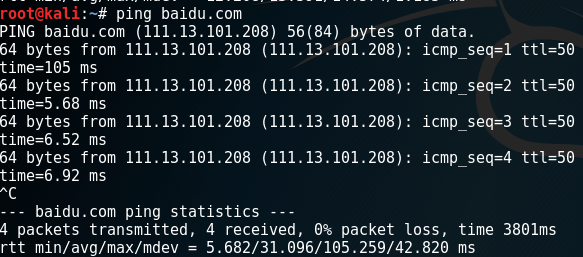

攻击者主机

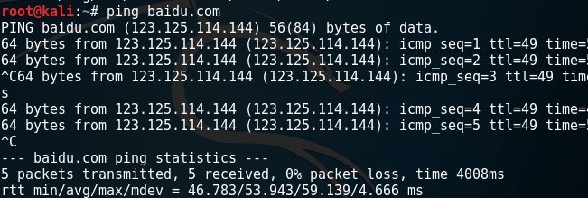

## iptables防火墙使用规则参考

[http://www.cnblogs.com/kevingrace/p/6265113.html](http://www.cnblogs.com/kevingrace/p/6265113.html)
