# Scapy编程实现网络扫描

## 实验要求
- TCP connect scan
- TCP stealth scan
- TCP XMAS scan
- UDP scan（未实现）

## 环境配置
- 服务器 10.0.2.4
- 客户端 10.0.2.15

## 实验过程

### TCP connect scan

- 服务器nmap扫描自身，查看端口开闭情况，所有端口全部为关闭状态

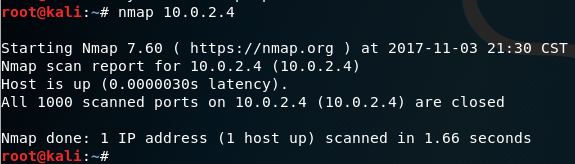

- 客户端调用TCP_connect_scan.py,80端口关闭

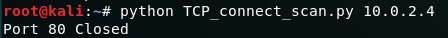

- 开启Apache2来开启80端口

- 客户端调用.py后检测到80端口开启

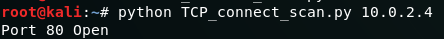
- iptables添加过滤规则，对80端口进行过滤，禁止外部访问（iptables -L 查看所有规则）

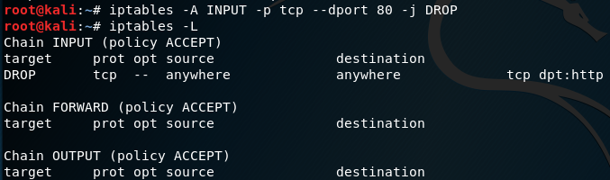

- nmap扫描出80端口已被过滤

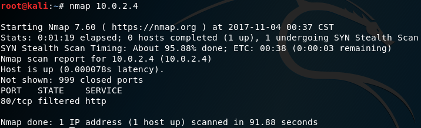

- 客户端调用后，显示‘Filtered’
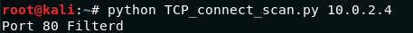

### TCP stealth scan

- nmap扫描服务器自身，查看到22端口关闭，之前过滤的80端口仍处于‘Filtered’状态

- 客户端调用TCP_stealth_scan.py

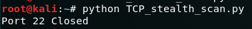

- 服务器开启22端口并扫描进行检测

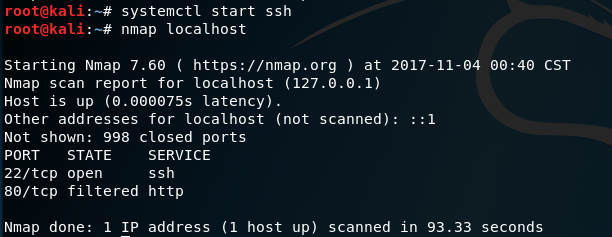

- 客户端调用.py

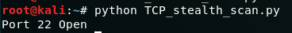

- 服务器配置iptables规则对22端口进行过滤

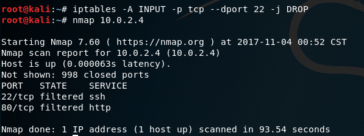

- 客户端

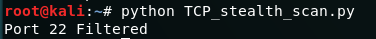

### TCP XMAS scan

- 服务器端关闭22端口。

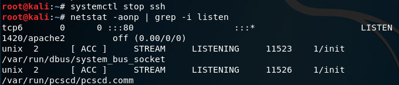

- 删除第二个实验中设置的iptables规则（包括80端口的过滤规则）

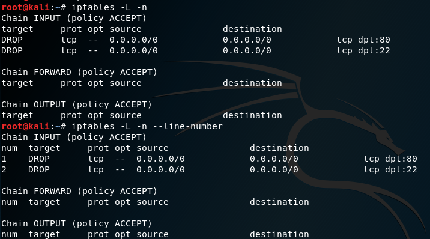

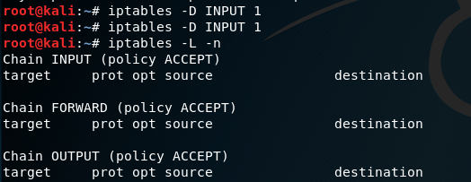

- 此时nmap,所有端口都处于关闭状态

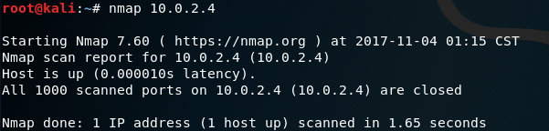

- 客户端TCP_XMAS_scan.py(上面是只关闭22端口而没有删除过滤规则的结果，下面是删除‘Open|Filtered’过滤规则并且关闭22端口后的结果)

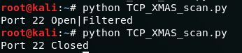

- 重新开启22端口

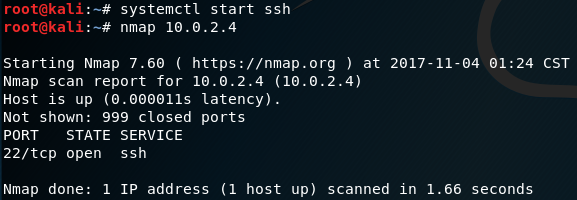

- 客户端

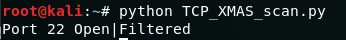

- 服务器配置iptables过滤规则并查看当前所有iptables规则

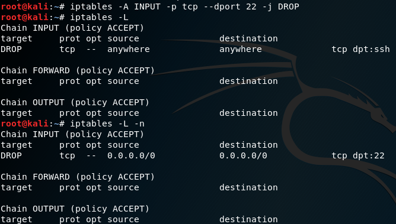

- 客户端

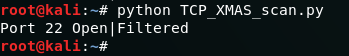

### UDP scan
- 服务器监听68端口失败，无法开启DHCP服务，客户端得不到反馈

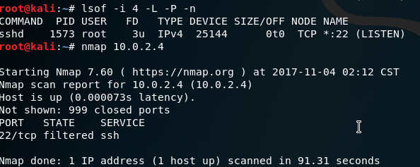
