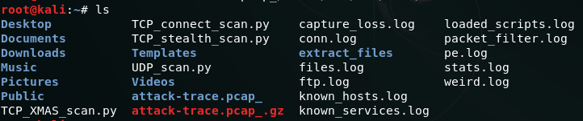

## 基于bro的计算机入侵取证实战分析

### 环境配置

- 安装bro工具

- 查看实验环境

- 配置bro

编辑/etc/bro/site/local.bro,在文件尾部追加以下配置代码(第一行代码提取所有文件)

在/etc/bro/site/目录下创建文件mytuning.bro,添加以下两行代码

### 实验过程

- 下载pcap包

- 解压缩后使用bro自动分析pcap包

如果在mytuning.bro中不加第二行会出现如下warning

添加第二行关于本地网络IP地址范围的变量定义后当前目录下会增加日志文件known_services.log和known_hosts.log,会报告在当前数据包文件中发现了本地网络IP和该IP关联的已知服务信息

- 查看/usr/share/bro/base/files/extract/main.bro中的on_add函数,得知该文件名最后的一个'-'右侧对应的字符串时files.log中的文件唯一标识

- 查看files.log，得到该流量的conn_uids为CU8XHe2BnwZ9zfs1C9

- 查看conn.log，找到CU8XHe2BnwZ9zfs1C9的相关信息，得到该PE文件来自于IP地址为98.114.205.102的主机

也可以用以下方式查看conn.log文件

