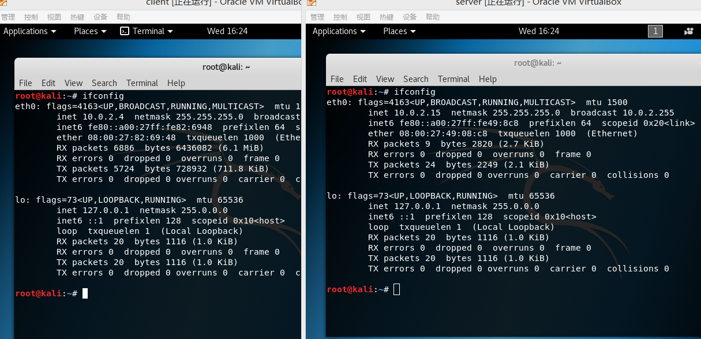
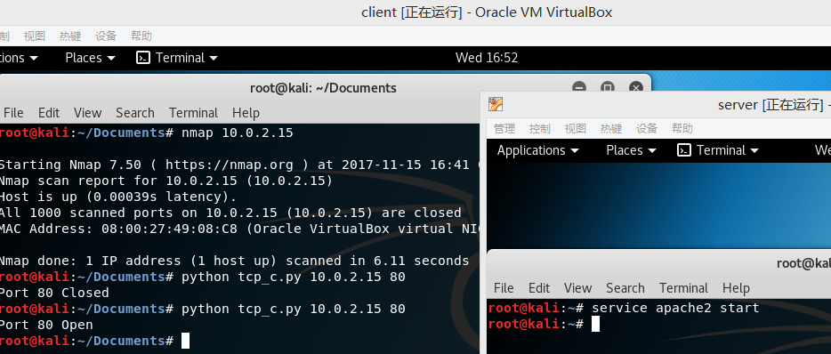
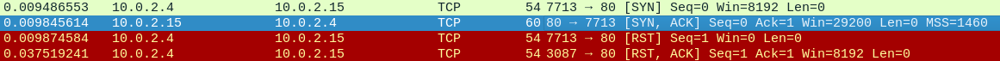
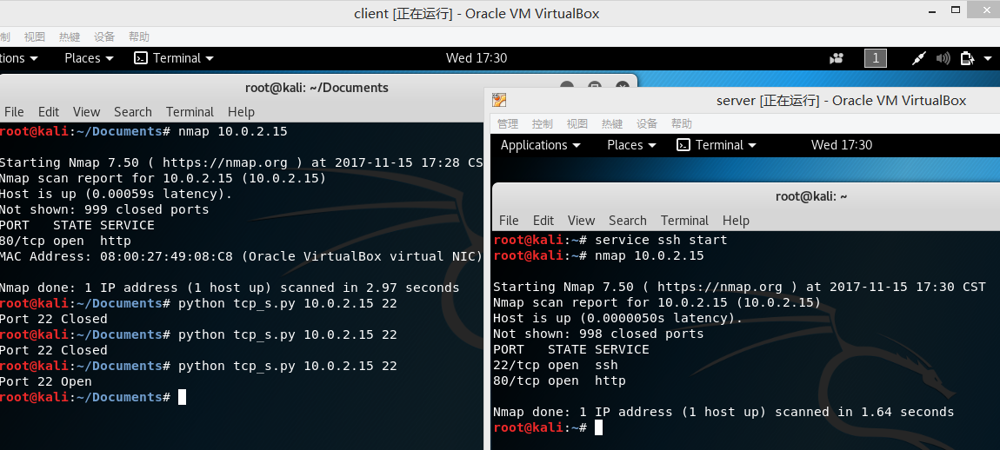
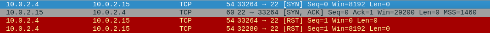
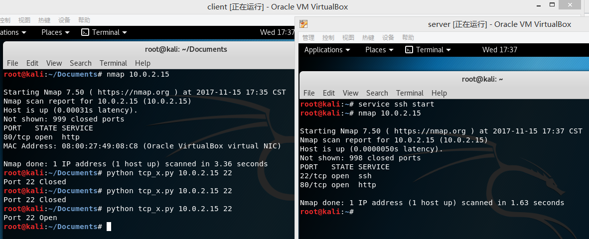
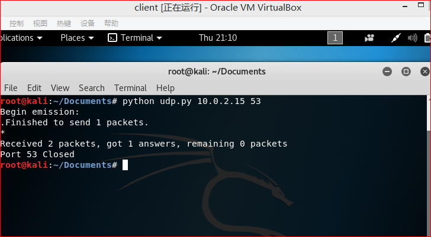
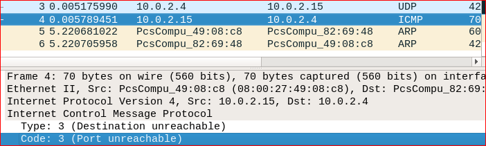
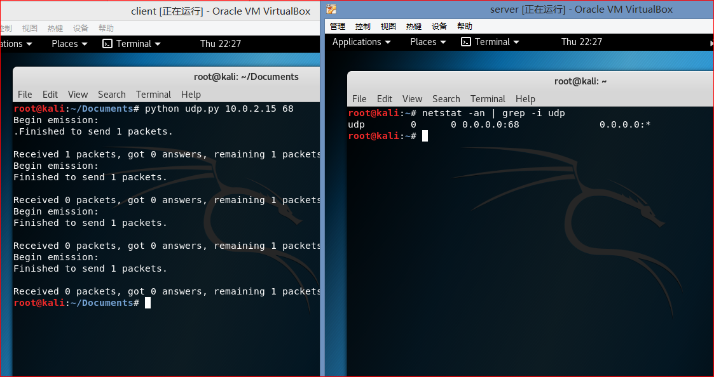
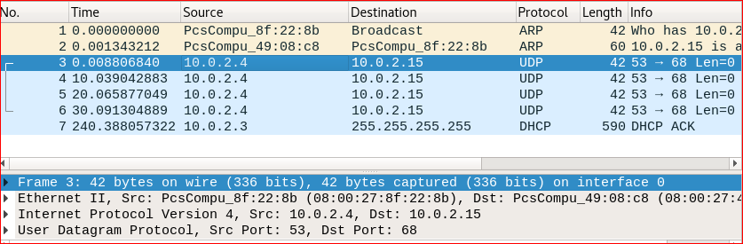

# port scanning

## 实验要求

- [x] 1. TCP connect scan
- [x] 2. TCP stealth scan
- [x] 3. TCP XMAS scan
- [ ] 4. UDP scan

## 实验环境
client为扫描的主机
server为被扫描的主机

  

### TCP connect scan  

* 代码运行结果  
    

* server机端口关闭时结果   
   

* server机端口开启时抓包结果  
   

* [代码](code/tcp_c.py)  

### TCP stealth scan   

* 代码运行结果  
    

* server机端口关闭时结果   
   

* server机端口开启时抓包结果  
   

* [代码](code/tcp_s.py)  

### TCP XMAS scan  

* 代码运行结果  
    

* server机端口关闭时抓包结果   
   

* server机端口开启时抓包结果  
   

* [代码](code/tcp_x.py)  

### TCP UDP scan  

* 代码运行结果  
    

* server机端口关闭时抓包结果，  
  ICMP包的code：3   type:3
   

* server机端口开启时抓包结果，关闭时client没有收到响应包
    
 

* [代码](code/udp.py)

[代码参考](http://resources.infosecinstitute.com/port-scanning-using-scapy/)
