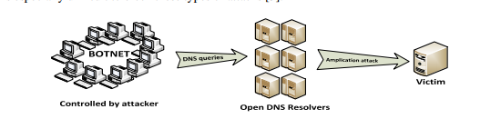

## 3. 大量DDoS攻击类型当前呈上升趋势
开放系统互连（OSI）模型将通信系统分成七个逻辑层。 每一层都有自己独特的安全挑战，并且容易受到拒绝服务（DOS）攻击或分布式拒绝服务（DDoS）攻击。 分布式拒绝服务攻击最近两年的呈上升趋势的主要分为两类攻击：基础设施（第三层和第四层）攻击和应用程序（第七层）攻击。 第一类攻击是基础设施攻击，通过发送非常大量的虚假请求，试图淹没带宽容量和路由基础设施。 第二类应用程序攻击利用了特定应用程序的限制，导致性能下降或最终导致远程服务器崩溃。
### 3.1 基础设施（第3和第4层）攻击
本节介绍当前OSI模型中网络层（Layer 3）和传输层（Layer 4）上最流行的DDoS攻击类型：
─ DNS反射攻击
─ TCP SYN floods
─ UDP floods
─ ICMP floods

根据已发表的主导产业安全报告统计记录[2-4]，这些攻击类型是恶意行为者的主要关注点，并将继续处于全球威胁的首位。
#### 3.1.1. 域名服务器（DNS）反射或放大攻击。
DNS反射或放大攻击是一种分布式拒绝服务（DDoS）攻击，其中攻击者向开放的DNS解析器发送DNS名称查找请求，源地址被欺骗为受害者的地址。 当DNS服务器发送DNS记录响应时，它将被发送给受害者（在欺骗请求中使用的源地址）。 由于响应的大小通常大于请求的大小，所以攻击者可以放大指向受害者的交通量。 通过利用僵尸网络执行额外的欺骗性DNS查询，攻击者可以通过很少的努力产生大量的流量，如图1所示。由于响应是来自有效名称服务器的合法数据，因此阻止这些类型的攻击是非常困难的。  
  
图一 DNS反射攻击    
DNS反射攻击可以通过以下方式[6]来实现：  

打开递归。 开放的DNS解析器被称为Internet上的服务器，启用递归，并向任何人提供递归DNS响应。 通过开放式解析程序项目（Open Resolver Project）可知，目前互联网上约有2700万个开放的DNS解析器。 开放的DNS解析器是放大的来源，收到一个小的DNS查询后返回一个更大的DNS响应。  

源地址欺骗。 DNS放大攻击类似于“Smurf”攻击，其中DNS查询的源地址被发送者以外的返回地址欺骗。 然后，一个开放的解析器返回一个不正确地发送到欺骗地址的DNS响应[7]。  

僵尸网络。 在DNS放大攻击中，攻击者损害了被称为僵尸网络的在线计算机组，用于发送DNS查询以打开解析器。  

恶意软件。 被恶意软件感染的僵尸网络计算机触发DNS放大攻击。 如果没有DNS扩展机制（EDNS0）[8]，一个64字节的查询将导致一个8x放大的512字节的UDP回复，允许DNS请求者通告它们的UDP数据包大小并且便于大于512字节的数据包的传输。  

DNSSEC。 DNSSEC（DNS安全扩展的缩写）[9]允许DNS服务器验证DNS响应，并防止添加了加密签名的高速缓存中毒攻击，从而导致需要EDNS0支持的更大的DNS消息大小。 由于支持DNSSEC的服务器也将在DNS响应中支持较大的UDP数据包，因此DNSSEC一直被批评为造成DNS放大攻击。
