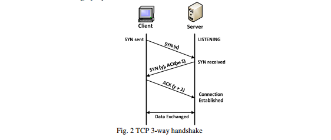
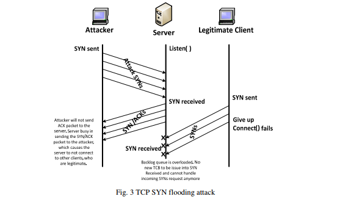
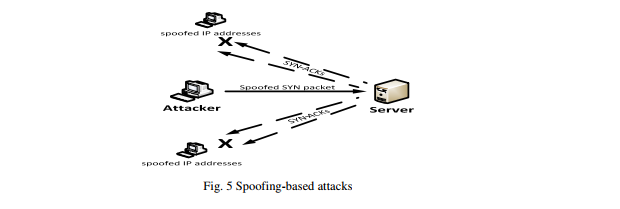
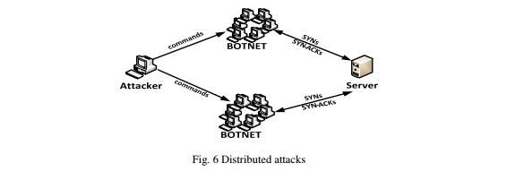

#### 3.1.2. TCP SYN Floods攻击
SYN洪泛攻击是建立在TCP开始连接时的三次握手的基础上的。 在这次握手中，如图2所示，客户端系统首先发送一个SYN消息给服务器。 然后，服务器通过向客户端发送SYN-ACK消息来确认SYN消息。 客户端然后通过响应ACK消息来完成建立连接。 客户端和服务器之间的连接随即打开，特定的服务数据可以
在客户端和服务器之间进行交换。 在服务器系统向客户端发送确认（SYN-ACK）但尚未收到ACK消息的地方，会出现滥用的可能性[10]。  

   

传输控制块（TCB）是一种传输协议数据结构，它保存连接上的所有信息，并且在从客户端接收到ACK消息之前，服务器已经接收到SYN数据包之后，连接只有一半打开。这种情况导致服务器的内核内存被传入的SYN耗尽，这会造成太多的TCB分配。 但是，操作系统通常在监听套接字中使用“backlog”参数来避免这种内存耗尽，但耗尽积压是TCP SYN洪泛攻击的目标，它尝试发送足够的SYN分段来填充整个积压的日志，导致新的连接请求被拒绝。下面的图3给出了在TCP SYN泛洪攻击中涉及的事件序列的简化。   
  
目前，在互联网上发现的TCP SYN攻击有三种变体[11]。  
i）直接攻击。 直接攻击是攻击者发送多个SYN段而不欺骗其IP源地址，并且阻止他们的操作系统响应SYN-ACK。 这个场景可以通过防火墙规则来完成，这些防火墙规则可以将外发数据包过滤到监听器（只允许SYN出去）或过滤传入数据包，以便在到达本地TCP处理代码之前丢弃任何SYN-ACK，如图  
  

ii)基于欺骗的攻击。 SYN洪泛攻击[12]使用IP地址欺骗，其中欺骗源地址处的客户端系统不响应发送给它们的SYN-ACK，或者是因为目前地址上没有客户端系统存在，或者是由于一定比例的伪造地址不会回应 ，如图5所示。  
  

iii)分布式攻击。 当攻击者利用整个互联网上的许多无人机或僵尸网络时，发生分布式SYN洪泛攻击，每个可更改的无人机使用欺骗攻击和多个欺骗性地址，这使得攻击难以被阻止或停止，如 图6  

