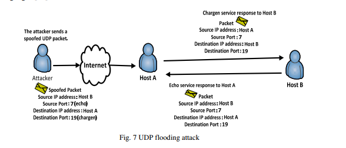
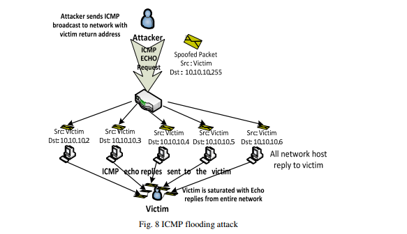

#### 3.1.3. UDP Floods  
UDP泛洪攻击是一种使用用户数据报协议（UDP）的带宽攻击。UDP是一种无连接状态的传输协议，不需要客户端和服务器建立会话，它强调的是最小延迟而不是可靠性的发送信息。通过生成大量的UDP数据包到受害系统的随机端口，可以启动UDP泛滥攻击。受害者系统将确定哪个应用程序正在等待目标端口以响应传入的UDP数据包。当实现这些服务的受害系统响应时，如果没有应用程序正在等待端口，它将响应每个带有IMCP不可达消息的伪造的源IP地址的每个UDP数据包。在这种情况下，恶意UDP发送方将IP源地址伪造成受害者的地址，因此，受害者的系统将受到多个UDP业务响应者的过载。这种类型的攻击最常用 “chargen”和“echo”服务。如图7所示，使得它们对DoS攻击有用（例如，UDP数据包由目标主机B的echo端口和目标主机A的chargen目标端口组成）[13]。chargen服务将继续生成一些随机字符并将其发送回假的源，而echo服务通过将随机字符回显给chargen而不断响应数据包。攻击者可以通过管道输出来回应并导致无限的网络活动结束流。 这种情况在两个UDP服务之间创建了一个无限循环，主机B将回应一个数据包到主机A，主机A然后响应主机B的回声端口，直到某些共享资源（例如缓冲区，链路，容量）耗尽[14]  
由于UDP是一种不可靠的协议，不会规范其发送流量速率，所以这种情况下可以很容易地让一个恶意UDP发送者伪造IP源地址为受害者。  
大多数UDP泛洪频繁用于大于1 Gbps的较大带宽DDoS攻击，因为它很容易从许多不同的脚本和编译语言中生成UPD数据包[15]。  

 

#### 3.1.4. ICMP Floods  
有时称为“Smurf”攻击或“Ping”泛洪的ICMP泛洪是基于ping的DOS攻击，它将大量ICMP数据包发送到服务器，并试图使服务器上的TCP / IP堆栈崩溃，导致 它停止响应传入的TCP / IP请求。然后，使用安装在受感染机器上的hping或自定义perl脚本来启动ICMP泛洪。 基本的SYN泛洪偶尔与ICMP泛洪一起发射[2]。当攻击者发送具有受害者欺骗性IP的ICMP请求到配置为将ICMP中继到路由器后面的所有设备的路由器的网络广播地址时，发生SMURF攻击。  
当攻击者发送具有受害者欺骗性IP的ICMP请求到配置为将ICMP中继到路由器后面的所有设备的路由器的网络广播地址时，发生SMURF攻击。当所有这些设备都回应ping，ICMP不包括握手和源IP将不被验证时，攻击被放大。 下面的图8展示了一个SMURF攻击[16]。 请参考[17]和[18]，了解更多关于aSmurf攻击的详细描述。   
  
