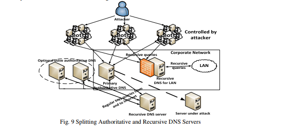
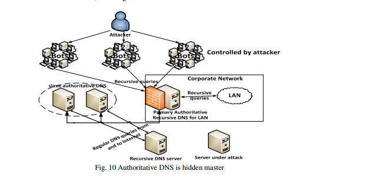

## 对当前DDos攻击使用云计算的缓解与保护技术  
目前，在小型和大型组织的网络和服务器上实施的常见的DDoS缓解和保护技术发现难以或不再能够减轻压倒性的千兆位攻击。要使这些DDoS缓解和保护技术有效，则就需要地理上分布的高互联网带宽和高处理能力的云计算。

由学术研究人员研究并由大型商用基于云的DDoS服务提供商（如Prolexic，CloudFlare，Cisco，Akamai和Arbor）用于缓解上述攻击类型的各种有效的大规模DDoS缓解和保护技术将做讨论如下：

### 4.1 DNS反射或放大攻击

#### 4.1.1. 入口过滤。  
入口过滤检查IP地址的有效性，它针对于你的网络所有出去的数据包，并被充分的记录在一个最通用实践文档BCP-38中。DNS服务器反映了依赖于被欺骗的IP地址的流量，这些IP地址通过使用这种过滤而被丢弃，并且在路由器中很容易实现，因为所有主要路由器供应商都有内置的方法来实现BCP-38 [26]。

#### 4.1.2. 限制DNS递归。

限制DNS递归[5]可以通过以下方式执行：

i) 配置您的服务器以允许递归获得授权的DNS服务器列表。

ii) 配置防火墙以阻止不来自指定的内部递归DNS服务器的DNS查询。

iii) 配置服务器以使用ISP的递归DNS服务器，然后只允许与这些服务器相关的DNS查询。

iiii) 分割您的权威和递归DNS服务器，这样递归DNS只能从LAN中访问，如图9所示。    

v) 使用隐藏的主服务器，以便只有您的从属权威DNS服务器在Internet上公开可用，如下面的图10所示  

4.1.3. DNS响应速率限制。

DNS-RRL。DNS响应速率限制是用于限制DNS服务器每秒返回的响应数量的一种实验机制。DNS放大攻击的有效性可以通过丢弃超过配置速率限制的响应来降低。有三种方法可以将响应速率限制应用于DNS服务器:由源IP地址、目标IP地址和DNS查询类型[27]。

#### 4.1.4. Anycast

Anycast允许多个、相同的、全局部署的DNS服务器发布相同的IP地址。使用Anycast，每个DNS服务器IP对应于来自不同地理位置的数百个系统。DNS服务器反映了伪造IP地址的流量，然后在距离查询客户端最近的DNS服务器上丢弃。

大多数Anycast实现都在网络层，但作者Ioannis Avramopoulos和Martin Suchara的研究已经证明，Anycast可以在应用层实现，结果表明安全性能与网络层的实现几乎相同[28]。
