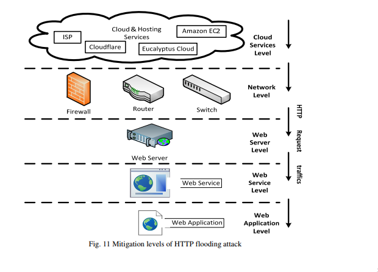

### 4.2 TCP SYN 泛洪
SYN泛洪缓解已经演变为两个类，即End-Host和Network。终端主机缓解涉及加强终端主机TCP实现，其中包括更改用于连接查找和建立的算法和数据结构。基于网络的缓解包括强化网络，这可以降低攻击先决条件的可能性，也可以插入中间件，将中间的网络中的服务器与非法的SYN隔离开来[11]。  

终端主机缓解技术包括以下内容：  

i)增加TCP积压  
ii）减少SYN-RECEIVED计时器  
iii）通过减少状态(SYN缓存)/生成0状态(SYN cookie)来操作的SYN缓存和SYN cookie最初是由接收到的SYN生成的TCB分配的，并推迟实例化完整状态。  
iv）结合两种或更多种上述技术的混合方法  

基于网络的缓解技术包括：  
i)入口过滤对于防止依赖伪造的IP数据包的SYN Flood攻击非常有效。  
ii)使用防火墙和代理通过向发起者发送欺骗SYN-ACK或者向监听者发送欺骗ACK来缓冲SYN泛滥攻击的终端主机。  
iii)使用较便宜且易于部署的主动监视设备观察并向整个网络的听众注入流量，而不需要每个监听者的操作系统实施终端主机缓解。  

经常使用终端主机和基于网络的缓解措施，并且在组合使用时通常不会产生干扰。 End-Host上的缓解优先于Network-Based，因为SYN flooding是针对终端主机的，而不是试图耗尽网络容量。  

SYN缓存技术是目前最有效和最经常使用的终端主机缓解技术; 它可以承受严重的攻击，而不会造成SYN Cookie的负面影响，并且在许多混合方法中不需要使用启发式阈值设置。  

对于基于网络的缓解，防火墙/代理的SYN-ACK欺骗和ACK-spoofing产生相同的效果; 比起防火墙/代理主动监视器是首选，因为它们成本低，管理简单，并且入口和出口过滤通常用作良好的互联网安全实践。  

### 4.3 UDP 泛洪  

由于最近由一群名为Anonymous的互联网活动家发起的高调攻击，UDP泛滥攻击已经变得突出了[29,30]。一种名为LOIC（低轨道离子加农炮）的DoS攻击工具可以在网络上广泛使用，该工具使用UDP数据包执行泛洪攻击。为了减轻UDP洪泛攻击的影响，已经提出了几种方法来抑制这些类型的攻击，如禁止UDP服务，限制UDP流量，保护代理服务器，配置路由器停止IP定向广播传输。例如，Komatsu等人 [31]进行了一个模拟，使用CHOKe与ACC（复杂带宽控制）作为拥塞控制方法来证明限速方法在减轻UDP洪水攻击方面的有效性。  

### 4.4　ICMP 泛洪  

正如Prolexic 2013年第一季度报告所述，ICMP洪水攻击在过去几个季度失去了知名度。 互联网上的攻击手段越来越有效和隐蔽，越来越成功。目前这些依靠路由器服务大型多址广播网络来构建IP广播地址的攻击，在网络运营商通过配置其路由器而拒绝向网络的广播地址转发ICMP请求的情况下容易停止。有一些操作系统允许配置来防止你的服务器被用作中介，并且对ICMP数据包（不通过本地网络上的路由器）转发给IP广播[17]作出响应。  

### 4.5 HTTP 泛洪攻击  

协议中的漏洞是造成泛洪攻击的主要原因。在想泛洪攻击的缓解方法时必须考虑系统/协议设计的角度，以确保其有效并能成功的实现。  

服务于应用层的HTTP协议用于启动HTTP Flood攻击，可以通过IPS（入侵检测系统）或WAF（Web应用防火墙）等应用层安全设备进行检测和分析。对于OSI模型不同层的其他安全设备，HTTP响应的TCP连接数是唯一的检测方法，以防止和阻止HTTP洪水攻击。  

如图11所示，HTTP Flood攻击可以在5个主要级别上得到缓解，即云服务级别，网络级别，Web服务器级别，Web服务级别和Web应用级别[32]：

云服务级别和网络级别是到达Web服务器之前检测和阻止HTTP Flood攻击的最重要的级别。  
  

#### 4.5.1. IOSEC HTTP防洪/拒绝服务安全网关模块。  

作者Gokhan Muharremoglu [32]提出了一种针对HTTP Flood攻击，IOSEC HTTP反洪泛/DOS安全网关模块。这种方法可以概括为以下3个步骤：  

i）根据之前定义的规则检测异常过量请求的IP地址，
ii）为了减少攻击面，请返回请求的响应使用少量的资源（例如空白页），  
iii）使用其他缓解级别的其他组件（例如，WAF，Web服务器/服务）阻止检测到的IP地址。  

有兴趣的读者可以参考[32]获取IOSEC HTTP反洪泛/ DoS安全网关模块的更详细的描述。  

#### 4.5.2. 用聚类和信息理论测量来检测HTTP-GET攻击。  

作者Chwalinski等[33]最近提出了一种离线聚类技术，该技术使用基于熵的聚类和信息理论测量的应用来区分超过80%的合法和攻击序列，而不考虑HTTP注入攻击者所选择的策略。  

作者通过分析攻击者不知道也不能重现的Web请求的实际顺序，将他们的研究重点放在了实际Web用户最近的行为上。经常变化和很少变化两种类型的攻击主机，是所提出的技术的目标。  

#### 4.5.3. 在三种不同的攻击情况下检测HTTP GET洪泛攻击。  

作者Das等人 [34]提出了一种HTTP GET泛洪攻击的检测方法，在以下三种不同的情况下命名：  

i）随机泛滥App-DoS，将HTTP请求到达与输入阈值进行比较。  
ii）Shrew Flooding App-DoS，通过生成合法访问模式（LAP）和计算模式不一致（PD）来检测攻击。  
iii）Flash Crowds App-DoS，它使用称为DSB的检测机制来执行攻击数据集的离线分析。  

#### 4.5.4. Arbor的Peakflow SP和Peakflow SP TMS可以阻止应用层DDoS攻击。  

Peakflow SP和Peakflow SP TMS是Arbor提供的在应用层上停止DDoS攻击的商业解决方案。 Peakflow SP是一种非常流行和有效的DDoS缓解解决方案，能够检测带宽消耗，连接层耗尽和应用程序攻击。 世界上大多数互联网服务提供商将这一解决方案作为其主要的DDoS检测和手术缓解措施之一。  

Arbor主要依靠Peakflow SP解决方案中的Peakflow SP威胁管理系统（TMS）来检测和缓解HTTP洪水攻击。这种方法是一种健壮的应用程序智能系统，用于多服务聚合网络，通过耦合高级别的威胁识别和数据包层分析来加速修复。它还提供了在网络上运行的关键应用程序的可见性，并且可以监视关键的应用程序性能指标[21]。  

### 5. 总结  

本研究对目前最流行的DDoS攻击类型和缓解进行了全面的调查和分析。  

在这次调查中，我们已经在Spamhaus.org上提供了一个完整的分析，说明当前最大的DNS反射攻击的产生和缓解，超过300Gbps。 这个分析之后，在基础设施和应用层讨论当前最流行的DDoS攻击类型（DNS反射攻击，SYN泛滥，UDP泛滥，ICMP泛滥和HTTP泛滥攻击）。  

针对本次调查中目前最流行的DDoS攻击类型，我们广泛讨论了学术研究人员和大型商用云端DDoS服务提供商提出的各种有效的基于云的DDoS缓解和保护技术。  

### 参考  

[1] M. Prince, "The Ddos That Knocked Spamhaus Offline (And How We Mitigated It),"  Vol. 2013, Ed: Cloudflare, March 20, 2013 P.Web Log Post.  

[2] Prolexic Technologies, "Prolexic Quarterly Global Ddos Attack Report Q1 2013," Florida2013.  

[3] Akamai  Technologies.  (2013).  The  State  Of  The  Internet  4th  Quarter,  2012  Report.  5.  Available:
Http://Www.Akamai.Com/Dl/Akamai/Akamai_Soti_Q412_Exec_Summary.Pdf   

[4] D.  Anstee,  D.  Bussiere,  And  G.  Sockrider.  (2013). Worldwide  Infrastructure  Security  Report  2012 Viii. Available: Http://Pages.Arbornetworks.Com/Rs/Arbor/Images/Wisr2012_En.Pdf  

[5] Cert.(2013,April 15). Dns Amplification Attacks And Open  Dns Resolvers. Available:
Https://Www.Cert.Be/Pro/Docs/Dns-Amplification-Attacks-And-Open-Dns-Resolvers  

[6] G. Lindsay. (2012,March 10). Dnssec And Dns Amplification    Attacks. Available:
Http://Technet.Microsoft.Com/En-Us/Security/Hh972393.Aspx  

[7] R. Beverly And S. Bauer, "The Spoofer Project: Inferring The Extent Of Source Address Filtering On The  Internet,"  Presented  At The Proceedings  Of  The Steps  To  Reducing  Unwanted  Traffic  On  The Internet On Steps To Reducing Unwanted Traffic On The Internet Workshop, Cambridge, Ma, 2005.  

[8] P. Vixie. (August 1999, Rfc 2671 ,   Extension   Mechanisms   For Dns (Edns0). Available: Http://Tools.Ietf.Org/Html/Rfc2671  

[9] Dnssec.Net. (2013).   Dnssec:   Dns   Security   Extensions   Securing   The   Domain   Name   System. Available:Http://Www.Dnssec.Net/  

[10] T.  Peng,  C.  Leckie,  And  K.  Ramamohanarao,  "Survey  Of  Network-Based  Defense  Mechanisms Countering The Dos And Ddos Problems," Acm Comput. Surv., Vol. 39, P. 3, 2007.  

[11] W.  M.  Eddy,  "Defenses  Against  Tcp  Syn  Flooding
  Attacks,"  The  Internet  Protocol  Journal  Vol.  9, 2006.  

[12] D.  S.  Paul  Ferguson.  (2000,  Network  Ingress  Filtering:  Defeating  Denial  Of  Service  Attacks  Which
Employ Ip Source Address Spoofing. 1-10. Available:
 Http://Www.Ietf.Org/Rfc/Rfc2827.Txt  

[13] Cert.   (1997,   Cert®   Advisory   Ca-1996-01   Udp   Port   Denial-Of-Service   Attack.   Available:
Http://Www.Cert.Org/Advisories/Ca-1996-01.Html  

[14] T.  Bowman,  "Incident  Handling  And  Hacker  Exploits  Certification  Practical  Version  1.5c,"  Sans
Institutemay 10, 2013 2001.  

[15] M.  Sauter,  ""Loic  Will  Tear  Us  Apart":  The  Impact  Of  Tool  Design  And  Media  Portrayals  In  The Success Of Activist Ddos Attacks," American Behavioral Scientist, P. 0002764213479370.   

[16] M. Prince, "Deep Inside A Dns Amplification Ddos Attack,"  Vol. 2013, Ed: Cloudflare, October 30,2012 P. Web Log Post.   

[17]  Cert.   (2000,   Cert®   Advisory   Ca-1998-01   Smurf   Ip   Denial-Of-Service   Attacks.   Available:
Http://Www.Cert.Org/Advisories/Ca-1998-01.Html  

[18]  C.  A.  Huegen.  (2000,  The  Latest  In  Denial  Of  Service  Attacks:  "Smurfing"  Description  And Information   To   Minimize   Effects.   Available:   Http://
Www.Pentics.Net/Denial-Of-Service/White-Papers/Smurf.Cgi  

[19]  A.  Litan.  (2013,  Arming  Financial  And  E-Commerce  Services  Against  Top  2013  Cyberthreats. Available: Http://Www.Gartner.Com/Technology/Reprints.Do?Id=1-1f9xfpx&Ct=130429&St=Sb   

[20]  S.  Mcgregory,  "Preparing  For  The  Next  Ddos  Attack,"  Network  Security,  Vol.  2013,  Pp.  5-6,  5// 2013.  

[21] Arbor Networks, "The Growing Threat Of Application-Layer Ddos Attacks," 2012.  

[22] S.  Ranjan,  R.  Swaminathan,  M.  Uysal,  And  E.  Knightly,  "Ddos-Resilient  Scheduling  To  Counter Application  Layer  Attacks  Under  Imperfect  Detection,"  In  Infocom  2006.  25th  Ieee  International Conference On Computer Communications. Proceedings,2006, Pp. 1-13.   

[23] D. Watson, "Web Application Attacks," Network Security, Vol. 2007, Pp. 10-14, 10// 2007.  

[24] C. Linhart, A. Klein, R. Heled, And S. Orrin, "Http Request Smuggling," Computer Security Journal, Vol. 22, Pp. 13-26, 2006.  

[25] S. Heron, "Denial Of Service: Motivations And Trends," Network Security, Vol. 2010, Pp. 10-12, 5// 2010.  

[26] T.  Rozekrans  And  J.  D.  Koning.  (2013,  Defending  Against  Dns  Reflection  Amplication  Attacks. System & Network Engineering Rp1.  

[27] S.  Lima,  "3  Ways  To  Use  Dns  Rate  Limit  Against
  Ddos  Attacks,"    Vol.  2013,  Ed:  Cloudshield January 29, 2013 P. Web Log Post.  

[28] I.  Avramopoulos  And  M.  Suchara,  "Protecting  The  Dns  From  Routing  Attacks:  Two  Alternative Anycast Implementations," Security & Privacy, Ieee,Vol. 7, Pp.14-20,2009.  

[29] Cert. (2012, May 7). "Anonymous" Ddos Activity.
Available: Http://Www.Us-Cert.Gov/Ncas/Alerts/Ta12-024a  

[30] A. S. Aiko Pras, Giovane C. M. Moura, Idilio Drago, Rafael Barbosa, Ramin Sadre, Ricardo Schmidt,Rick  Hofstede,  "Attacks  By  “Anonymous”  Wikileaks  Proponents  Not  Anonymous,"  University  Of Twente, Enschede, The Netherlands2010.  

[31] T.  Komatsu  And  A.  Namatame,  "On  The  Effectiveness  Of  Rate-Limiting  Methods  To  Mitigate Distributed  Dos  (Ddos) Attacks(<Special  Section>New Challenge  For  Internet  Technology  And  Its Architecture)," Ieice Transactions On Communications, Vol. 90, Pp. 2665-2672, 2007/10/01 2007.   

[32] G. Muharremoğlu. (2012) Web Application Level Approach Against  The Http  Flood Attacks :  Iosec Http  Anti  Flood/Dos  Security  Gateway  Module.  Hakin9 -  It  Security  Magazine.  56-59.  Available: Http://Www.Iosec.Org/Hakin9_11_2012_Iosec.Pdf   

[33] P.  Chwalinski,  R.  Belavkin,  And  X.  Cheng,  "Detection  Of  Http-Get  Attack  With  Clustering  And Information  Theoretic  Measurements,"  In  Foundations And  Practice  Of  Security.  Vol.  7743,  J. Garcia-Alfaro, F. Cuppens, N.Cuppens-Boulahia, A. Miri,  And N. Tawbi, Eds., Ed: Springer  Berlin Heidelberg, 2013, Pp. 45-61.  

[34] D.  Das,  U.  Sharma,  And  D.  K.  Bhattacharyya,  "Detection  Of  Http  Flooding  Attacks  In  Multiple Scenarios," Presented At The Proceedings Of The 2011 International Conference On Communication, Computing &#38; Security, Rourkela, Odisha, India, 2011.   

### 作者  

Fui Fui Wong现任博士学位。 同济大学计算机科学与技术系候选人。 她于2004年获得澳大利亚卧龙岗大学信息与通信技术硕士学位。她的研究兴趣是网络安全和云计算。  

Cheng  Xiang  Tan教授是同济大学计算机科学与技术系教授。 他获得博士学位 1994年获得中国西北工业大学学士学位。他是信息安全标准化委员会，中国公安部成员，中国国家计算机网络犯罪计算机取证顾问，中国国家计算机攻击研究中心副主任 和病毒。 他的研究活动主要集中在信息安全，手机和移动安全领域，对数字取证工作特别感兴趣。
