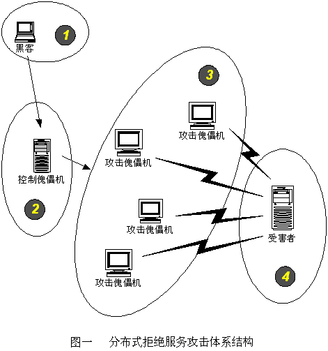

## DDOS 攻击简单的介绍
分布式拒绝服务(DDoS:Distributed Denial of Service)攻击指借助于客户/服务器技术，将多个计算机联合起来作为攻击平台，对一个或多个目标发动DDoS攻击，从而成倍地提高拒绝服务攻击的威力。通常，攻击者使用一个偷窃帐号将DDoS主控程序安装在一个计算机上，在一个设定的时间主控程序将与大量代理程序通讯，代理程序已经被安装在网络上的许多计算机上。代理程序收到指令时就发动攻击。利用客户/服务器技术，主控程序能在几秒钟内激活成百上千次代理程序的运行。
#### 形象的解释
一群恶霸试图让对面那家有着竞争关系的商铺无法正常营业，他们会采取什么手段呢？（只为举例，切勿模仿）恶霸们扮作普通客户一直拥挤在对手的商铺，赖着不走，真正的购物者却无法进入；或者总是和营业员有一搭没一搭的东扯西扯，让工作人员不能正常服务客户；也可以为商铺的经营者提供虚假信息，商铺的上上下下忙成一团之后却发现都是一场空，最终跑了真正的大客户，损失惨重。此外恶霸们完成这些坏事有时凭单干难以完成，需要叫上很多人一起。嗯，网络安全领域中DoS和DDoS攻击就遵循着这些思路。

在信息安全的三要素——“保密性”、“完整性”和“可用性”中，DoS（Denial of Service），即拒绝服务攻击，针对的目标正是“可用性”。该攻击方式利用目标系统网络服务功能缺陷或者直接消耗其系统资源，使得该目标系统无法提供正常的服务。

DdoS的攻击方式有很多种，最基本的DoS攻击就是利用合理的服务请求来占用过多的服务资源，从而使合法用户无法得到服务的响应。单一的DoS攻击一般是采用一对一方式的，当攻击目标CPU速度低、内存小或者网络带宽小等等各项指标不高的性能，它的效果是明显的。随着计算机与网络技术的发展，计算机的处理能力迅速增长，内存大大增加，同时也出现了千兆级别的网络，这使得DoS攻击的困难程度加大了-目标对恶意攻击包的"消化能力"加强了不少。这时候分布式的拒绝服务攻击手段（DDoS）就应运而生了。DDoS就是利用更多的傀儡机（肉鸡）来发起进攻，以比从前更大的规模来进攻受害者。  

跟详细的介绍见参考链接,参考百度百科介绍，我认为解释很好。

[参考链接](https://baike.baidu.com/item/%E5%88%86%E5%B8%83%E5%BC%8F%E6%8B%92%E7%BB%9D%E6%9C%8D%E5%8A%A1%E6%94%BB%E5%87%BB/3802159?fromtitle=DDOS&fromid=444572#1)
