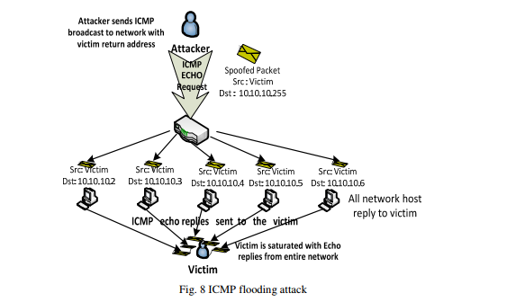

国际网络安全及其应用杂志（IJNSA），第6卷，第3期，2014年5月

# 大规模DDOS攻击和基于云的缓解趋势的调查

中国上海同济大学计算机科学与技术系

## 抽象的解释

现在的分布式拒绝服务（DDos）攻击通过宽带上网已经被放大到千兆比特数量；同时，在小型和大型组织的网络和服务器中使用更强大的僵尸网络和常见的DDoS缓解和保护解决方案已不再有效。我们的调查用超过300 Gbps的宽带深入研究了Spamhaus.org官网目前最大的DNS反射攻击。最后，讨论了由学术研究人员和大型基于商业云的DDoS服务提供商提出的有效的基于云的DDoS缓解和保护技术。

## 关键词

DoS，DDoS，DNS反射或放大攻击，SYN Flood，UDP Flood，ICMP Flood，HTTP Flood攻击。

## 1.介绍

2013年3月，Spamhaus官网遭受了最大的分布式拒绝服务攻击（DDoS）攻击，估计大小超过300 Gbps [1]。CloudFlare采用基于云的DDoS保护解决方案，旨在减轻此次攻击。根据Prolexic的“2013年第1季度全球DDoS攻击报告”，目前超过10％的大规模DDoS攻击已超过60Gbps，超过75％的攻击针对基础设施（第3层和第4层），带宽容量和路由基础架构; 剩余的攻击在应用层[2]。

在DDoS攻击中，攻击者试图暂时中断或暂停某个服务网站，使其不可用于用户。2012年Akamai第四季度互联网状况报告指出，2012年共发生768起DDoS攻击。针对商业部门企业的三分之一（269或35％）的袭击事件中，有164起（22％）攻击媒体和娱乐公司，155起攻击（20％）针对的企业包括金融服务，110个攻击（14％）针对高科技公司，70个攻击（9％）针对公共部门机构[3]。这些攻击对目标公司或组织造成收入损失，客户满意度和品牌资产损失。

本次调查旨在为目前最受欢迎的大规模攻击中使用的DDoS攻击类型提供全面的更新，并讨论各种有效的基于云的DDOS缓解和保护技术。在调查的第二部分中，我们首先详细介绍了目前对Spamhaus的DDoS攻击。 然后，我们将在第三节中讨论当前最受欢迎的基础设施（第3层和第4层）和应用层攻击类型。第4节讨论了各种有效的基于云的DDOS缓解和保护技术，最后，我们在第5节中提出我们的结论。

## 2. 在SPAMHAUS的DDos攻击历史

spamhaus.org是一个在线提供反垃圾邮件过滤服务的Spamhaus网站，2013年3月18日，受到超过100 Gbps的大量DDoS的攻击。 这种攻击是巨大的，饱和了他们的互联网连接; 访问他们的网站是不可能的。 这些攻击被分类为第3层攻击，并且难以用软件解决方案解决，因为与可处理的流量相比，由于超量的网络流量使路由器饱和。 那时候攻击者的身份是不知道的。

这些大型的第3层攻击有许多来源，并且是分布式的，其中源发送流量来洪泛目标的互联网位置。 一群一起工作的个人，被盗用的电脑僵尸网络，受到攻击的服务器僵尸网络，配置错误的DNS解析器，甚至是密码较弱的家庭互联网路由器都有可能是攻击流量的来源。

因为通过发送包含源IP的欺骗信息的随机数据包来启动第三层攻击，因此IP过滤的DDoS防范技术将不再有效，接收到的响应将被忽略。 CloudFlare是一家提供基于云的DDoS防护解决方案的公司，Spamhaus聘请了CloudFlare来缓解这种攻击，该网站在几个小时内就可以投入使用。

### 2.1 生成75 Gbps DDoS攻击Spamhaus
 自2012年以来，DNS反射攻击已经成为最大的三层DDoS攻击的主要来源。 Spamhaus最大的攻击流量来自DNS反射。

Spamhaus的攻击者首先从开放的DNS解析器请求用于ripe.net的DNS区域文件。分配给Spamhaus的CloudFlare IP在攻击者的DNS请求中被欺骗。DNS区域文件通过打开解析程序进行响应，该解析程序生成大约75 Gbps的攻击通信量，这是由放大的36字节请求导致的3,000字节响应。

Spamhaus攻击涉及30,000个独特的DNS解析器。 每个开放的DNS解析器都发送一个2.5 Mbps的DNS区域文件，这是大多数DNS解析器所允许的。然后，攻击者只使用DNS放大，并控制一个僵尸网络或服务器群集生成一个750 Mbps的DNS区域文件。

### 2.2 减少75 Gbps DDoS攻击Spamhaus
CloudFlare使用Anycast来减轻Spamhaus的75 Gbps DDoS攻击。 Anycast将对Spamhaus的攻击分散到全球23个CloudFlare数据中心。 每个数据中心都使用同一个Spamhaus的IP地址，导致流量不能被定位到任何一个地点。 这种攻击不是多对一的攻击，而是多对多的攻击，无法造成网络任何一个点的瓶颈。 在这次攻击分散之后，在到达Spamhaus服务器之前，在每个CloudFlare数据中心停止了三层攻击。  

## 3. 大量DDoS攻击类型当前呈上升趋势
开放系统互连（OSI）模型将通信系统分成七个逻辑层。 每一层都有自己独特的安全挑战，并且容易受到拒绝服务（DOS）攻击或分布式拒绝服务（DDoS）攻击。 分布式拒绝服务攻击最近两年的呈上升趋势的主要分为两类攻击：基础设施（第三层和第四层）攻击和应用程序（第七层）攻击。 第一类攻击是基础设施攻击，通过发送非常大量的虚假请求，试图淹没带宽容量和路由基础设施。 第二类应用程序攻击利用了特定应用程序的限制，导致性能下降或最终导致远程服务器崩溃。
### 3.1 基础设施（第3和第4层）攻击
本节介绍当前OSI模型中网络层（Layer 3）和传输层（Layer 4）上最流行的DDoS攻击类型：  
─ DNS反射攻击  
─ TCP SYN floods  
─ UDP floods  
─ ICMP floods

根据已发表的主导产业安全报告统计记录[2-4]，这些攻击类型是恶意行为者的主要关注点，并将继续处于全球威胁的首位。
#### 3.1.1. 域名服务器（DNS）反射或放大攻击。
DNS反射或放大攻击是一种分布式拒绝服务（DDoS）攻击，其中攻击者向开放的DNS解析器发送DNS名称查找请求，源地址被欺骗为受害者的地址。 当DNS服务器发送DNS记录响应时，它将被发送给受害者（在欺骗请求中使用的源地址）。 由于响应的大小通常大于请求的大小，所以攻击者可以放大指向受害者的交通量。 通过利用僵尸网络执行额外的欺骗性DNS查询，攻击者可以通过很少的努力产生大量的流量，如图1所示。由于响应是来自有效名称服务器的合法数据，因此阻止这些类型的攻击是非常困难的。  
  
图一 DNS反射攻击    
DNS反射攻击可以通过以下方式[6]来实现：  

打开递归。 开放的DNS解析器被称为Internet上的服务器，启用递归，并向任何人提供递归DNS响应。 通过开放式解析程序项目（Open Resolver Project）可知，目前互联网上约有2700万个开放的DNS解析器。 开放的DNS解析器是放大的来源，收到一个小的DNS查询后返回一个更大的DNS响应。  

源地址欺骗。 DNS放大攻击类似于“Smurf”攻击，其中DNS查询的源地址被发送者以外的返回地址欺骗。 然后，一个开放的解析器返回一个不正确地发送到欺骗地址的DNS响应[7]。  

僵尸网络。 在DNS放大攻击中，攻击者损害了被称为僵尸网络的在线计算机组，用于发送DNS查询以打开解析器。  

恶意软件。 被恶意软件感染的僵尸网络计算机触发DNS放大攻击。 如果没有DNS扩展机制（EDNS0）[8]，一个64字节的查询将导致一个8x放大的512字节的UDP回复，允许DNS请求者通告它们的UDP数据包大小并且便于大于512字节的数据包的传输。  

DNSSEC。 DNSSEC（DNS安全扩展的缩写）[9]允许DNS服务器验证DNS响应，并防止添加了加密签名的高速缓存中毒攻击，从而导致需要EDNS0支持的更大的DNS消息大小。 由于支持DNSSEC的服务器也将在DNS响应中支持较大的UDP数据包，因此DNSSEC一直被批评为造成DNS放大攻击。  

#### 3.1.2. TCP SYN Floods攻击
SYN洪泛攻击是建立在TCP开始连接时的三次握手的基础上的。 在这次握手中，如图2所示，客户端系统首先发送一个SYN消息给服务器。 然后，服务器通过向客户端发送SYN-ACK消息来确认SYN消息。 客户端然后通过响应ACK消息来完成建立连接。 客户端和服务器之间的连接随即打开，特定的服务数据可以
在客户端和服务器之间进行交换。 在服务器系统向客户端发送确认（SYN-ACK）但尚未收到ACK消息的地方，会出现滥用的可能性[10]。  

   

传输控制块（TCB）是一种传输协议数据结构，它保存连接上的所有信息，并且在从客户端接收到ACK消息之前，服务器已经接收到SYN数据包之后，连接只有一半打开。这种情况导致服务器的内核内存被传入的SYN耗尽，这会造成太多的TCB分配。 但是，操作系统通常在监听套接字中使用“backlog”参数来避免这种内存耗尽，但耗尽积压是TCP SYN洪泛攻击的目标，它尝试发送足够的SYN分段来填充整个积压的日志，导致新的连接请求被拒绝。下面的图3给出了在TCP SYN泛洪攻击中涉及的事件序列的简化。   
  
目前，在互联网上发现的TCP SYN攻击有三种变体[11]。  
i）直接攻击。 直接攻击是攻击者发送多个SYN段而不欺骗其IP源地址，并且阻止他们的操作系统响应SYN-ACK。 这个场景可以通过防火墙规则来完成，这些防火墙规则可以将外发数据包过滤到监听器（只允许SYN出去）或过滤传入数据包，以便在到达本地TCP处理代码之前丢弃任何SYN-ACK，如图  
  

ii)基于欺骗的攻击。 SYN洪泛攻击[12]使用IP地址欺骗，其中欺骗源地址处的客户端系统不响应发送给它们的SYN-ACK，或者是因为目前地址上没有客户端系统存在，或者是由于一定比例的伪造地址不会回应 ，如图5所示。  
  

iii)分布式攻击。 当攻击者利用整个互联网上的许多无人机或僵尸网络时，发生分布式SYN洪泛攻击，每个可更改的无人机使用欺骗攻击和多个欺骗性地址，这使得攻击难以被阻止或停止，如 图6  

#### 3.1.3. UDP Floods  
UDP泛洪攻击是一种使用用户数据报协议（UDP）的带宽攻击。UDP是一种无连接状态的传输协议，不需要客户端和服务器建立会话，它强调的是最小延迟而不是可靠性的发送信息。通过生成大量的UDP数据包到受害系统的随机端口，可以启动UDP泛滥攻击。受害者系统将确定哪个应用程序正在等待目标端口以响应传入的UDP数据包。当实现这些服务的受害系统响应时，如果没有应用程序正在等待端口，它将响应每个带有IMCP不可达消息的伪造的源IP地址的每个UDP数据包。在这种情况下，恶意UDP发送方将IP源地址伪造成受害者的地址，因此，受害者的系统将受到多个UDP业务响应者的过载。这种类型的攻击最常用 “chargen”和“echo”服务。如图7所示，使得它们对DoS攻击有用（例如，UDP数据包由目标主机B的echo端口和目标主机A的chargen目标端口组成）[13]。chargen服务将继续生成一些随机字符并将其发送回假的源，而echo服务通过将随机字符回显给chargen而不断响应数据包。攻击者可以通过管道输出来回应并导致无限的网络活动结束流。 这种情况在两个UDP服务之间创建了一个无限循环，主机B将回应一个数据包到主机A，主机A然后响应主机B的回声端口，直到某些共享资源（例如缓冲区，链路，容量）耗尽[14]  
由于UDP是一种不可靠的协议，不会规范其发送流量速率，所以这种情况下可以很容易地让一个恶意UDP发送者伪造IP源地址为受害者。  
大多数UDP泛洪频繁用于大于1 Gbps的较大带宽DDoS攻击，因为它很容易从许多不同的脚本和编译语言中生成UPD数据包[15]。  
  

#### 3.1.4. ICMP Floods  
有时称为“Smurf”攻击或“Ping”泛洪的ICMP泛洪是基于ping的DOS攻击，它将大量ICMP数据包发送到服务器，并试图使服务器上的TCP / IP堆栈崩溃，导致 它停止响应传入的TCP / IP请求。然后，使用安装在受感染机器上的hping或自定义perl脚本来启动ICMP泛洪。 基本的SYN泛洪偶尔与ICMP泛洪一起发射[2]。当攻击者发送具有受害者欺骗性IP的ICMP请求到配置为将ICMP中继到路由器后面的所有设备的路由器的网络广播地址时，发生SMURF攻击。  
当攻击者发送具有受害者欺骗性IP的ICMP请求到配置为将ICMP中继到路由器后面的所有设备的路由器的网络广播地址时，发生SMURF攻击。当所有这些设备都回应ping，ICMP不包括握手和源IP将不被验证时，攻击被放大。 下面的图8展示了一个SMURF攻击[16]。 请参考[17]和[18]，了解更多关于aSmurf攻击的详细描述。   
   

### 3.2应用程序（第7层）攻击  
应用层DDoS攻击在复杂性和流行性方面不断增长。 研究公司Gartner预测，2013年25％的DDoS攻击将是应用级的，该报告名为“针对2013年网络威胁的武装金融和电子商务服务”[19]。 应用层中的DDoS攻击尝试使用Web Flood攻击特定的服务; 例如，HTTP泛洪攻击会向服务器发送高速率的合法应用层请求，企图淹没服务器资源。 这些攻击一般消耗很少的带宽，而且更难识别，因为攻击者通过大量的合法请求攻击受害者服务器[20]。  
#### 3.2.1. 常见的应用层DDoS攻击类型  
应用层攻击可以细分为四类[21] [22]：  
i）当大量的合法应用层请求（例如，HTTP GET，DNS查询和SIP INVITE）被发送到服务器以覆盖其会话资源时，发生请求泛洪攻击。  
ii）非对称攻击发生在消耗大量服务器资源（如CPU，内存或磁盘空间）的正常请求发送到Web服务器，目的是严重降低其服务或将服务器完全关闭。  
iii)当多个TCP会话中的高工作量请求被发送到服务器时，发生重复的一次性攻击，目的是降低或降低服务器的服务。 这些攻击与执行请求泛洪和非对称应用层攻击类似。  
iv)应用程序漏洞攻击通过服务器的操作系统或应用程序中造成故障而攻击应用程序中的漏洞，并允许攻击者获得应用程序、系统或网络的控制权。脚本漏洞，缓冲区溢出，cookie中毒，隐藏域操作，跨站点脚本和结构化查询语言（SQL）注入是这些攻击的例子[23]。  

#### 3.2.2. HTTTP Flood 攻击.  
根据Prolexic 2013年第一季度全球DDoS攻击报告，总DDOS攻击中有23.46％发生在应用程序（第7层）攻击中，19.33％的DDOS攻击以HTTP GET泛洪的形式出现，代表了大部分应用攻击。Http Post Flood使攻击者能够将大量数据发布到应用程序，是应用程序攻击中第二流行的，占DDoS攻击的1.43％[2]。  

有三种类型的HTTP泛洪可以发起，如下[21]：  

i)当无效HTTP数据包发送到Web服务器耗尽服务器资源时，会发生HTTP格式错误攻击。这种类型攻击的一个例子是Zafi.B蠕虫，它是使用格式不正确的HTTP GET请求进行攻击。  
ii)当不同类型的合法HTTP请求（即，HTTP GETS和POSTS）被发送到Web服务器，试图通过消耗服务器资源来泛洪它们时[24] 会发生HTTP请求攻击。  
iii)HTTP空闲（HTTP Idle）攻击发生在HTTP连接打开并且处于空闲状态而未实际发送攻击的完整HTTP请求时。这种攻击的一个例子是“slowloris”[25]，其中包括无限期地运送每个数据包的少量字节，以防止连接超时，但永远无法完成请求。  

## 4. 对当前DDos攻击使用云计算的缓解与保护技术  
目前，在小型和大型组织的网络和服务器上实施的常见的DDoS缓解和保护技术发现难以或不再能够减轻压倒性的千兆位攻击。要使这些DDoS缓解和保护技术有效，则就需要地理上分布的高互联网带宽和高处理能力的云计算。

由学术研究人员研究并由大型商用基于云的DDoS服务提供商（如Prolexic，CloudFlare，Cisco，Akamai和Arbor）用于缓解上述攻击类型的各种有效的大规模DDoS缓解和保护技术将做讨论如下：

### 4.1 DNS反射或放大攻击

#### 4.1.1. 入口过滤。  
入口过滤检查IP地址的有效性，它针对于你的网络所有出去的数据包，并被充分的记录在一个最通用实践文档BCP-38中。DNS服务器反映了依赖于被欺骗的IP地址的流量，这些IP地址通过使用这种过滤而被丢弃，并且在路由器中很容易实现，因为所有主要路由器供应商都有内置的方法来实现BCP-38 [26]。

#### 4.1.2. 限制DNS递归。

限制DNS递归[5]可以通过以下方式执行：

i) 配置您的服务器以允许递归获得授权的DNS服务器列表。

ii) 配置防火墙以阻止不来自指定的内部递归DNS服务器的DNS查询。

iii) 配置服务器以使用ISP的递归DNS服务器，然后只允许与这些服务器相关的DNS查询。

iiii) 分割您的权威和递归DNS服务器，这样递归DNS只能从LAN中访问，如图9所示。    

v) 使用隐藏的主服务器，以便只有您的从属权威DNS服务器在Internet上公开可用，如下面的图10所示  

#### 4.1.3. DNS响应速率限制。

DNS-RRL。DNS响应速率限制是用于限制DNS服务器每秒返回的响应数量的一种实验机制。DNS放大攻击的有效性可以通过丢弃超过配置速率限制的响应来降低。有三种方法可以将响应速率限制应用于DNS服务器:由源IP地址、目标IP地址和DNS查询类型[27]。

#### 4.1.4. Anycast

Anycast允许多个、相同的、全局部署的DNS服务器发布相同的IP地址。使用Anycast，每个DNS服务器IP对应于来自不同地理位置的数百个系统。DNS服务器反映了伪造IP地址的流量，然后在距离查询客户端最近的DNS服务器上丢弃。

大多数Anycast实现都在网络层，但作者Ioannis Avramopoulos和Martin Suchara的研究已经证明，Anycast可以在应用层实现，结果表明安全性能与网络层的实现几乎相同[28]。  

### 4.2 TCP SYN 泛洪
SYN泛洪缓解已经演变为两个类，即End-Host和Network。终端主机缓解涉及加强终端主机TCP实现，其中包括更改用于连接查找和建立的算法和数据结构。基于网络的缓解包括强化网络，这可以降低攻击先决条件的可能性，也可以插入中间件，将中间的网络中的服务器与非法的SYN隔离开来[11]。  

终端主机缓解技术包括以下内容：  

i)增加TCP积压  
ii）减少SYN-RECEIVED计时器  
iii）通过减少状态(SYN缓存)/生成0状态(SYN cookie)来操作的SYN缓存和SYN cookie最初是由接收到的SYN生成的TCB分配的，并推迟实例化完整状态。  
iv）结合两种或更多种上述技术的混合方法  

基于网络的缓解技术包括：  
i)入口过滤对于防止依赖伪造的IP数据包的SYN Flood攻击非常有效。  
ii)使用防火墙和代理通过向发起者发送欺骗SYN-ACK或者向监听者发送欺骗ACK来缓冲SYN泛滥攻击的终端主机。  
iii)使用较便宜且易于部署的主动监视设备观察并向整个网络的听众注入流量，而不需要每个监听者的操作系统实施终端主机缓解。  

经常使用终端主机和基于网络的缓解措施，并且在组合使用时通常不会产生干扰。 End-Host上的缓解优先于Network-Based，因为SYN flooding是针对终端主机的，而不是试图耗尽网络容量。  

SYN缓存技术是目前最有效和最经常使用的终端主机缓解技术; 它可以承受严重的攻击，而不会造成SYN Cookie的负面影响，并且在许多混合方法中不需要使用启发式阈值设置。  

对于基于网络的缓解，防火墙/代理的SYN-ACK欺骗和ACK-spoofing产生相同的效果; 比起防火墙/代理主动监视器是首选，因为它们成本低，管理简单，并且入口和出口过滤通常用作良好的互联网安全实践。  

### 4.3 UDP 泛洪  

由于最近由一群名为Anonymous的互联网活动家发起的高调攻击，UDP泛滥攻击已经变得突出了[29,30]。一种名为LOIC（低轨道离子加农炮）的DoS攻击工具可以在网络上广泛使用，该工具使用UDP数据包执行泛洪攻击。为了减轻UDP洪泛攻击的影响，已经提出了几种方法来抑制这些类型的攻击，如禁止UDP服务，限制UDP流量，保护代理服务器，配置路由器停止IP定向广播传输。例如，Komatsu等人 [31]进行了一个模拟，使用CHOKe与ACC（复杂带宽控制）作为拥塞控制方法来证明限速方法在减轻UDP洪水攻击方面的有效性。  

### 4.4　ICMP 泛洪  

正如Prolexic 2013年第一季度报告所述，ICMP洪水攻击在过去几个季度失去了知名度。 互联网上的攻击手段越来越有效和隐蔽，越来越成功。目前这些依靠路由器服务大型多址广播网络来构建IP广播地址的攻击，在网络运营商通过配置其路由器而拒绝向网络的广播地址转发ICMP请求的情况下容易停止。有一些操作系统允许配置来防止你的服务器被用作中介，并且对ICMP数据包（不通过本地网络上的路由器）转发给IP广播[17]作出响应。  

### 4.5 HTTP 泛洪攻击  

协议中的漏洞是造成泛洪攻击的主要原因。在想泛洪攻击的缓解方法时必须考虑系统/协议设计的角度，以确保其有效并能成功的实现。  

服务于应用层的HTTP协议用于启动HTTP Flood攻击，可以通过IPS（入侵检测系统）或WAF（Web应用防火墙）等应用层安全设备进行检测和分析。对于OSI模型不同层的其他安全设备，HTTP响应的TCP连接数是唯一的检测方法，以防止和阻止HTTP洪水攻击。  

如图11所示，HTTP Flood攻击可以在5个主要级别上得到缓解，即云服务级别，网络级别，Web服务器级别，Web服务级别和Web应用级别[32]：

云服务级别和网络级别是到达Web服务器之前检测和阻止HTTP Flood攻击的最重要的级别。  
  

#### 4.5.1. IOSEC HTTP防洪/拒绝服务安全网关模块。  

作者Gokhan Muharremoglu [32]提出了一种针对HTTP Flood攻击，IOSEC HTTP反洪泛/DOS安全网关模块。这种方法可以概括为以下3个步骤：  

i）根据之前定义的规则检测异常过量请求的IP地址，
ii）为了减少攻击面，请返回请求的响应使用少量的资源（例如空白页），  
iii）使用其他缓解级别的其他组件（例如，WAF，Web服务器/服务）阻止检测到的IP地址。  

有兴趣的读者可以参考[32]获取IOSEC HTTP反洪泛/ DoS安全网关模块的更详细的描述。  

#### 4.5.2. 用聚类和信息理论测量来检测HTTP-GET攻击。  

作者Chwalinski等[33]最近提出了一种离线聚类技术，该技术使用基于熵的聚类和信息理论测量的应用来区分超过80%的合法和攻击序列，而不考虑HTTP注入攻击者所选择的策略。  

作者通过分析攻击者不知道也不能重现的Web请求的实际顺序，将他们的研究重点放在了实际Web用户最近的行为上。经常变化和很少变化两种类型的攻击主机，是所提出的技术的目标。  

#### 4.5.3. 在三种不同的攻击情况下检测HTTP GET洪泛攻击。  

作者Das等人 [34]提出了一种HTTP GET泛洪攻击的检测方法，在以下三种不同的情况下命名：  

i）随机泛滥App-DoS，将HTTP请求到达与输入阈值进行比较。  
ii）Shrew Flooding App-DoS，通过生成合法访问模式（LAP）和计算模式不一致（PD）来检测攻击。  
iii）Flash Crowds App-DoS，它使用称为DSB的检测机制来执行攻击数据集的离线分析。  

#### 4.5.4. Arbor的Peakflow SP和Peakflow SP TMS可以阻止应用层DDoS攻击。  

Peakflow SP和Peakflow SP TMS是Arbor提供的在应用层上停止DDoS攻击的商业解决方案。 Peakflow SP是一种非常流行和有效的DDoS缓解解决方案，能够检测带宽消耗，连接层耗尽和应用程序攻击。 世界上大多数互联网服务提供商将这一解决方案作为其主要的DDoS检测和手术缓解措施之一。  

Arbor主要依靠Peakflow SP解决方案中的Peakflow SP威胁管理系统（TMS）来检测和缓解HTTP洪水攻击。这种方法是一种健壮的应用程序智能系统，用于多服务聚合网络，通过耦合高级别的威胁识别和数据包层分析来加速修复。它还提供了在网络上运行的关键应用程序的可见性，并且可以监视关键的应用程序性能指标[21]。  

## 5. 总结  

本研究对目前最流行的DDoS攻击类型和缓解进行了全面的调查和分析。  

在这次调查中，我们已经在Spamhaus.org上提供了一个完整的分析，说明当前最大的DNS反射攻击的产生和缓解，超过300Gbps。 这个分析之后，在基础设施和应用层讨论当前最流行的DDoS攻击类型（DNS反射攻击，SYN泛滥，UDP泛滥，ICMP泛滥和HTTP泛滥攻击）。  

针对本次调查中目前最流行的DDoS攻击类型，我们广泛讨论了学术研究人员和大型商用云端DDoS服务提供商提出的各种有效的基于云的DDoS缓解和保护技术。  

## 参考  

[1] M. Prince, "The Ddos That Knocked Spamhaus Offline (And How We Mitigated It),"  Vol. 2013, Ed: Cloudflare, March 20, 2013 P.Web Log Post.  

[2] Prolexic Technologies, "Prolexic Quarterly Global Ddos Attack Report Q1 2013," Florida2013.  

[3] Akamai  Technologies.  (2013).  The  State  Of  The  Internet  4th  Quarter,  2012  Report.  5.  Available:
Http://Www.Akamai.Com/Dl/Akamai/Akamai_Soti_Q412_Exec_Summary.Pdf   

[4] D.  Anstee,  D.  Bussiere,  And  G.  Sockrider.  (2013). Worldwide  Infrastructure  Security  Report  2012 Viii. Available: Http://Pages.Arbornetworks.Com/Rs/Arbor/Images/Wisr2012_En.Pdf  

[5] Cert.(2013,April 15). Dns Amplification Attacks And Open  Dns Resolvers. Available:
Https://Www.Cert.Be/Pro/Docs/Dns-Amplification-Attacks-And-Open-Dns-Resolvers  

[6] G. Lindsay. (2012,March 10). Dnssec And Dns Amplification    Attacks. Available:
Http://Technet.Microsoft.Com/En-Us/Security/Hh972393.Aspx  

[7] R. Beverly And S. Bauer, "The Spoofer Project: Inferring The Extent Of Source Address Filtering On The  Internet,"  Presented  At The Proceedings  Of  The Steps  To  Reducing  Unwanted  Traffic  On  The Internet On Steps To Reducing Unwanted Traffic On The Internet Workshop, Cambridge, Ma, 2005.  

[8] P. Vixie. (August 1999, Rfc 2671 ,   Extension   Mechanisms   For Dns (Edns0). Available: Http://Tools.Ietf.Org/Html/Rfc2671  

[9] Dnssec.Net. (2013).   Dnssec:   Dns   Security   Extensions   Securing   The   Domain   Name   System. Available:Http://Www.Dnssec.Net/  

[10] T.  Peng,  C.  Leckie,  And  K.  Ramamohanarao,  "Survey  Of  Network-Based  Defense  Mechanisms Countering The Dos And Ddos Problems," Acm Comput. Surv., Vol. 39, P. 3, 2007.  

[11] W.  M.  Eddy,  "Defenses  Against  Tcp  Syn  Flooding
  Attacks,"  The  Internet  Protocol  Journal  Vol.  9, 2006.  

[12] D.  S.  Paul  Ferguson.  (2000,  Network  Ingress  Filtering:  Defeating  Denial  Of  Service  Attacks  Which
Employ Ip Source Address Spoofing. 1-10. Available:
 Http://Www.Ietf.Org/Rfc/Rfc2827.Txt  

[13] Cert.   (1997,   Cert®   Advisory   Ca-1996-01   Udp   Port   Denial-Of-Service   Attack.   Available:
Http://Www.Cert.Org/Advisories/Ca-1996-01.Html  

[14] T.  Bowman,  "Incident  Handling  And  Hacker  Exploits  Certification  Practical  Version  1.5c,"  Sans
Institutemay 10, 2013 2001.  

[15] M.  Sauter,  ""Loic  Will  Tear  Us  Apart":  The  Impact  Of  Tool  Design  And  Media  Portrayals  In  The Success Of Activist Ddos Attacks," American Behavioral Scientist, P. 0002764213479370.   

[16] M. Prince, "Deep Inside A Dns Amplification Ddos Attack,"  Vol. 2013, Ed: Cloudflare, October 30,2012 P. Web Log Post.   

[17]  Cert.   (2000,   Cert®   Advisory   Ca-1998-01   Smurf   Ip   Denial-Of-Service   Attacks.   Available:
Http://Www.Cert.Org/Advisories/Ca-1998-01.Html  

[18]  C.  A.  Huegen.  (2000,  The  Latest  In  Denial  Of  Service  Attacks:  "Smurfing"  Description  And Information   To   Minimize   Effects.   Available:   Http://
Www.Pentics.Net/Denial-Of-Service/White-Papers/Smurf.Cgi  

[19]  A.  Litan.  (2013,  Arming  Financial  And  E-Commerce  Services  Against  Top  2013  Cyberthreats. Available: Http://Www.Gartner.Com/Technology/Reprints.Do?Id=1-1f9xfpx&Ct=130429&St=Sb   

[20]  S.  Mcgregory,  "Preparing  For  The  Next  Ddos  Attack,"  Network  Security,  Vol.  2013,  Pp.  5-6,  5// 2013.  

[21] Arbor Networks, "The Growing Threat Of Application-Layer Ddos Attacks," 2012.  

[22] S.  Ranjan,  R.  Swaminathan,  M.  Uysal,  And  E.  Knightly,  "Ddos-Resilient  Scheduling  To  Counter Application  Layer  Attacks  Under  Imperfect  Detection,"  In  Infocom  2006.  25th  Ieee  International Conference On Computer Communications. Proceedings,2006, Pp. 1-13.   

[23] D. Watson, "Web Application Attacks," Network Security, Vol. 2007, Pp. 10-14, 10// 2007.  

[24] C. Linhart, A. Klein, R. Heled, And S. Orrin, "Http Request Smuggling," Computer Security Journal, Vol. 22, Pp. 13-26, 2006.  

[25] S. Heron, "Denial Of Service: Motivations And Trends," Network Security, Vol. 2010, Pp. 10-12, 5// 2010.  

[26] T.  Rozekrans  And  J.  D.  Koning.  (2013,  Defending  Against  Dns  Reflection  Amplication  Attacks. System & Network Engineering Rp1.  

[27] S.  Lima,  "3  Ways  To  Use  Dns  Rate  Limit  Against
  Ddos  Attacks,"    Vol.  2013,  Ed:  Cloudshield January 29, 2013 P. Web Log Post.  

[28] I.  Avramopoulos  And  M.  Suchara,  "Protecting  The  Dns  From  Routing  Attacks:  Two  Alternative Anycast Implementations," Security & Privacy, Ieee,Vol. 7, Pp.14-20,2009.  

[29] Cert. (2012, May 7). "Anonymous" Ddos Activity.
Available: Http://Www.Us-Cert.Gov/Ncas/Alerts/Ta12-024a  

[30] A. S. Aiko Pras, Giovane C. M. Moura, Idilio Drago, Rafael Barbosa, Ramin Sadre, Ricardo Schmidt,Rick  Hofstede,  "Attacks  By  “Anonymous”  Wikileaks  Proponents  Not  Anonymous,"  University  Of Twente, Enschede, The Netherlands2010.  

[31] T.  Komatsu  And  A.  Namatame,  "On  The  Effectiveness  Of  Rate-Limiting  Methods  To  Mitigate Distributed  Dos  (Ddos) Attacks(<Special  Section>New Challenge  For  Internet  Technology  And  Its Architecture)," Ieice Transactions On Communications, Vol. 90, Pp. 2665-2672, 2007/10/01 2007.   

[32] G. Muharremoğlu. (2012) Web Application Level Approach Against  The Http  Flood Attacks :  Iosec Http  Anti  Flood/Dos  Security  Gateway  Module.  Hakin9 -  It  Security  Magazine.  56-59.  Available: Http://Www.Iosec.Org/Hakin9_11_2012_Iosec.Pdf   

[33] P.  Chwalinski,  R.  Belavkin,  And  X.  Cheng,  "Detection  Of  Http-Get  Attack  With  Clustering  And Information  Theoretic  Measurements,"  In  Foundations And  Practice  Of  Security.  Vol.  7743,  J. Garcia-Alfaro, F. Cuppens, N.Cuppens-Boulahia, A. Miri,  And N. Tawbi, Eds., Ed: Springer  Berlin Heidelberg, 2013, Pp. 45-61.  

[34] D.  Das,  U.  Sharma,  And  D.  K.  Bhattacharyya,  "Detection  Of  Http  Flooding  Attacks  In  Multiple Scenarios," Presented At The Proceedings Of The 2011 International Conference On Communication, Computing &#38; Security, Rourkela, Odisha, India, 2011.   

### 作者  

Fui Fui Wong现任博士学位。 同济大学计算机科学与技术系候选人。 她于2004年获得澳大利亚卧龙岗大学信息与通信技术硕士学位。她的研究兴趣是网络安全和云计算。  

Cheng  Xiang  Tan教授是同济大学计算机科学与技术系教授。 他获得博士学位 1994年获得中国西北工业大学学士学位。他是信息安全标准化委员会，中国公安部成员，中国国家计算机网络犯罪计算机取证顾问，中国国家计算机攻击研究中心副主任 和病毒。 他的研究活动主要集中在信息安全，手机和移动安全领域，对数字取证工作特别感兴趣。
