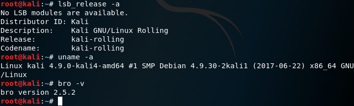
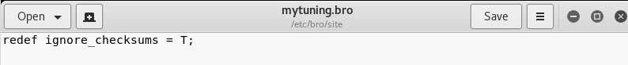
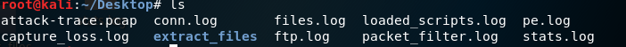
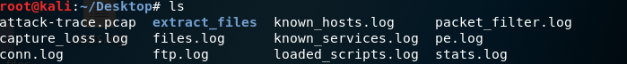
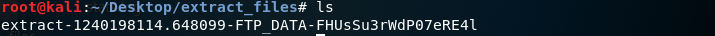
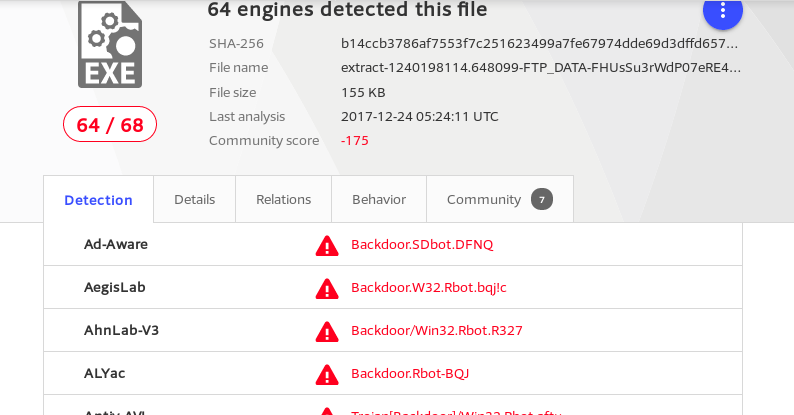
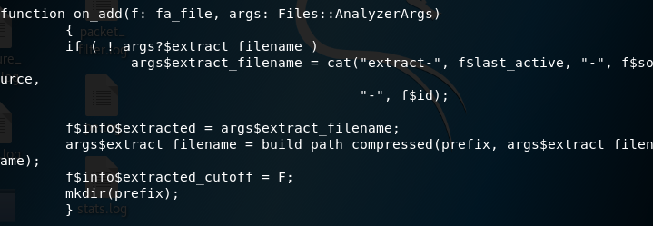
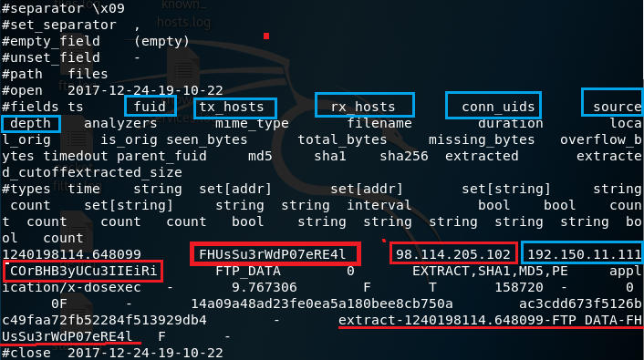
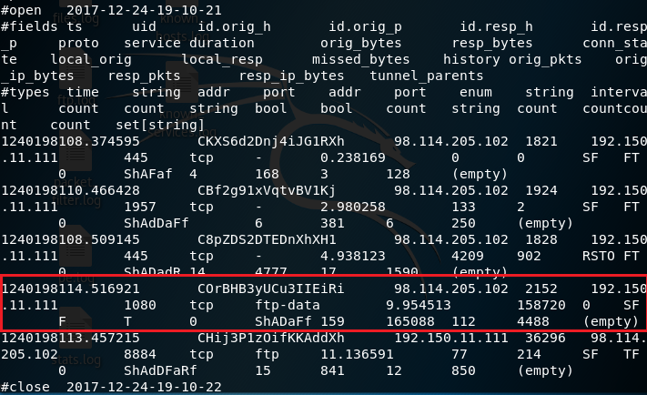

# 实战Bro网络入侵取证  

## 1. 安装bro  
```  
apt-get install bro bro-aux  
```

## 2. 实验环境基本信息  
    

## 3. 编辑bro配置文件  
* 编辑 /etc/bro/site/local.bro，在文件尾部追加两行新配置代码   
```
 @load frameworks/files/extract-all-files  
 @load mytuning.bro   
 ```  

    

* 在/etc/bro/site/目录下创建新文件mytuning.bro，内容为：  
  ```
  redef ignore_checksums = T;  
  ```

    

## 4. 使用bro自动化分析pcap文件  
```  
 bro -r attack-trace.pcap /etc/bro/site/local.bro  
 ```

 出现警告信息,如下图。对于本次入侵取证实验来说没有影响。  

   
   

如果要解决上述警告信息，编辑mytuning.bro，增加一行变量定义即可  
```
redef Site::local_nets = { 192.150.11.0/24 };
```

注意添加和不添加上述一行变量定义除了bro运行过程中是否会产生警告信息的差异，增加这行关于本地网络IP地址范围的定义对于本次实验来说会新增2个日志文件,会报告在当前流量（数据包文件）中发现了本地网络IP和该IP关联的已知服务信息。  

  
  

在attack-trace.pcap文件的当前目录下会生成一些.log文件和一个extract_files目录，在该目录下我们会发现有一个文件。  

   

将该文件上传到virustotal我们会发现匹配了一个历史扫描报告，该报告表明这是一个已知的后门程序！至此，基于这个发现就可以进行逆向倒推，寻找入侵线索了。  

  

该报告表明这是一个已知的后门程序！
至此，基于这个发现就可以进行逆向倒推，寻找入侵线索了。


通过阅读/usr/share/bro/base/files/extract/main.bro的源代码


我们了解到该文件名的最右一个-右侧对应的字符串FHUsSu3rWdP07eRE4l是files.log中的文件唯一标识。

通过查看files.log，发现该文件提取自网络会话标识（bro根据IP五元组计算出的一个会话唯一性散列值）为COrBHB3yUCu3IIEiRi的FTP会话。


该COrBHB3yUCu3IIEiRi会话标识在conn.log中可以找到对应的IP五元组信息。
通过conn.log的会话标识匹配，我们发现该PE文件来自于IPv4地址为：98.114.205.102的主机。   



## 5. bro的一些其他技巧  

```
bro-cut ts uid id.orig_h id.resp_h proto < conn.log  
```  

