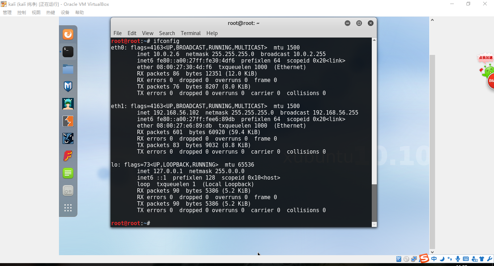

# 基于VirtualBox的网络攻防基础环境搭建

## 实验要求
- [x] 靶机可以直接访问攻击者主机
- [x] 攻击者主机无法直接访问靶机
- [x] 网关可以直接访问攻击者主机和靶机
- [x] 靶机的所有对外上下行流量必须经过网关
- [x] 所有节点均可以访问互联网
- [x] 所有节点制作成基础镜像（多重加载的虚拟硬盘）

## 实验环境
1.多重加载  

2.添加host-only网络，配置开启DHCP服务器  

3.网关kali配置两块网卡，网卡1设置为NAT网络模式（外网），网卡2设置为host-only模式（内网）；动态获取IP  
  
  

4.靶机kali victim设置一块网卡为host-only模式，IP手动设定，网关设定为kali的eth1的IP地址  
  

5.攻击者主机kali attack 设置一块网卡为 NAT 网络模式，IP手动设定，网关设定为kali的eth0的IP地址  
  

## 实验过程
对于网关kali的设置  
利用iptable对网关进行配置，允许靶机通过网关访问外部网络
  
因为内部网络的原因，攻击者主机无法访问靶机但是靶机可以访问攻击者主机  
更改ip_forward：0->1 允许进行转发

靶机可以直接访问攻击者主机  

攻击者主机无法直接访问靶机  

网关可以直接访问攻击者主机和靶机  

靶机的所有对外上下行流量必须经过网关  

所有节点均可以访问互联网  
网关  
  
攻击者主机  
  
靶机  

