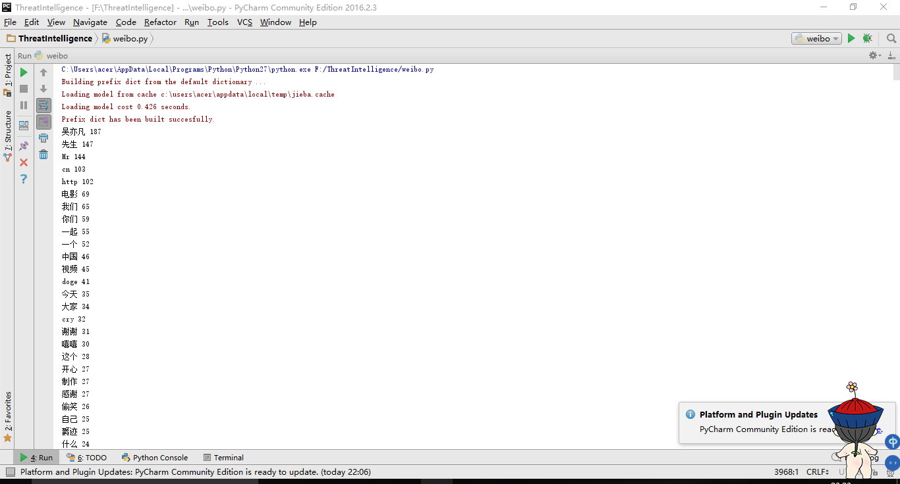

# 轻量级威胁情报融合分析系统

## 一.威胁情报简介
- 威胁情报的定义  
Gartner在2014年发表的《安全威胁情报服务市场指南》（Market Guide for Security Threat Intelligence Service）中提出：“威胁情报是关于IT或信息资产所面临的现有或潜在威胁的循证知识，包括情境、机制、指标、推论与可行建议，这些知识可为威胁响应提供决策依据。”

  Jon Friedman和Mark Bouchard在2015年发表的《网络威胁情报权威指南》（Definitive Guide to Cyber Threat Intelligence）中对威胁情报所下的定义：
“对敌方的情报，及其动机、企图和方法进行收集、分析和传播，帮助各个层面的安全和业务成员保护企业关键资产。”

- 威胁情报的内容

 - 攻击者身份：威胁情报需要能够帮助企业将攻击/恶意活动最终溯源至相应组织（网络犯罪团体、黑客、政府/国家机构等）

 - 攻击的原因：了解地方动机，以及他们会在攻击中投入多少精力（APT或仅是投机型攻击），及其针对性有多强等

 - 攻击目的：了解攻击者的目的，对于企业和组织基于资产重要性调整响应优先级也是有意义的

 - 具体是怎么做的：也就是所谓的TTP（Tatics策略、Technique技术和Procedure程序），这其中也包含了攻击者所用的工具、基础设施等

 - 攻击者的位置：结合地方所在国家，以及其地缘政治状况，自然能够帮助企业和组织更好地理解地方情况

 - 如何组织情报：包括IOC一类的技术指标（比如IP地址、哈希值等）提供的信息可用来更准确地检测和标记恶意行为

 - 如何缓解攻击：企业可用以保护自身的信息


- 威胁情报的生命周期

 - 定向：定义目标并完善

 - 收集：从多种开放或封闭的源收集数据；电子的、人工的

 - 处理：如有需要，翻译；进行可靠性评估；核对多个源

 - 分析：判断此信息的意义；评估信息的重要性；推荐相应措施

 - 传递：将情报传递给客户
 - 反馈：依照需求调整


- 威胁情报的共享
 - 威胁情报共享的意义  
在当今的安全威胁环境下，为了应对更加复杂的攻击（如APT），如何便捷地分享、交流安全情报成为针对特定目标攻击检测、响应和防止的关键问题。传统地解决方案是先从主机或者网络中收集威胁情报信息，然后采用特定的技术规范描述，形成书面的报告分发共享给其它相关人员。这种做法最明显的问题是时间延迟非常高。因为即使在一个组织内部，情报共享的效率完全依赖于员工阅读和分发报告的能力，每次消息的传递都在增加安全事件的响应延迟。因此常见的情况是，当组织开始对事件响应时，所依据的信息往往已经过时，而且攻击早已在网络中蔓延造成了损失。

 - OpenIOC  
OpenIOC本身是一个记录、定义以及共享安全情报的格式，它可以帮助你借助机器可读的形式实现不同类型威胁情报的快速共享。OpenIOC本身是开放、灵活的框架，因此你随时可以根据发现添加新的情报，完善你的IOC（Indicator of Compromise）。OpenIOC主要使用XML（Extensible Markup Language）来实现，XML语言提供了丰富、灵活的格式来将数据表示成可机读的形式。通常在使用OpenIOC时会定义自己的指示器属性表（Indicator Term Documens），里面列出了要使用的诸多属性，当然也可以根据自己的需要添加新的属性描述。

 - CybOX  
Observable eXpression (CybOX) 规范定义了一个表征计算机可观察对象与网络动态和实体的方法。可观察对象包括文件，HTTP会话，X509证书，系统配置项等。CybOX 规范提供了一套标准且支持扩展的语法，用来描述所有我们可以从计算系统和操作上观察到的内容。在某些情况下，可观察的对象可以作为判断威胁的指标，比如Windows的RegistryKey。这种可观察对象由于具有某个特定值，往往作为判断威胁存在与否的指标。IP地址也是一种可观察的对象，通常作为判断恶意企图的指标。

 - STIX   
Structured Threat Information eXpression (STIX) 提供了基于标准XML的语法描述威胁情报的细节和威胁内容的方法。STIX支持使用CybOX格式去描述大部分STIX语法本身就能描述的内容，当然，STIX还支持其他格式。标准化将使安全研究人员交换威胁情报的效率和准确率大大提升，大大减少沟通中的误解，还能自动化处理某些威胁情报。实践证明，STIX规范可以描述威胁情报中多方面的特征，包括威胁因素，威胁活动，安全事故等。它极大程度利用DHS规范来指定各个STIX实体中包含的数据项的格式。

 - TAXII  
Trusted Automated eXchange of Indicator Information (TAXII) 提供安全的传输和威胁情报信息的交换。很多文章让人误以为TAXII只能传输TAXII格式的数据，但实际上它支持多种格式传输数据。当前的通常做法是用TAXII来传输数据，用STIX来作情报描述，用CybOX的词汇。
TAXII在标准化服务和信息交换的条款中定义了交换协议，可以支持多种共享模型，包括hub-and-spoke，peer-to-peer，subscription。
TAXII在提供了安全传输的同时，还无需考虑拓朴结构、信任问题、授权管理等策略，留给更高级别的协议和约定去考虑。

 - 其他规范
   - Common Weakness Enumeration (CWE) 定义了通用软件设计与实现的弱点，安全漏洞往往是由这些弱点而来的。
   - Common Attack Pattern Enumeration and Classification (CAPEC) 提供了一个与跨事件攻击相似的功能。
   - Malware Attribute Enumeration and Characterization (MAEC) 可用于描述恶意软件的信息，类似于CVE和漏洞之间的关系。
   - Open Vulnerability Assessment Language (OVAL) 为评估漏洞范围和影响提供了一个框架。
 - 参考链接：  
[威胁情报共享的相关规范和标准]("https://www.tuicool.com/articles/UJf6j2M")  
[浅析安全威胁情报共享框架OpenIOC]("http://www.freebuf.com/sectool/86580.html?utm_source=tuicool&utm_medium=referral")  
[威胁情报简介及市场浅析]("http://www.freebuf.com/column/136763.html")


## 二.一款免费的威胁情报收集器简介：OSTrICa
- OSTrICa是一个免费的开源的框架，使用基于插架的架构，可以让每一个人自动化地从公开的、内部的、商业的源中收集信息，并可视化显示各种类型的威胁情报数据。由专家来分析收集的情报，显示成图形格式，还可基于远程连接、文件名、mutex等，显示多个恶意软件的关联情况。

- OSTrICa的使用
 - 下载链接：[github: OsTrICa]("https://github.com/Ptr32Void/OSTrICa/")
 - 依赖库(在官方提供的requirements.txt文档中有)
   - beautifulsoup
   - dnspython
   - ipwhois
   - requests
   - whois
   - pythonwhois
   - python-deepviz

 -  OSTrICa适用于版本>= 2.7.9的Python环境

 - 使用方法简介
   - domain：用于收集此域名相关信息
   - ip：用于收集此ip相关信息
   - md5：用于收集此md5值相关信息
   - sha256：用于收集此sha256值相关信息
   - asn：用于收集asn信息
   - email：用于收集此邮箱相关信息
   - graph：基于以上收集的信息生成一张关系图
   - cola_graph：同上，但是生成的节点不会相互重叠
   - gclean：清理图像信息
   - show：显示将要收集的所有信息
   - run：开始收集情报
   - help：显示帮助信息
   - plugins：显示可用插件

  - 实例：
  [def68607-bfb1-42cb-9745-b3cfeb488318.html]("def68607-bfb1-42cb-9745-b3cfeb488318.html")   

- 参考链接：[开源的威胁情报收集器:OsTrICa]("http://www.freebuf.com/sectool/111049.html")


## 三.简易威胁情报融合分析系统
- 需求分析：根据微博用户的用户名获取相关数据，分析该用户喜好，特征等。

- 情报收集：使用网络爬虫，收集该用户所发的所有微博内容。
  - 观察用户微博主页URL可知它们统一的结构：http://weibo.cn/u/userID/page=x 我们只需获取最后的userID即可，这个只需直接使用一个浏览器搜索用户微博主页获取一下即可。

  - 除了主页第一页，其余页面直接使用URL打开都需要先登录，所以先登录一下微博，之后直接使用之前登录时的cookie即可

  - 除第一页外其余页面都为JavaScript动态生成的，所以使用了Python的selenium中webdriver模块，使用浏览器将完整的页面加载出来。

  - 观察发现用户原创微博在class属性为ctt的<span>标签中，使用 find_element_by_xpath（）进行定位，获取原创微博内容。

  - 可以在用户主页第一页下方得到用户微博总的页数，但是发现一个问题，Python在循环内部改变了控制循环次数的值但是并不起作用，如:循环while page<=num，在其内部改变了num的值，但是对这个循环控制不起作用，即使page大于num了，也会一直进入这个循环，所以直接将num初值赋为页面总数。

- 情报分析：使用开源的中文分词工具Jieba对各条微博内容进行分词，获取出现频率最高的词。
 - jieba分词简介：
   - 支持三种分词模式：

     - 精确模式，试图将句子最精确地切开，适合文本分析；
     - 全模式，把句子中所有的可以成词的词语都扫描出来, 速度非常快，但是不能解决歧义；
     - 搜索引擎模式，在精确模式的基础上，对长词再次切分，提高召回率，适合用于搜索引擎分词。

   - 支持繁体分词

   - 支持自定义词典

   - 主要函数介绍
     - jieba.cut 方法接受三个输入参数: 需要分词的字符串；cut_all 参数用来控制是否采用全模式；HMM 参数用来控制是否使用 HMM 模型
     - jieba.cut_for_search 方法接受两个参数：需要分词的字符串；是否使用 HMM 模型。该方法适合用于搜索引擎构建倒排索引的分词，粒度比较细
待分词的字符串可以是 unicode 或 UTF-8 字符串、GBK 字符串。注意：不建议直接输入 GBK 字符串，可能无法预料地错误解码成 UTF-8
     - jieba.cut 以及 jieba.cut_for_search 返回的结构都是一个可迭代的 generator，可以使用 for 循环来获得分词后得到的每一个词语(unicode)，或者用
     - jieba.lcut 以及 jieba.lcut_for_search 直接返回 list
     - jieba.Tokenizer(dictionary=DEFAULT_DICT) 新建自定义分词器，可用于同时使用不同词典。jieba.dt 为默认分词器，所有全局分词相关函数都是该分词器的映射。


- Jieba资源链接：[github: Jieba]("https://github.com/fxsjy/jieba")

- 代码
```python
#!/usr/bin/env python
# -*- coding: utf-8 -*-
import time
import jieba
from selenium import webdriver
WEIBO_ACCOUNT =   #微博账号
WEIBO_PASSWORD =  #微博密码
def main():
    #用户的微博主页从第二页开始就是使用JavaScript脚本动态生成的，所以用浏览器加载网页得到完整网页内容
    browser = webdriver.Chrome()
    browser.get("https://passport.weibo.cn/signin/login?entry=mweibo&r=http%3A%2F%2Fweibo.cn&page=2&uid=3591355593&_T_WM=1ff404edd274066bcdfdcccd6cca2464")
    time.sleep(1)  #这里停一秒是因为由于网络原因，有时页面加载过慢，网页还没加载出来，而下面获取网页元素的命令已经执行了，防止出现这种错误

    #登录微博
    username=browser.find_element_by_xpath('//*[@id="loginName"]')
    password=browser.find_element_by_xpath('//*[@id="loginPassword"]')
    login=browser.find_element_by_xpath('//*[@id="loginAction"]')
    username.send_keys()
    password.send_keys()
    login.click()

    n= 48    #用户微博页面总数
    page = 1
    words=[]   #保存微博内容分词结果
    while page<=n:
    #获取lxml页面
    url = 'http://weibo.cn/u/%d?page=%d' % (3591355593, page)
       browser.get(url)

       #用户微博从第二页开始就需要登录了才能访问，所以获取第一次登录时的cookie
       browser.add_cookie({'name': 'userName', 'value': ''})
       browser.add_cookie({'name': 'password', 'value': ''})

       time.sleep(1)
       if page==1:
           x=browser.find_element_by_xpath('//*[@id="pagelist"]/form/div/input[1]')
           n2=x.get_attribute('value')    #获取用户微博页面总数
           #在这儿改变了n的值发现对循环的控制并不起作用，循环不会停止
           #class属性为'ctt'的span标签包含了用户原创的微博内容

      a = browser.find_elements_by_xpath('//span[@class="ctt"]')
      for i in a:
         seg_list = jieba.cut(i.text, cut_all=False)  # 精确模式
         for j in seg_list:
             if len(j)>=2:
                 words.append(j)
      page=page+1
      #统计获取的内容的出现频次

    count = {}
    for i in words:
        if i in count:
            count[i] = count[i] + 1
        else:
            count[i] = 1
    #按照出现频次排序
    count = sorted(count.iteritems(), key=lambda asd: asd[1], reverse=True)

    #输出
    for key, value in count:
        p = key.encode('utf-8')
        print p, value
if __name__ == '__main__':
    main()
```
- 结果示例（后面的数字为此词语出现的次数）


- 评价

  此程序运行出来的结果不能称作威胁情报，我原本准备弄一个危险词汇库，即包含一些反动言论、词语之类的，然后与运行出来的结果进行匹配，高危词汇越多，对这个用户的评分就越低，来判断这个用户是否可以定义为“危险用户”，但是最后没有确定这个词库的内容，因为不太确定什么样的词汇该入选，就舍弃了这一步。结果不太完善，有待进一步的改进。
