# 使用bro完成网络入侵取证分析
## 安装bro
```
apt-get install bro bro-aux
```

## 实验环境基本信息
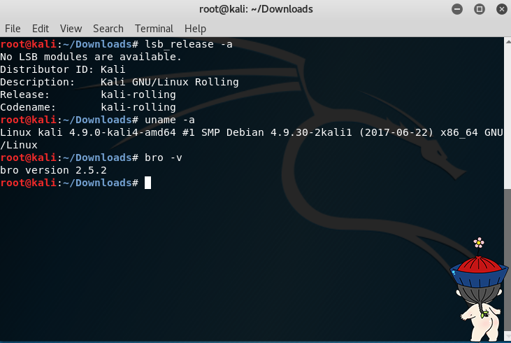

## 编辑bro配置文件
* 编辑/etx/bro/site/local.bro,在文件尾追加两行新配置代码
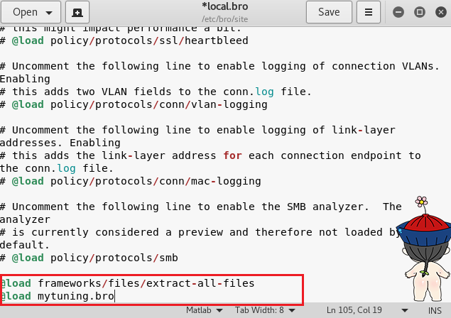
加载库指令，以@load来加载module中定义的命名空间。命令1表示使用bro提取所有文件，命令2表示加载mytuning.bro中我们自己编写的指令。

* 在/etc/site/bro/目录下创建新文件mytuning.bro,内容为：
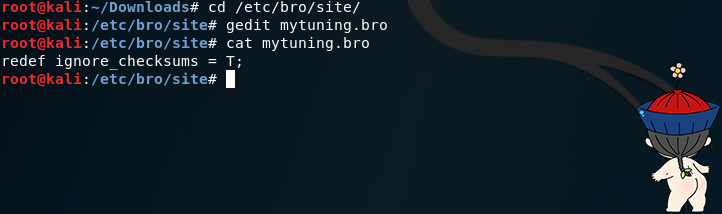

## 使用bro自动化分析pcap文件
下载实验所用pcap文件：
http://sec.cuc.edu.cn/huangwei/textbook/ns/chap0x12/attack-trace.pcap

```
bro -r attack-trace.pcap /etc/bro/site/local.bro
```
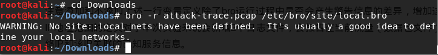

出现警告信息WARNING: No Site::local_nets have been defined. It's usually a good idea to define your local networks.对于本次入侵取证实验来说没有影响。
如果要解决上述警告信息，同样是编辑mytuning.bro，增加一行变量定义即可（此本地网络地址ip范围为pcap包中靶机ip所在网络）

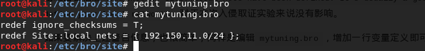

注意添加和不添加上述一行变量定义除了bro运行过程中是否会产生警告信息的差异，增加这行关于本地网络IP地址范围的定义对于本次实验来说会新增2个日志文件，会报告在当前流量（数据包文件）中发现了本地网络IP和该IP关联的已知服务信息。
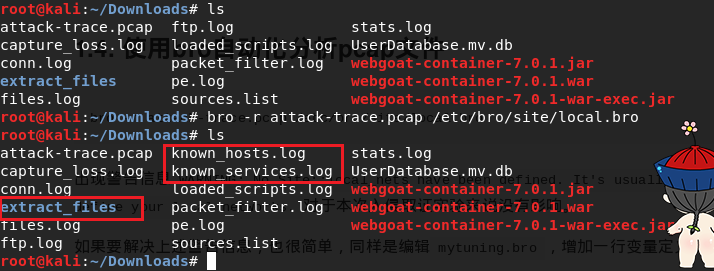

在attack-trace.pcap文件的当前目录下会生成一些.log文件和一个extract_files目录，在该目录下我们会发现有一个文件。
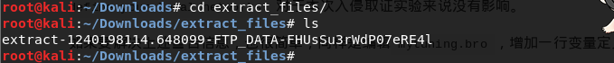

将该文件上传到x.threatbook.cn我们会发现匹配了一个历史扫描报告
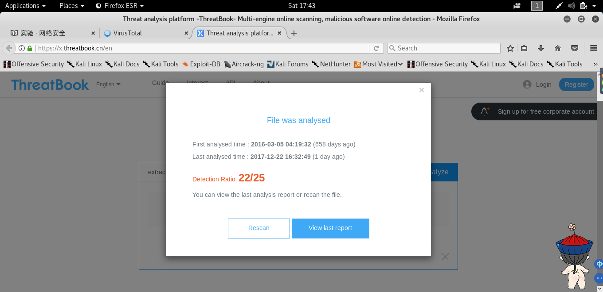
该报告表明这是一个已知的后门程序！
至此，基于这个发现就可以进行逆向倒推，寻找入侵线索了。
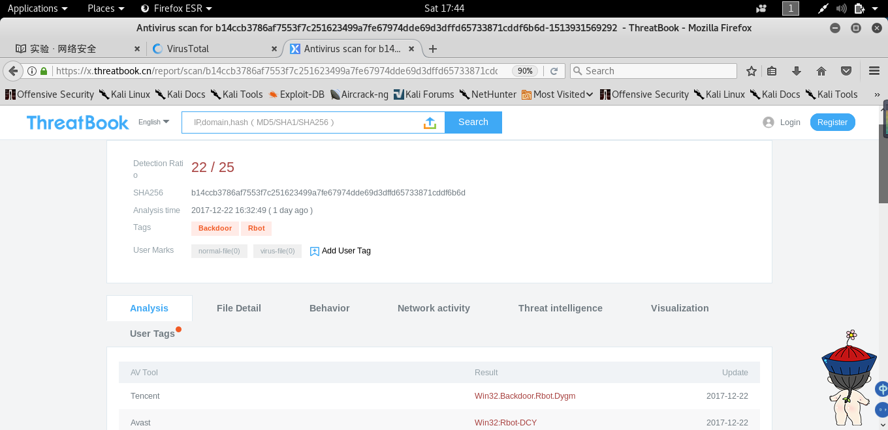

通过阅读/usr/share/bro/base/files/extract/main.bro的源代码
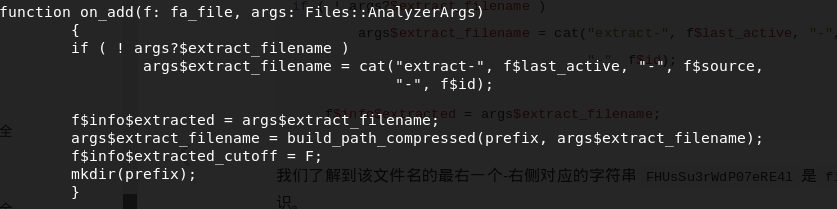

我们了解到该文件名的最右一个-右侧对应的字符串FHUsSu3rWdP07eRE4l是files.log中的文件唯一标识。

通过查看files.log，发现该文件提取自网络会话标识（bro根据IP五元组计算出的一个会话唯一性散列值）为C3hfjY1u7FHHBy7sL的FTP会话。
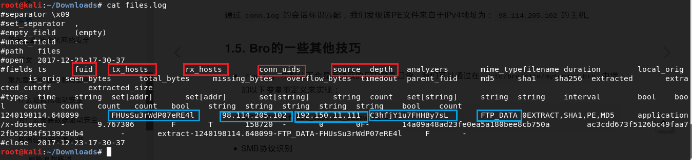

该C3hfjY1u7FHHBy7sL会话标识在conn.log中可以找到对应的IP五元组信息。
通过conn.log的会话标识匹配，我们发现该PE文件来自于IPv4地址为：98.114.205.102的主机。
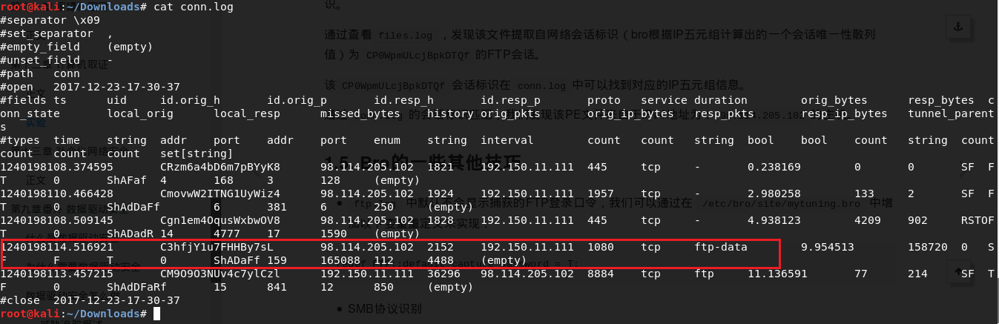

## bro的一些其他技巧
* ftp.log 中默认不会显示捕获的FTP登录口令，我们可以通过在 /etc/bro/site/mytuning.bro 中增加以下变量重定义来实现：
```
redef FTP::default_capture_password = T;
```
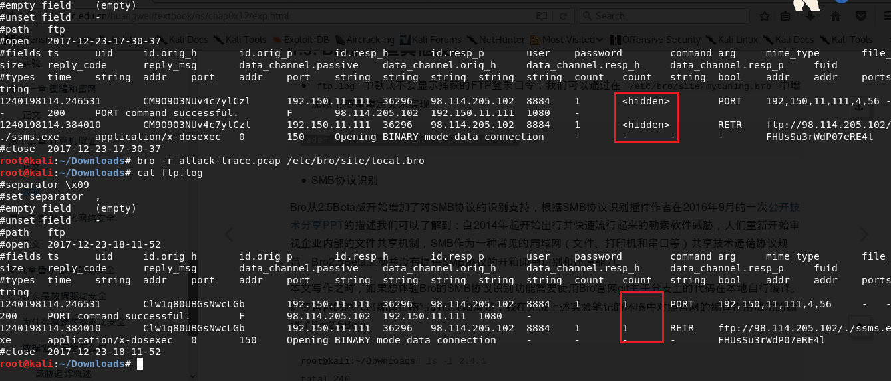

* 使用bro-cut（在bro-aux软件包中）更“优雅”的查看日志中关注的数据列  
1.查看conn.log中所有可用的“列名”
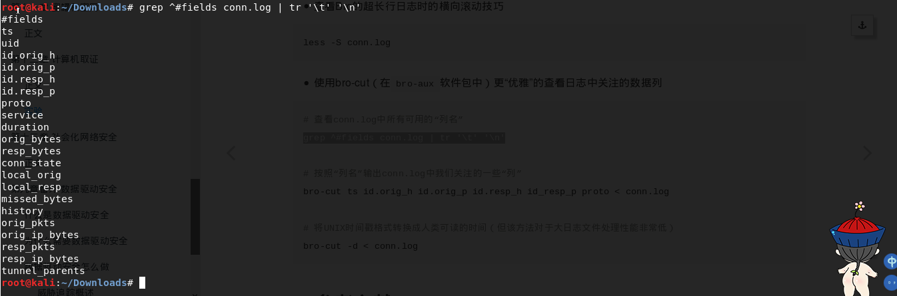
2.按照“列名”输出conn.log中我们关注的一些“列”
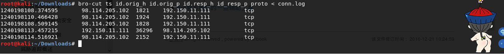
3.将UNIX时间戳格式转换成人类可读的时间（但该方法对于大日志文件处理性能非常低）
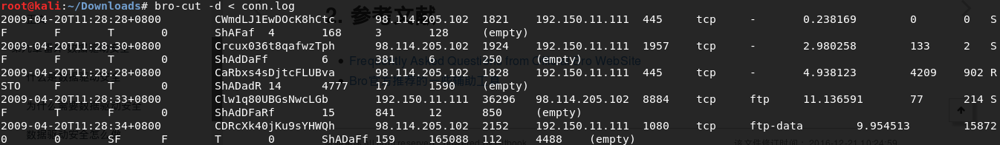
