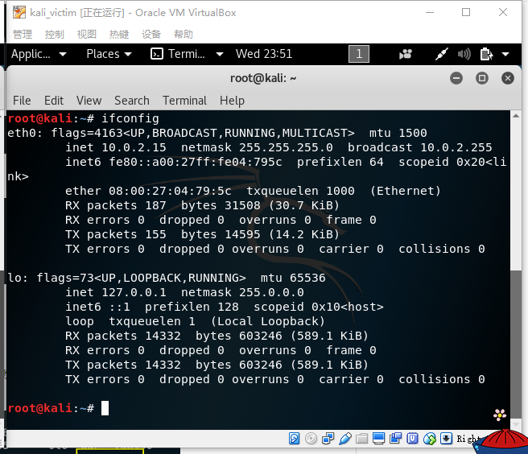
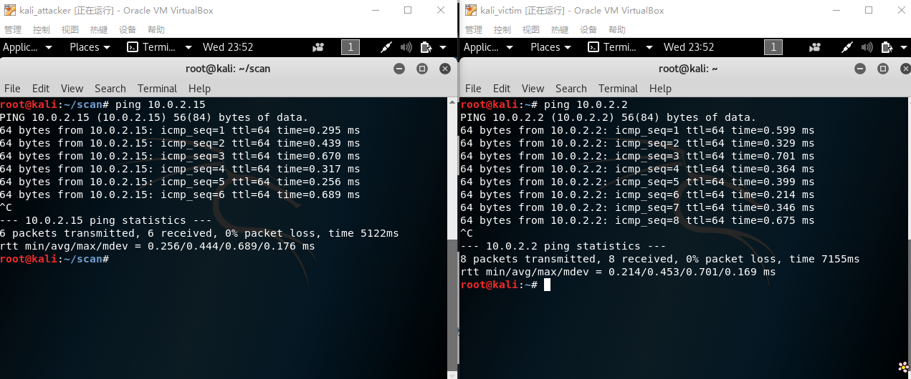
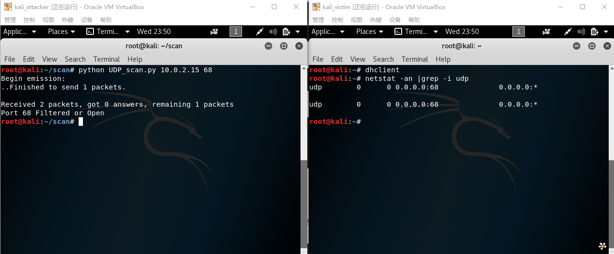
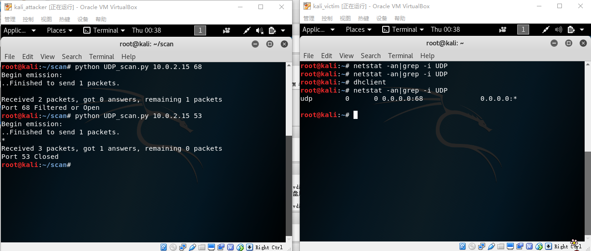

## TCP Connect 扫描
发送一个SYN数据包到目标主机的特定端口上，接着我们可以通过接收包的情况对端口的状态进行判断：
* 收到SYN/ACK数据包--开放,发送一个ACK确认包到目标主机
* 收到RST/ACK数据包--关闭
* 目标主机没有响应 --过滤  
[TCP_connect_scan.py](./code/TCP_connect_scan.py)
## TCP Stealth 扫描
也称TCP SYN扫描，发送一个SYN包给目标主机：
* 收到SYN/ACK数据包--开放，发送一个RST给目标主机立即拆除连接
* 收到RST/ACK数据包--关闭
* 目标主机没有响应--过滤  
[TCP_stealth_scan.py](./code/TCP_stealth_scan.py)

## TCP Xmas 扫描
发送一个TCP包，并对TCP报文头FIN、URG和PUSH标记进行设置：
* 收到RST报文--关闭
* 目标主机没有响应--开放/过滤  
[TCP_Xmas_scan.py](./code/TCP_Xmas_scan.py)

## UDP 扫描
向各个被扫描的UDP端口发送零字节的UDP数据包：
* 收到一个ICMP不可到达的回应--关闭
* 目标主机没有响应--开放/过滤  
[UDP_scan.py](./code/UDP_scan.py)

目标主机IP：
  

进行扫描的主机(kali_attacker)与目标主机(kali_victim)的连通性：
  

扫描开放的端口:  
TCP_connect_scan,TCP_stealth_scan,TCP_Xmas_scan:

UDP_scan:

扫描关闭的端口：  
TCP_connect_scan,TCP_stealth_scan,TCP_Xmas_scan:
  
UDP_scan:  

扫描设置过滤规则的端口：

参考链接：  
[http://resources.infosecinstitute.com/port-scanning-using-scapy/](http://resources.infosecinstitute.com/port-scanning-using-scapy/)
[https://huangwei.me/sec.cuc.edu.cn/textbook/ns/chap0x05/main.html](https://huangwei.me/sec.cuc.edu.cn/textbook/ns/chap0x05/main.html)
