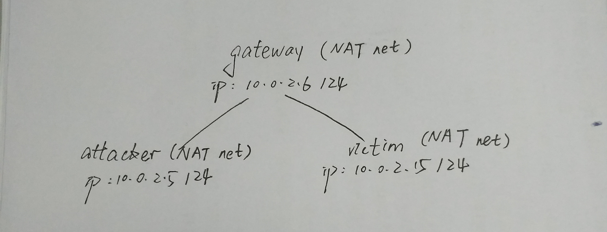
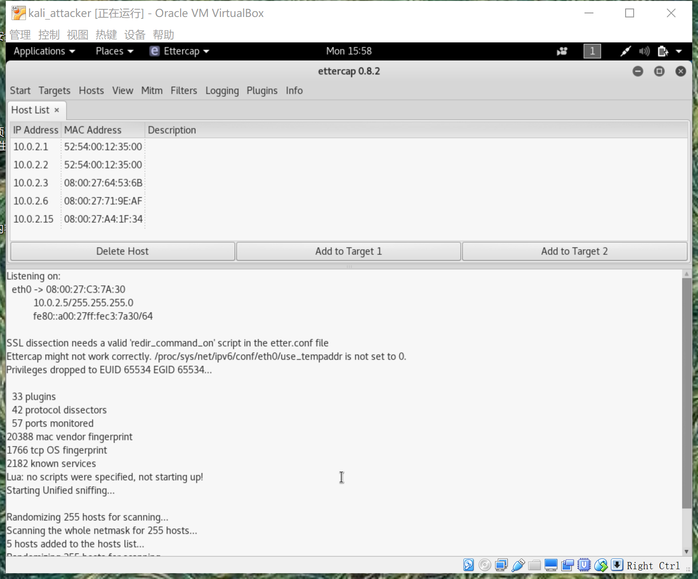
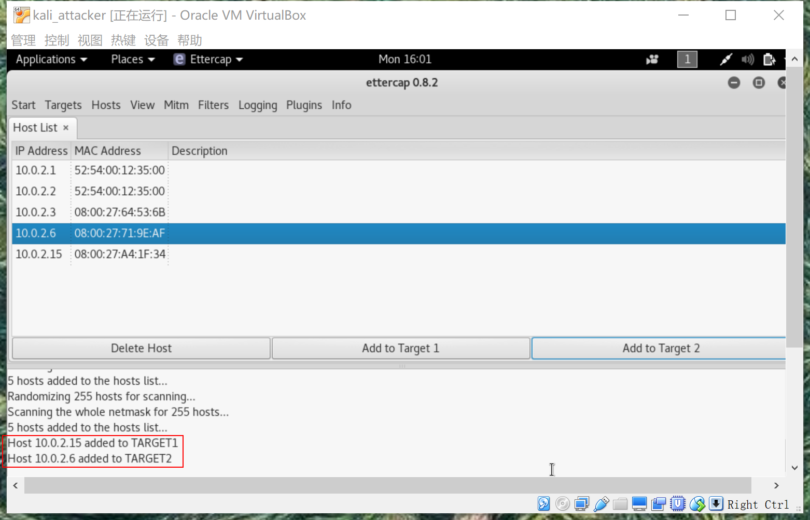
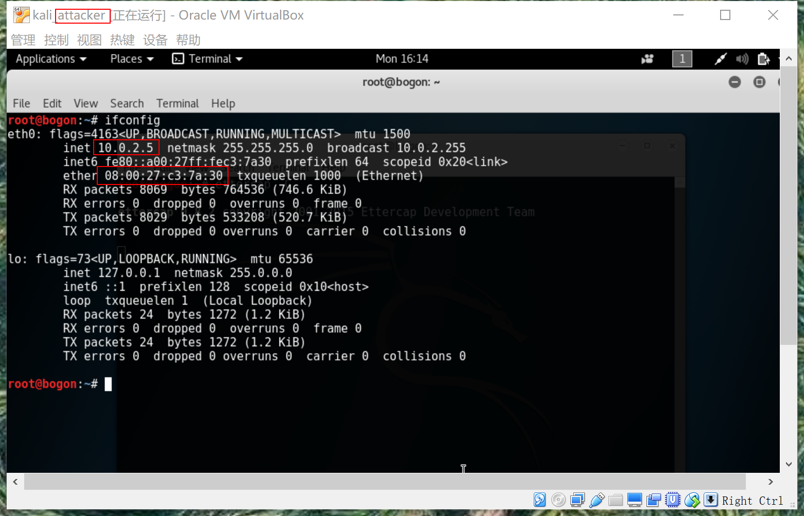
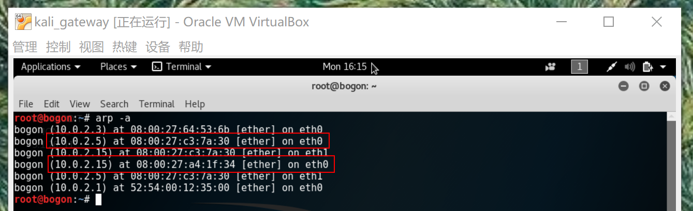
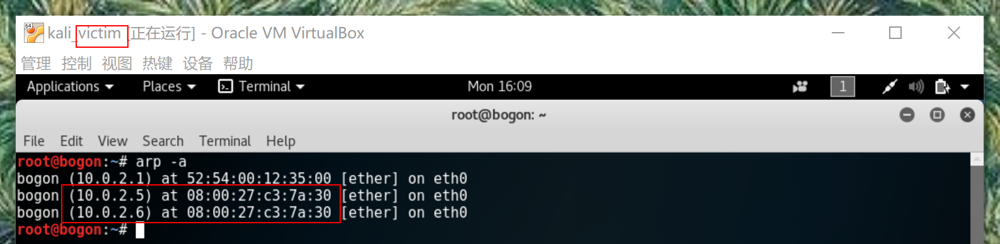

# ARP欺骗与MITM  
## 什么是ARP欺骗
地址解析协议是建立在网络中各个主机互相信任的基础上的，它的诞生使得网络能够更加高效的运行，但其本身也存在缺陷。  
ARP地址转换表是依赖于计算机中高速缓冲存储器动态更新的，而高速缓冲存储器的更新是受到更新周期的限制的，只保存最近使用的地址的映射关系表项，这使得攻击者有了可乘之机，可以在高速缓冲存储器更新表项之前修改地址转换表，实现攻击。  
ARP请求为广播形式发送的，网络上的主机可以自主发送ARP应答消息，并且当其他主机收到应答报文时不会检测该报文的真实性就将其记录在本地的MAC地址转换表，这样攻击者就可以向目标主机发送伪ARP应答报文，从而篡改本地的MAC地址表。  
ARP欺骗可以导致目标计算机与网关通信失败，更会导致通信重定向，所有的数据都会通过攻击者的机器。攻击者再对目标和网关之间的数据进行转发，则可作为一个“中间人”，实现监听目标却又不影响目标正常上网的目的。

## 攻击步骤
具体的中间人攻击，大体上可以分为以下几个步骤：
1. 对目标主机进行ARP欺骗，声称自己是网关。
2. 转发目标的NAT数据到网关，维持目标的外出数据。
3. 对网关进行ARP欺骗，声称自己是目标主机。
4. 转发网关的NAT数据到目标主机，维持目标的接收数据。
5. 监听劫持或者修改目标的进入和外出数据，从而实现攻击。  

其中1，3都是ARP欺骗；2，4都是转发。  

## 后果
一旦中间人建立攻击成功，劫持了目标的上网流量，那么接下来也就为所欲为了。  
轻则监控目标的上网行为，就如同二十四小时站在你身后看你上网；或者劫持目标的cookie从而用目标的帐号登录第三方网站，浏览其隐私数据和进行其他操作；  
重则进行钓鱼攻击，使目标下载恶意程序或者执行恶意脚本，从而威胁其计算机安全。  

## 防范方法
- 一般在小规模网络中，比较推荐使用双向绑定，也就是在路由器和终端上都进行IP-MAC绑定的措施，并且在网关MAC地址改变的时候发出提醒，从而防止ARP毒化攻击。它可以对ARP欺骗的两边，伪造网关和截获数据，都具有约束的作用。它对付最普通的ARP欺骗是有效的。   
- 最好不要在公共WiFi下浏览有重要隐私的网站，警惕碰上不怀好意的人就在局域网中。
- VLAN和交换机端口绑定。细致地划分VLAN，减小广播域的范围，使ARP在小范围内起作用，而不至于发生大面积影响。

## 使用ettercap工具
实验参考链接：  
[关于ARP欺骗与MITM（中间人攻击）的一些笔记（一）](https://www.2cto.com/article/201305/208754.html)   
- 实验环境如图
  
- 首先打开终端，输入ettercap -G 启动ettercap的图形界面模式。
- 点击”sniff”，选择”unified sniffing”然后根据自己的要求选择要抓包的网卡。
- 单击Hosts选项，选择Scan for host，待扫描完成之后再选择Scan for host，然后选择Host list，此时可以看到ettercap-NG已经扫描的主机列表。
   
- 然后我们就可以选择要攻击的目标了， 选择victim的IP地址，点击Add to Target 1,然后选择网关的IP地址，点击Add to Target 2,可以看到ettercap提示成功加入目标。
  
- 然后明确攻击方式：ARP欺骗。告诉victim我才是gateway，使得victim把所有数据流量全部发给我，然后抓包截获。对gateway声称自己是victim。
- 选择“mitm”—“arp poisoning”— “Sniff remote connections” — “确定”
- 这时可以看看目标主机的arp地址表，ARP缓存毒化成功。  
attacker mac  
  
gateway arp  
  
victim arp  
  
