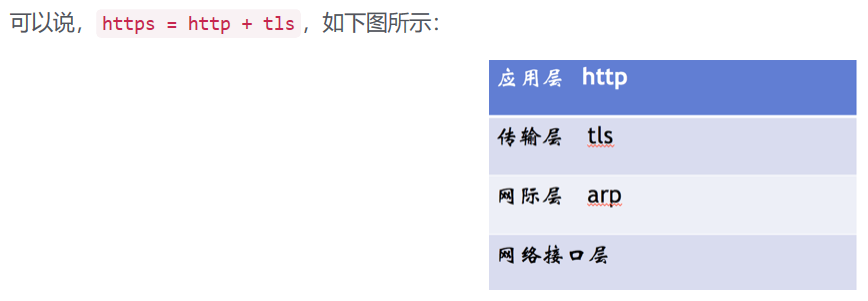

# 伪造证书
## https解决中间人攻击问题
1. Web 浏览器将支持的加密信息发送给网站服务器；
2. 网站服务器会选择出一套加密算法和哈希算法，将验证身份的信息以证书（证书发布CA机构、证书有效期、公钥、证书所有者、签名等）的形式发送给Web浏览器；
3. 当 Web 浏览器收到证书之后首先需要验证证书的合法性，如果证书受到浏览器信任则在浏览器地址栏会有标志显示，否则就会显示不受信的标识。当证书受信之后，Web 浏览器会随机生成一串密码，并使用证书中的公钥加密。之后就是使用约定好的哈希算法握手消息，并生成随机数对消息进行加密，再将之前生成的信息发送给网站；
4. 当网站服务器接收到浏览器发送过来的数据后，会使用网站本身的私钥将信息解密确定密码，然后通过密码解密Web浏览器发送过来的握手信息，并验证哈希是否与Web浏览器一致。然后服务器会使用密码加密新的握手信息，发送给浏览器；
5. 最后浏览器解密并计算经过哈希算法加密的握手消息，如果与服务发送过来的哈希一致，则此握手过程结束后，服务器与浏览器会使用之前浏览器生成的随机密码和对称加密算法进行加密交换数据   

  

  

## 伪造证书类型的SSL会话劫持成功的必要条件如下：
- 能够通过ARP欺骗、DNS欺骗或者浏览器数据重定向等欺骗技术，使得SSL客户端和服务端之间的数据都流向中间人监测主机；
- SSL客户端在接收到伪造的X.509证书后，用户选择信任该证书，并继续SSL连接；
- SSL服务端未要求对SSL客户端进行认证。

## 攻击基本原理：
- 攻击者对目标客户端和网关发送ARP投毒攻击，污染它们的ARP缓存表。  
客户端在浏览器中输入网址，浏览器会尝试和服务器的443端口建立SSL连接，但是因为客户端受到了ARP投毒攻击，原本发往网关的数据包被发往了攻击者的主机。
攻击者在本机使用iptables将接收到的443目的端口的数据包重定向到本机的IP地址。这样，受攻击者客户端的浏览器就只会和攻击者主机进行SSL连接。
- 攻击者在本机使用监听443端口，并且伪造一个假的SSL证书，用于和客户端的连接，同时，提取客户端发送的数据包的原始目的IP地址，用于和客户端原始请求的服务器建立另一个SSL连接。  
- 中间人攻击者在双向的SSL Socket通信都建立完成后，对两边的socket进行数据读写同步，将数据通道打通，使客户端的浏览器能够正常访问。在数据同步的同时，记录下明文数据，达到SSL中间人攻击的目的。

## 步骤
- 劫持victim发出的流量。
- 欺骗网关并不是必须的，我们的目的是当用户连接mail时获得用户名密码，连接mail使用的SSL连接是由victim发起的，到了attacker后，流量被劫持，所以mail的服务器实际上就是在和attacker通信，不需要劫持网关就能得到服务器的数据。但如果劫持网关的话，可以防止victim在使用其他协议时出现异常，使得中间人攻击更隐蔽，更不容易被发现。

   

1. 用ARP欺骗的方法劫持victim。
使用arpspoof进行ARP欺骗 apt-get install dsniff  
为了让victim认为attacker是gateway  
arpspoof -i eth0 -t 10.0.2.15 10.0.2.6    
在执行完该命令后，原本能上网的victim不能上网了，这是因为原本应该发往网关的报文都被发往了attacker。

2. 将劫持的流量发往网关。
开启iptables的IP转发：  
echo 1 > /proc/sys/net/ipv4/ip_forward  
由于我们没有设置路由表，非本地的IP报文默认被转发到网关。   
在iptables的nat表中的PREROUTING链中添加一个规则，将tcp流量中目的端口为443（即SSL连接）的流量转发到本地的8888端口，以便本地程序进行处理。   
iptables -t nat -A PREROUTING -p tcp --dport 443 -j   REDIRECT --to-port 8888   
victim现在可以连接http，但却不能连接https，因为SSL的流量都被转发到attacker的本地端口8888了。

3. 与victim建立socket连接。  
我们使用socket监听8888端口，以便等待victim的连接。  
当victim发起一个SSL连接时，我们在本地8888端口就可以监听到连接，这时我们接受这个连接，并获得该链接的原始目的地址，得到报文被iptables重定向之前的原始目的地址。    
这时，我们便成功的劫持了victim的socket连接，并且获得了victim原始连接的服务器地址。  
接下来我们使用操作系统的fork函数新建一个子进程处理接下来的事情，而主进程继续监听8888端口等待其他的连接。  

4. 与服务器建立socket连接
通过获得的victim要连接的原始服务器地址，与服务器建立一个socket连接。

5. 与服务器建立SSL连接
可以使用linux系统中著名的SSL库openssl来完成。

6. 伪造证书并与主机B建立SSL连接
为了假冒服务器与主机B进行通信，我们需要假冒一个证书。  
浏览器会查看证书中的发行者，并在浏览器中查找该证书发行者的公钥，如果找到就用该公钥验证该证书，没有找到则报警。  
我们伪造的证书没有办法避免浏览器报警，但可以将发行者一项伪造的极像一个合法的CA，并使用自己的私钥进行签名，而证书的其他部分则照搬原始的证书，这样等浏览器告警，用户自己查看证书后，用户选择继续浏览的可能性也更大。因此我们采用动态生成证书的方式，而不是预先生成证书的方式。  
为了伪造证书，首先要先生成密钥。密钥可以是程序运行过程中动态生成的，但为了避免浏览器连续告警，用户每次浏览同一站点时，我们伪造的证书必须相同，所以密钥最好每次保持一致。因此，我们采用预先生成密钥并保存成文件的方式，当程序启动时再加载。
Openssl库中已经内置了生成密钥的工具，我们可以使用一下命令生成密钥：  
openssl genrsa -out private.key 1024  
openssl rsa -in private.key -pubout -out public.key  
这两条命令会在当前目录下生成两个文件，private.key和public.key，分别存储了1024位的RSA私钥和对应的公钥。  
有了相应的密钥后，我们便在程序中加载它们。
然后我们调用SSL_to_client_init函数，生成一个新的CTX，并设置它使用的证书和密钥,新建一个SSL连接。  
最后，调用SSL_accept函数完成与主机B的SSL连接。至此，SSL中间人攻击完成，接下来就可以抓取数据了。

参考链接：  
[通过伪造CA证书，实现SSL中间人攻击](http://blog.sina.com.cn/s/blog_4a898cfb0100t8j7.html)
