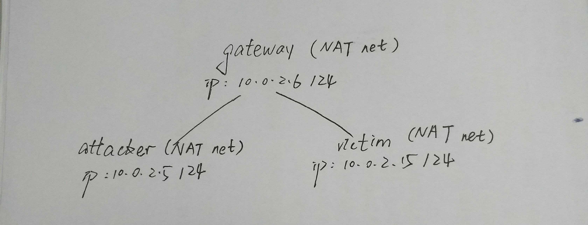
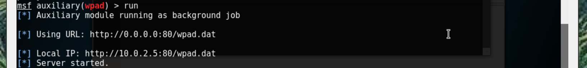

参考链接：   
[WPAD Man in the Middle ](http://www.netresec.com/?page=Blog&month=2012-07&post=WPAD-Man-in-the-Middle)   
[基于WPAD的中间人攻击](https://www.2cto.com/article/201512/453496.html)
# WPAD中间人劫持
## WPAD
在多个局域网中需设置不同的代理服务器参数来使浏览器访问网络。在自动切换代理服务器的功能中使用了被称为“WPAD”(Web Proxy Auto-Discovery protocol)的协议。WPAD 通过让浏览器自动发现代理服务器，使代理服务器对用户来说是透明的，进而轻松访问互联网。通过让浏览器自动发现代理服务器，定位代理配置文件，下载编译并运行，最终自动使用代理访问网络。WPAD 可以借助 DNS 服务器或 DHCP 服务器来查询代理自动配置(PAC)文件的位置。

## 具体方式
  
用户在访问网页时，首先会查询PAC文件的位置。
1. 通过DHCP服务器  
 - web浏览器向DHCP服务器发送DHCP INFORM查询PAC文件位置  
 - DHCP服务器返回DHCP ACK数据包，包含PAC文件位置
2. 通过DNS查询  
 - web浏览器向DNS服务器发起 WPAD＋X 的查询
 - DNS服务器返回提供WPAD主机的IP地址
 - web浏览器通过该IP的80端口下载wpad.dat
3. 通过NBNS查询  
如果DHCP和DNS服务器均没有响应，同时当前缓存没有所请求的主机名，就会发起如下名称解析：
 - 如果当前系统支持LLMNR（Link-Local Multicast Name Resolution），先发起广播LLMNR查询，如果没有响应再发起广播NBNS查询
 - 如果有主机回应PAC文件位置，web浏览器通过该IP的80端口下载wpad.dat

## WPAD漏洞
  
如果在被攻击用户发起NBNS查询时伪造NBNS响应，那么就能控制其通过伪造的代理服务器上网，达到会话劫持的目的。

## 漏洞测试

1. 监听NBNS查询  

2. 设置WPAD服务器  

3. 被攻击用户发起查询  
构造广播NBNS查询  
需要使当前dbcp和dns服务器均无法提供的PAC文件位置  

4. 响应被攻击机用户的广播NBNS查询    

5. 被攻击机用户使用伪造的代理配置上网
可在伪造的代理上面抓取被攻击用户的数据包，中间人攻击成功。

## WPAD实际利用
基于WPAD的中间人攻击有多大威力，超级电脑病毒Flame给了我们很好的示范。
其工作模式如下：

1. SNACK: NBNS spoofing
监听当前网络，如果收到了NBNS查询包含WPAD字符，立即伪造NBNS响应  
2. MUNCH: Spoofing proxy detection and Windows Update request  
提供WPAD服务，用来更改被攻击主机的WPAD设置   
当其成功作为被攻击主机的代理后，会劫持特定的Windows更新请求，提供带有后门的windows更新文件给用户下载  
Flame最终成功实现了基于WPAD实施中间人攻击，篡改windows更新数据，最终感染了内网其他主机。  

## 防护
可通过如下设置关闭WPAD应用来避免此种攻击：  
Internet Explorer-Internet Options-Connections-LAN settings  
  
取消选中Automatically detect settings  
  

## 自检
如果已被NBNS中间人攻击，可通过查看netbios缓存检查
> nbtstat -c

## 补充
Responder可以说是内网中间人攻击神器，很值得尝试。
简单使用命令如下：
> git clone https://github.com/SpiderLabs/Responder.git  
> cd Responder/  
> python Responder.py -I eth0 -i 192.168.16.245 -b  

当被攻击主机访问主机共享时就能抓到其hash
