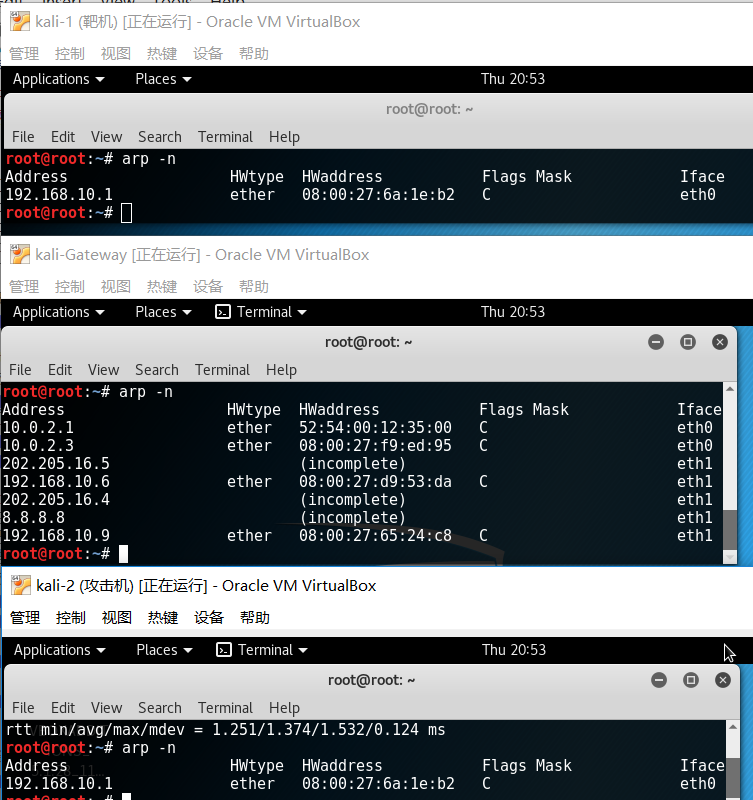
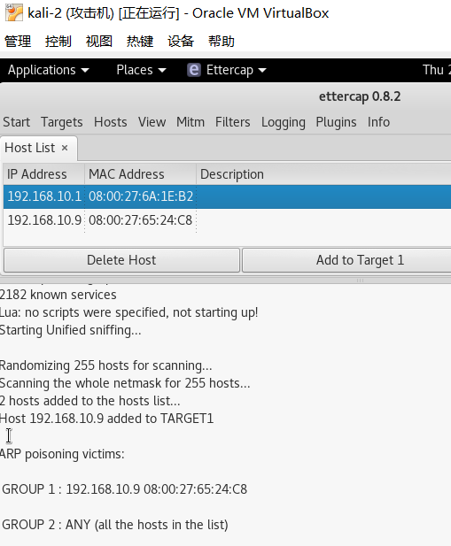
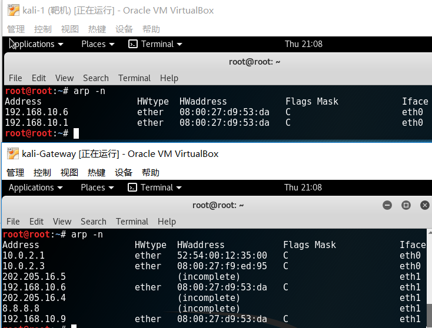
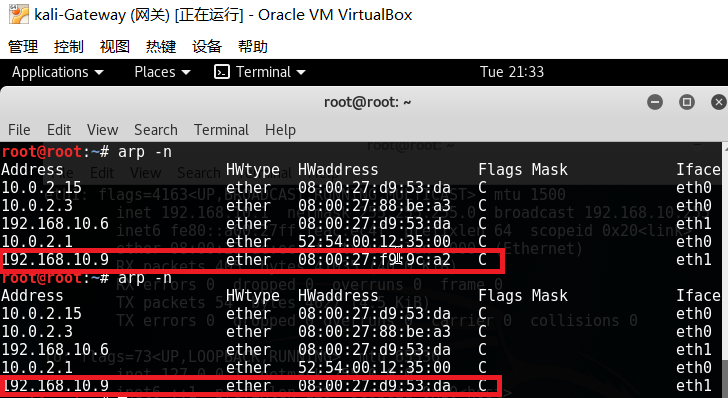
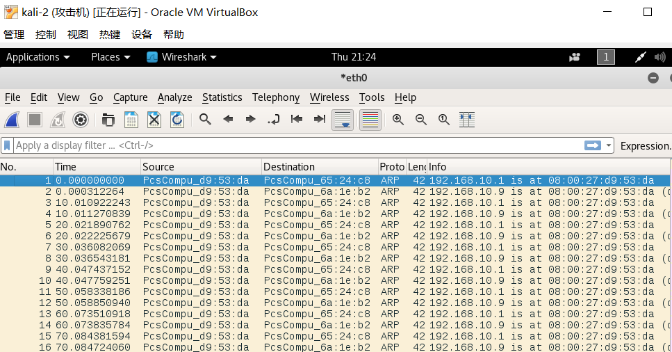
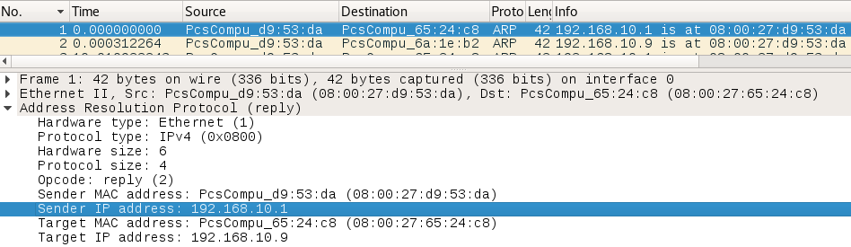
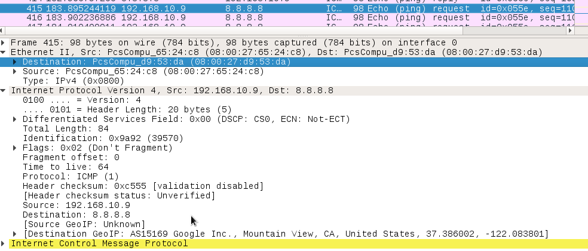
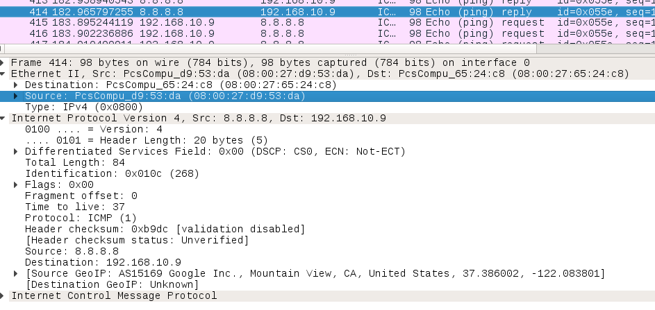

# 基于kali的ARP欺骗与MITM实验 #
## 网络配置 ##

|  | IP地址 | 网络设置 |
| :--- | :----: | :----: |
| kali-1（靶机）|192.168.10.9|内部网络intnet0|
| kali-Gateway（网关）|192.168.10.1|内部网络intnet0|
| kali-Gateway（网关）|10.0.2.4|NAT网络|
| kali-2（攻击机）|192.168.10.6|内部网络intnet0|

正常的ARP表： 

## Ettercap配置 ##
攻击机（192.168.10.6）向靶机（192.168.10.9）投毒。使得ARP表改变。

ARP前后变化：

## wireshark抓包 ##
1. 在攻击机上启动wireshark抓包
2. 靶机ping 8.8.8.8
3. 结果如下
攻击机不断发出ARP请求

ICMP request

ICMP reply

## 参考资料 ##
[http://www.lixh.cn/archives/444.html](http://www.lixh.cn/archives/444.html)