# BetterCap：EttherCap的继任者 #

## BetterCap 与 EttherCap 的比较 ##
1. ettercap是一款不可多得的工具，但已经过时了。
2. 我们发现ettercap的过滤十分简单，已经成为了过去式。并且也没有那么多的C开发者愿意继续维护这个项目。
3. ettercap在大网络下十分不稳定，如果你尝试在大型网络使用ettercap的主机探索功能，你就知道有多蛋疼了。
4. 使用ettercap，你可以看到连接和raw pcap，但是作为一名专用人员我只想看到我想要的东西。
5. 除非你是一名C\C++开发者，那么你不能够轻松扩展ettercap，更别谈什么制作自己的模块了。
6. Ettercap和MITMf对ICMP欺骗是完全没有用的，而BetterCap可以进行ICMP欺骗。
7. Ettercap不提供内置和模块化的HTTP（S）和TCP透明代理服务器。
8. Ettercap不提供一个可定制的凭证嗅探器，而BetterCap提供。
9. BetterCap是一款完整，模块化，轻量级，易扩展的中间人攻击工具和框架

## 常用的命令 ##

嗅探器默认的模式,所有解析器启用:

> sudo bettercap -X

启用嗅探器，启用指定解析器：

> sudo bettercap -X -P "FTP,HTTPAUTH,MAIL,NTLMSS"

启用嗅探器+所有解析器，此外并解析本地通信

> sudo bettercap -X -L

启用嗅探器+所有解析器，并输出到pcap

> sudo bettercap --sniffer --sniffer-pcap=output.pcap

只保存http的流量到pcap文件

> sudo bettercap --sniffer --sniffer-pcap=http.pcap --sniffer-filter "tcp and dst port 80"

默认端口（8080）启用代理，不带任何模块

> sudo bettercap --proxy

使用自定义端口启用代理

> sudo bettercap --proxy --proxy-port=8081

启用代理并加载hack_title.rb模块

> sudo bettercap --proxy --proxy-module=hack_title.rb

禁用spoofer并启用代理（独立代理模式）

> sudo bettercap -S NONE --proxy

使用实时制作的证书启用HTTPS代理

> sudo bettercap --proxy-https

使用自定义.pem证书启用HTTPS代理

> sudo bettercap --proxy-https --proxy-pem ./mycert.pem

## 实验测试 ##

### 靶机和攻击机网络配置 ###

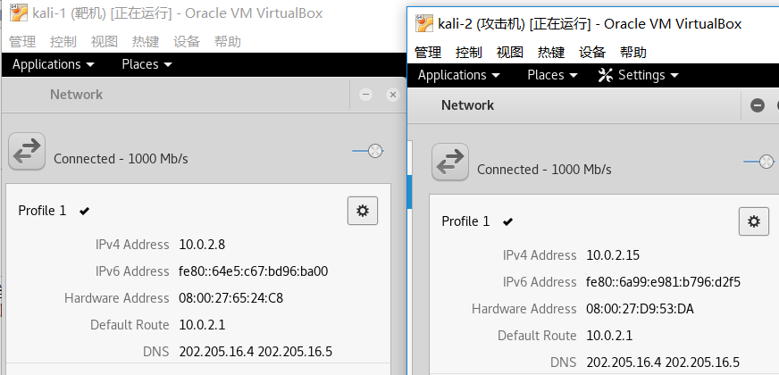

### 测试：baidu.com 解析POST数据 ###

-P POST 解析POST数据

> bettercap --proxy -P POST

靶机访问 baidu.com ,使用百度搜索ssl，网址被重定向为 http://wwww.baidu.com  ，POST数据被中间人解析到

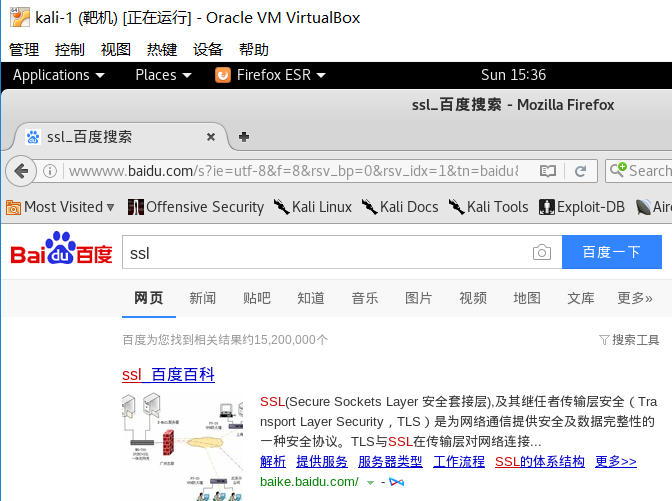

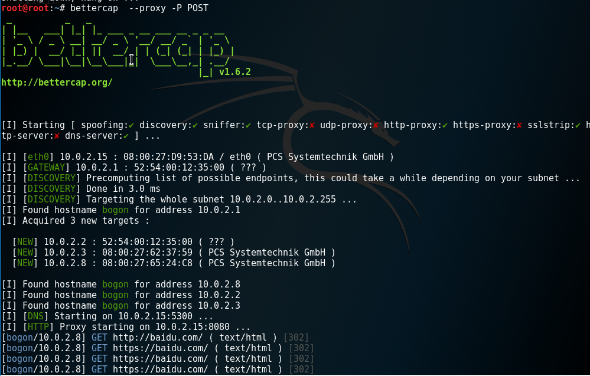

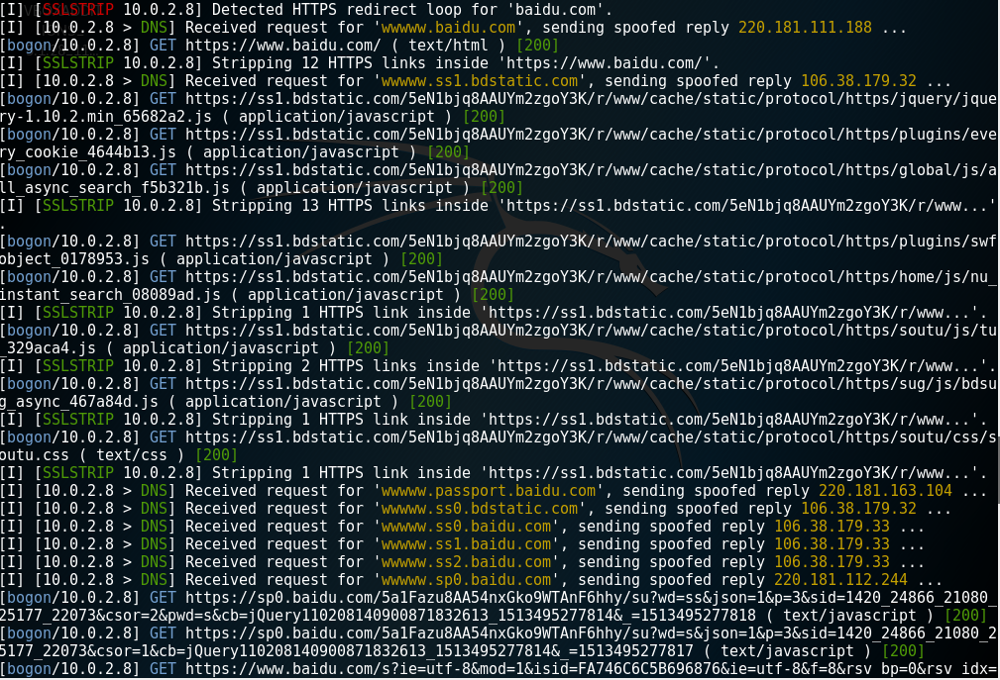

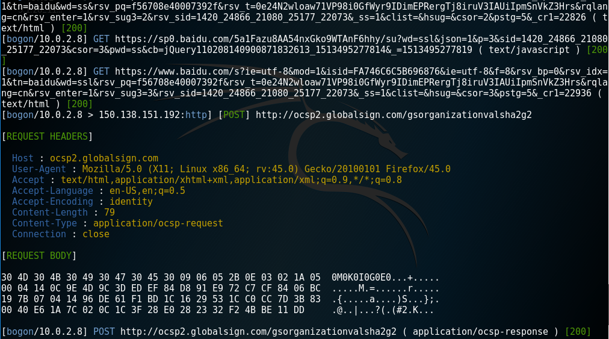

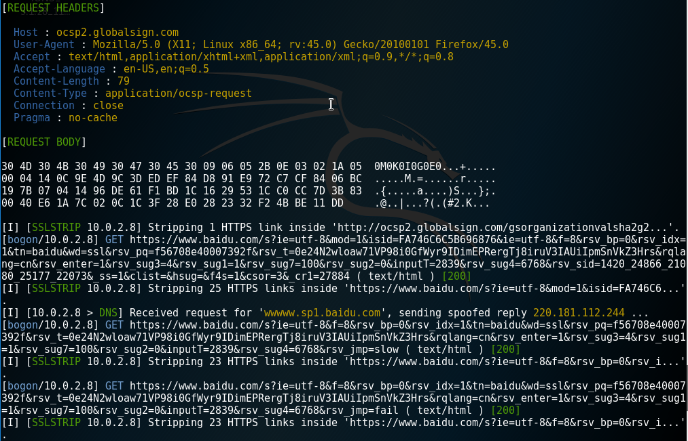

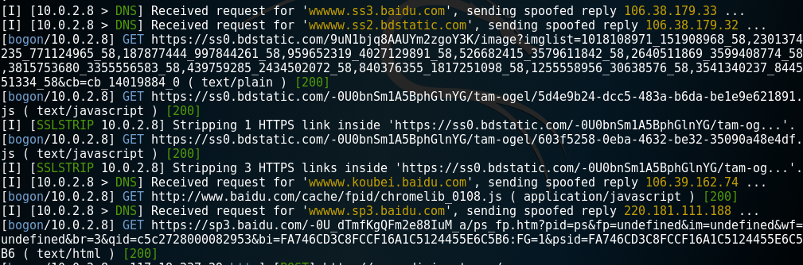

### 测试 github.com  将所有HTTPS流量定向到攻击者主机 ###

SSLStrip功能默认开启，但是在HTTPS代理模式下关闭

> bettercap --proxy-https -T 10.0.2.8

启用HTTPS代理，将所有HTTPS流量定向到攻击者主机。

Github服务器校验证书，无法认证攻击者的身份。

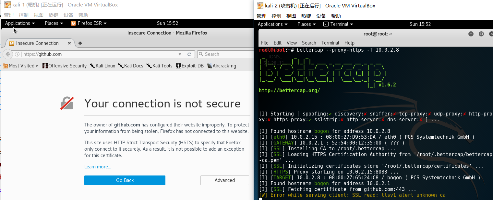

### 实战SSL卸载与HTTPS数据重定向 ###

> bettercap -T 10.0.2.8 --proxy 

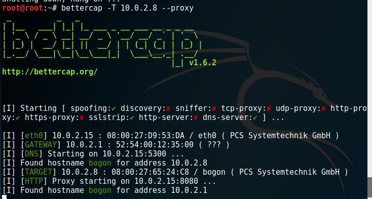

#### 测试qq邮箱 mail.qq.com  ####
QQ邮箱不断被循环重定向

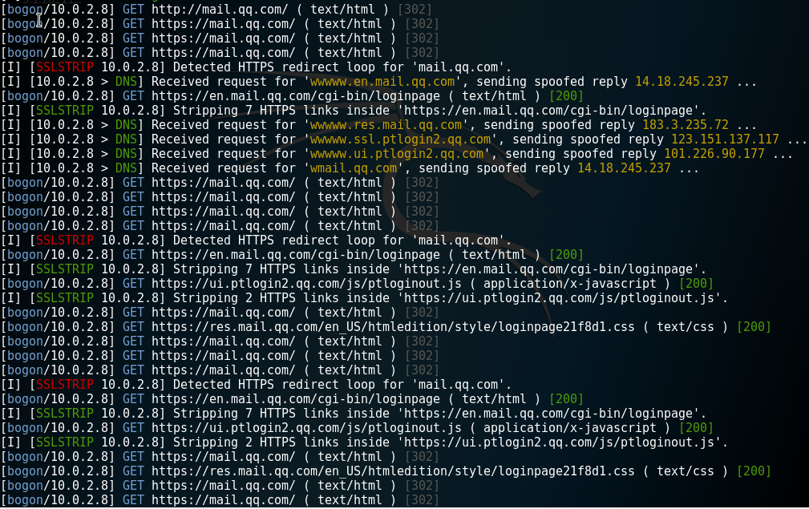

#### 测试网易163邮箱 mail.163.com  ####

网易163邮箱，虽然点击重新尝试普通加密方式登录，但是还是无法登录邮箱。并且，虽然靶机输入用户名和密码，但是站点可能使用JS对用户密码进行了加密，因此中间人无法获得密码。

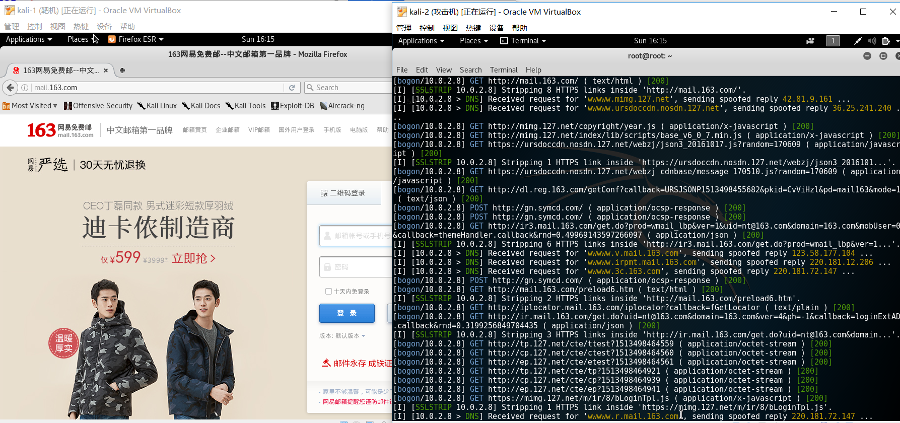

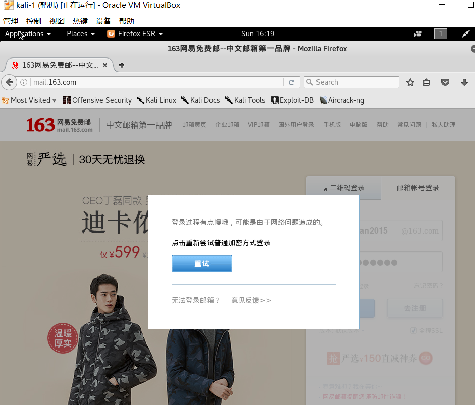

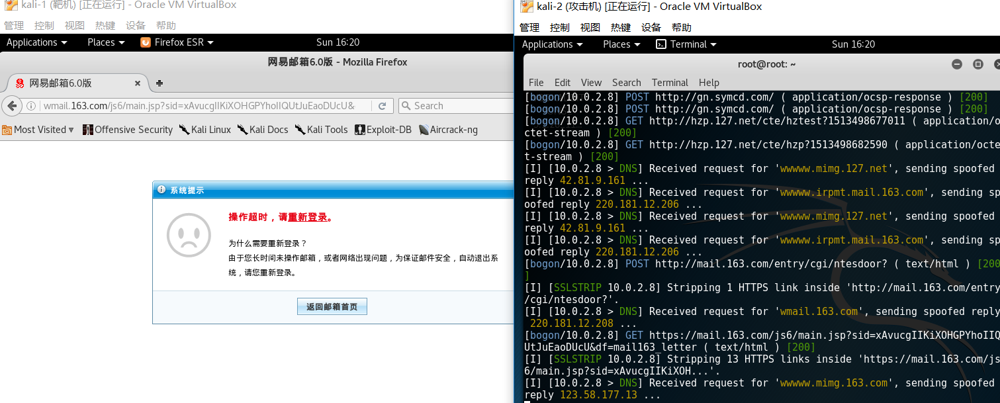

## 参考资料 ##

[官网文档](https://www.bettercap.org/)

[https://github.com/CUCCS/ns/blob/2016-2/2016-2/zzj_cay/TASK.Exploration_and_experiments_on_SSL_MITM_attacks/%E6%8B%93%E5%B1%95%E5%AE%9E%E9%AA%8C2.md](https://github.com/CUCCS/ns/blob/2016-2/2016-2/zzj_cay/TASK.Exploration_and_experiments_on_SSL_MITM_attacks/%E6%8B%93%E5%B1%95%E5%AE%9E%E9%AA%8C2.md)

