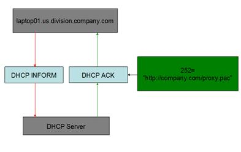
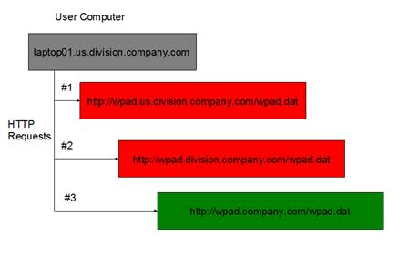

# WPAD 中间人攻击 #
## 原理 ##

WPAD 通过让浏览器自动发现代理服务器，使代理服务器对用户来说是透明的，进而轻松访问互联网。WPAD 可以借助 DNS 服务器或 DHCP 服务器来查询代理自动配置(PAC)文件的位置。

### Proxy Auto-Config（PAC）文件 ###

代理自动配置(PAC)文件定义了浏览器和其他用户代理如何自动选择适当的代理服务器来访问一个 URL。要使用 PAC，我们应当在一个网页服务器上发布一个 PAC 文件，并且通过在浏览器的代理链接设置页面输入这个 PAC 文件的 URL 或者通过使用 WPAD 协议告知用户代理去使用这个文件。

###  DHCP 服务器部署 WPAD 的原理 ###

首先确保 DHCP 服务器有效，然后为每个包含客户的子网建立了作用域。DHCP 服务器中的 252 选项通常被当作查询或注册用的指针，我们可以通过 252 项发现打印机、时间服务器、WPAD 主机以及其他的网络服务器。在 DHCP 服务器中添加一个用于查找 WPAD 主机的 252 项，这个252选项是一个字符串值，内容是部署在 WPAD 主机上 PAC 文件的 URL。因此 DHCP 客户机便可获得 PAC 文件的 URL，当客户机需要对浏览器或防火墙客户端进行自动配置时，就可以下载该 PAC 文件并得到代理服务器的地址。




在上图示意中，用户访问 laptop01.us.division.company.com 时，web 浏览器发送 DHCP INFORM 包于 DHCP 服务器来请求配置文件的位置，DHCP ACK 为 DHCP 服务器返回的数据包，其中 252 选项即为代理自动配置文件的位置。

### DNS 实现 WPAD原理 ###

客户机向 DNS 服务器发起 WPAD＋X 的查询。DNS 返回提供 WPAD 主机 IP 地址，客户机通过该 IP 的 80 端口去 WPAD 主机下载 WPAD.DAT（浏览器配置用文件）和 WSPAD.DAT（防火墙配置用文件）两个文件以实现自动配置。

客户机向 DNS 发起的 WPAD 查询的后缀是根据 WPAD 主机所处的环境决定的，如果客户机是在一个域环境下时，发起的查询便是一个“WPAD.所在域的域名”的标准域名查询，这种情况下配合 DNS 里添加 WPAD 主机的 A 或别名记录便可轻松在域环境中对 WPAD 主机的定位。

但是如果在工作组环境下时，客户机发起的查询可能是一个标准的域名查询(如果计算机名有加域名后缀）也可能只是个没有后缀的 WPAD 查询，这时就要通过创建 DNS 私有根域查询或是通过创建单标签域的方式进行 WPAD 主机查询。

从以上的原理分析，首先 WPAD 主机要在 80 端口提供 wpad.dat 和 wspad.dat，有了这两个文件，客户机上的浏览器或防火墙客户端才能实现自动配置。其次，DNS 服务器要创建相关记录，当客户机来查询时，将解析结果指向 WPAD 主机。

例如：如果DHCP服务器不提供所需的信息，那么使用DNS。用户计算机的网络名称是pc.department.branch.example.com，浏览器会依次尝试以下URL，直到在客户端的域中找到代理配置文件：

- http://wpad.department.branch.example.com/wpad.dat
- http://wpad.branch.example.com/wpad.dat
- http://wpad.example.com/wpad.dat
- http://wpad.com/wpad.dat (in incorrect implementations, see note in Security below)




## 相关代码 ##
```c
/*************************************************************************
*
* wpad.cpp
*
* This demo is for Proxy auto defection(WPAD) feature development & UT.
*
* 来源：https://www.ibm.com/developerworks/cn/linux/1309_quwei_wpad/index.html
* 对源代码稍微修改，可编译执行
*************************************************************************/
#ifndef UNICODE
#define UNICODE
#endif

#ifndef WIN32_LEAN_AND_MEAN
#define WIN32_LEAN_AND_MEAN
#endif

#define _AFXDLL

//#include <winsock2.h>
//#include <Ws2tcpip.h>
#include <stdio.h>
#include<sys/types.h>
#include<afxsock.h>
#include <io.h>
#include <stdlib.h>
#include <string.h>
#include <iostream>
#include <string>
#include <algorithm>
#include <sstream>

/* Useful definitions */
#define DHCP_SERVER_PORT            67
#define DHCP_CLIENT_PORT            68
#define MAGIC_COOKIE                    0x63825363
#define DHCP_INFORM                     8

/* Sizes for DHCP options */
#define MTU_MAX 1500
#define DHCP_CHADDR_LEN 16
#define SERVERNAME_LEN 64
#define BOOTFILE_LEN 128
#define DHCP_UDP_LEN (14 + 20 + 8)
#define DHCP_FIXED_LEN (DHCP_UDP_LEN + 226)
#define DHCP_OPTION_LEN (MTU_MAX - DHCP_FIXED_LEN)
#define IPADDR "127.0.0.1"
#define MAC "aa:bb:cc:dd:ee:ff"


/* DHCP options */
enum DHO {
	DHO_MESSAGETYPE = 53,
	DHO_PARAMETERREQUESTLIST = 55,
	DHO_PACFILELOCATION = 252,
	DHO_END = 255
};

//DHCP 报文结构
typedef struct dhcp_message_ {
	uint8_t op;           /* message type */
	uint8_t hwtype;       /* hardware address type */
	uint8_t hwlen;        /* hardware address length */
	uint8_t hwopcount;    /* should be zero in client message */
	uint32_t xid;            /* transaction id */
	uint16_t secs;           /* elapsed time in sec. from boot */
	uint16_t flags;
	uint32_t ciaddr;         /* (previously allocated) client IP */
	uint32_t yiaddr;         /* 'your' client IP address */
	uint32_t siaddr;         /* should be zero in client's messages */
	uint32_t giaddr;         /* should be zero in client's messages */
	uint8_t chaddr[DHCP_CHADDR_LEN];  /* client's hardware address */
	uint8_t servername[SERVERNAME_LEN];    /* server host name */
	uint8_t bootfile[BOOTFILE_LEN];    /* boot file name */
	uint32_t cookie;
	uint8_t options[DHCP_OPTION_LEN]; /* message options - cookie */
}dhcp_message;


void * xzalloc(size_t s)
{
	void *value = malloc(s);
	if (value != NULL)
	{
		RtlZeroMemory(value, s);
	}

	return value;
}


uint32_t GetIPV4Ciaddr(const std::string& ip_addr)
{
	if (3 != std::count(ip_addr.begin(), ip_addr.end(), '.'))
	{
		std::cout << "invalid IP Format : " << ip_addr;
		return 0;
	}

	std::string::size_type beg = 0;
	std::string::size_type end = 0;
	std::string tmp_str[4];
	uint32_t tmp_int[4];

	for (int i = 0; i < 4; i++)
	{
		end = ip_addr.find(".", beg);
		tmp_str[i] = ip_addr.substr(beg, end - beg);
		tmp_int[i] = atoi(tmp_str[i].c_str());
		if (tmp_int[i] > 255)
		{
			std::cout << "invalid IP Format : " << ip_addr;
			return 0;
		}
		//std::cout<< tmp_int[i] << " ";
		beg = end + 1;
	}

	return (uint8_t)tmp_int[0] | ((uint8_t)tmp_int[1] << 8) | ((uint8_t)tmp_int[2] << 16) | ((uint8_t)tmp_int[3] << 24);
}


uint32_t GetCiaddr(const std::string& ip_addr)
{
	//Just Ipv4 Now
	return GetIPV4Ciaddr(ip_addr);
}


uint32_t GetChaddr(const std::string& mac_addr, uint8_t* chaddr)
{
	if (5 != std::count(mac_addr.begin(), mac_addr.end(), ':'))
	{
		std::cout << "invalid MAC Format : " << mac_addr;
		return 0;
	}

	std::string::size_type beg = 0;
	std::string::size_type end = 0;
	std::string tmp_str[6];
	uint32_t tmp_int[6];

	for (int i = 0; i < 6; i++)
	{
		end = mac_addr.find(":", beg);
		tmp_str[i] = mac_addr.substr(beg, end - beg);

		std::stringstream tmp_stream;
		tmp_stream << "0x" << tmp_str[i];
		tmp_stream >> std::hex >> tmp_int[i];

		if (tmp_int[i] > 255)
		{
			std::cout << "invalid MAC Format : " << mac_addr;
			return 0;
		}
		chaddr[i] = tmp_int[i];
		//std::cout<< std::hex << (int)chaddr[i] << " ";
		beg = end + 1;
	}
}


//  将本机的 IP 地址和 MAC 地址等数据封装成 DHCP INFORM 报文
void make_message(const std::string& ip_addr, const std::string& mac_addr, dhcp_message **message)
{
	dhcp_message* dhcp;
	dhcp = (dhcp_message*)xzalloc(sizeof(*dhcp));
	RtlZeroMemory(dhcp, sizeof(dhcp_message));

	dhcp->op = 1;
	dhcp->hwtype = 1;  //ARPHRD_ETHER
	dhcp->hwlen = 6;    //MAC ADDR LENGTH
	dhcp->xid = 1983;  //random
	dhcp->ciaddr = GetCiaddr(ip_addr);
	GetChaddr(mac_addr, dhcp->chaddr);

	dhcp->cookie = htonl(MAGIC_COOKIE);

	uint8_t *p = dhcp->options;

	//option 53
	*p++ = DHO_MESSAGETYPE;
	*p++ = 1;
	*p++ = DHCP_INFORM;

	//option 55
	*p++ = DHO_PARAMETERREQUESTLIST;
	*p++ = 1;
	*p++ = DHO_PACFILELOCATION;

	*p++ = DHO_END;

	*message = dhcp;
}


//广播的实现首先创建 UDP 的 socket，将发送端口 socket 设置为广播类型，开启发送广播报文
int open_send_socket()
{
	int sockfd;
	struct sockaddr_in addr;

	if ((sockfd = socket(AF_INET, SOCK_DGRAM, 0)) < 0)
	{
		//TBI
	}

	int  bBroadcast = 1;
	setsockopt(sockfd, SOL_SOCKET, SO_BROADCAST, (const char*)bBroadcast, sizeof(bBroadcast));

	return sockfd;
}

//接收端口绑定地址和这组广播的端口号
//（DHCP 统一使用两个 IANA 分配的端口作为 BOOTP ： 
// 服务器端 使用 67/udp， 客户端 使用 68/udp），接受广播信息
int open_recv_socket(char* ipaddr)
{
	int sockfd;
	struct sockaddr_in addr;

	if ((sockfd = socket(AF_INET, SOCK_DGRAM, 0)) < 0)
	{
		std::cout << "setup socket failed" << std::endl;//TBI
	}

	RtlZeroMemory(&addr, sizeof(addr));
	addr.sin_family = AF_INET;
	addr.sin_port = htons(DHCP_CLIENT_PORT);
	addr.sin_addr.s_addr = InetPton(AF_INET, PCWSTR(ipaddr), &addr);//inet_addr(ipaddr);

	const int retry_cnt = 10;
	int retry_num = retry_cnt;
	while (bind(sockfd, (struct sockaddr *)&addr, sizeof(addr)) < 0 && (retry_num > 0))
	{
		std::cout << "bind to " << ipaddr << ":" << DHCP_CLIENT_PORT << " failed!" << std::endl;//TBI
		Sleep(3);
		--retry_num;
	}

	return sockfd;
}

//广播 DHCP INFORM 报文
int send_packet(int udp_fd, const uint8_t *data, size_t len)
{
	struct sockaddr_in sin;

	RtlZeroMemory(&sin, sizeof(sin));
	sin.sin_family = AF_INET;
	sin.sin_addr.s_addr = InetPton(AF_INET, PCWSTR("255.255.255.255"), &sin);
	sin.sin_port = htons(DHCP_SERVER_PORT);

	return sendto(udp_fd, (const char*)(data), len, 0, (struct sockaddr *)&sin, sizeof(sin));
}

//解析 DHCP ACK 包
std::string dhcp_parser(uint8_t* options)
{
	uint8_t* p = options;
	int len;
	std::string url;

	while ((p - options) < DHCP_OPTION_LEN)
	{
		if (252 == *p)
		{
			++p;
			len = *p++;
			for (int i = 0; i < len; ++i, ++p)
			{
				url.push_back(*p);
			}
			std::cout << "find option 252 with length " << url.size() << std::endl;
			break;
		}
		else if (255 == *p)
		{
			break;
		}
		else
		{
			++p;
			len = *p++;
			p += len;
		}
	}

	return url;
}

//将接收端口设置超时选项并接收消息：
int readable_timeo(int sock_fd, int sec)
{
	struct timeval tv_out;
	tv_out.tv_sec = sec;
	tv_out.tv_usec = 0;
	setsockopt(sock_fd, SOL_SOCKET, SO_RCVTIMEO, (char *)&tv_out, sizeof(tv_out));
	return 0;
}


int main(int argc, char **argv)
{
	//dhcp_send 代表 DHCP INFORM 包
	//dhcp_recv 代表 DHCP 服务器返回的 DHCP ACK 包。
	dhcp_message *dhcp_send;
	dhcp_message *dhcp_recv;

	struct in_addr to;
	struct timeval tv;

	int send_socket_fd = open_send_socket();
	int recv_socket_fd = open_recv_socket(IPADDR);

	std::cout << "making DHCP message" << std::endl;
	make_message(IPADDR, MAC, &dhcp_send);
	dhcp_recv = (dhcp_message*)xzalloc(sizeof(*dhcp_recv));

	for (int i = 0; i < 3; ++i)
	{
		std::cout << "sending DHCP message" << std::endl;
		if (-1 == send_packet(send_socket_fd, (uint8_t *)dhcp_send, sizeof(*dhcp_send)))
		{
			std::cout << "sendto() error" << std::endl;
			continue;
		}

		struct sockaddr_in addr;
		RtlZeroMemory(&addr, sizeof(addr));
		int addr_len = sizeof(struct sockaddr_in);

		std::cout << "receiving DHCP message" << std::endl;
		readable_timeo(recv_socket_fd, 6);
		//if (-1 == recvfrom(recv_socket_fd, (uint8_t *)dhcp_recv, sizeof(*dhcp_recv), 0, (struct sockaddr*)&addr, (socklen_t*)&addr_len))
		if (-1 == recvfrom(recv_socket_fd, (char *)dhcp_recv, sizeof(*dhcp_recv), 0, (struct sockaddr*)&addr, (socklen_t*)&addr_len))
		{
			std::cout << "recvfrom() error" << std::endl;
			continue;
		}

		break;
	}

	/*
	for(int i=0;i<100;i++)
	{
	std::cout << std::hex << int(dhcp_recv->options[i]) << " ";
	}
	*/

	std::cout << "dhcp->xid = " << dhcp_recv->xid << std::endl;
	std::cout << "wpad url = " << dhcp_parser(dhcp_recv->options) << std::endl;

	_close(send_socket_fd);
	_close(recv_socket_fd);
	return 0;
}
```

## 安全性 ##
- 网络中的攻击者可以设置一个DHCP服务器来发送恶意PAC脚本的URL
- 如果网络是“company.co.uk”，并且没有提供 http://wpad.company.co.uk/wpad.dat 的文件，浏览器将继续请求 http://wpad.co.uk/wpad.dat 。 浏览器不确定这是否仍在相应的组织内
- http://wpad.org.uk 提供的wpad.dat，会把所有用户的流量重定向到互联网拍卖网站
- 已经实施DNS劫持的ISP可以通过将用户指向非代理服务器的主机来中断WPAD协议的DNS查找。
- 泄露的WPAD查询可能导致与内部网络命名方案的域名冲突。 如果攻击者注册一个域来回答泄漏的WPAD查询并配置一个有效的代理，那么就有可能在互联网上进行**中间人（MitM）攻击**。

通过WPAD文件，攻击者可以将用户的浏览器指向自己的代理，拦截并修改所有的WWW流量。尽管2005年对Windows WPAD处理进行了简单的修复，但它只解决了.com域的问题。在Kiwicon的一次演讲显示，世界其他地区仍然严重受到这个安全漏洞的威胁。Kiwicon在新西兰注册了一个样本域名，用于接收来自全国各地的代理请求。几个wpad.tld域名（包括COM，NET，ORG和US）现在指向客户端回送地址，以帮助防止此漏洞，尽管有些域名仍然是已被注册了的（wpad.co.uk）。

因此，管理员应确保用户可以信任组织中的所有DHCP服务器，并且该组织的所有可能的wpad域都受到控制。此外，如果组织没有配置wpad域，则用户将转到具有域层次结构中下一个wpad站点的任何外部位置，并将其用于配置。这就允许谁在某个特定的国家注册wpad子域名，通过将自己设置为所有流量或感兴趣的站点的代理，对该国的大部分互联网流量进行中间人攻击。

**如果WPAD打开，HTTPS在保护敏感信息方面要比以前认为的要少得多。**

HTTPS URL包含需要认证的tokens和其他敏感信息，例如https://example.com/login?authtoken=ABC1234 会由于DNS请求https.example.com.login.authtoken.ABC1234.leak而泄露，然后https URL在攻击者的服务器上重构。攻击者通过基于PAC的HTTPS URL 泄露方法，可以获取用户在Google搜索的关键词，知道用户浏览过的维基百科的文章。

攻击者还可以使用流氓代理重定向网页到虚假的门户网站，这个虚假的门户网站会强制浏览器加载像Facebook 或 Google页面，然后执行302 HTTP重定向到需要用户登录认证的页面。一旦用户输入用户名密码，攻击者就可以窃取到账号密码，收集账户信息。这种攻击可以暴露各种网站上受害者的账户名称，包括可以通过直接链接访问账户的私人照片。 例如，Facebook上的人们私人照片实际上是托管在网站的内容交付网络（content delivery network）上，其他用户只要知道CDN上的完整URL，就直接访问获得私人照片。


## 参考资料 ##
[Wikipedia：Web Proxy Auto-Discovery Protocol](https://en.wikipedia.org/wiki/Web_Proxy_Auto-Discovery_Protocol "https://en.wikipedia.org/wiki/Web_Proxy_Auto-Discovery_Protocol")

[Disable WPAD now or have your accounts and private data compromised](https://www.pcworld.com/article/3105998/disable-wpad-now-or-have-your-accounts-and-private-data-compromised.html "https://www.pcworld.com/article/3105998/disable-wpad-now-or-have-your-accounts-and-private-data-compromised.html")

[WPAD 的原理及实现](https://www.ibm.com/developerworks/cn/linux/1309_quwei_wpad/index.html "https://www.ibm.com/developerworks/cn/linux/1309_quwei_wpad/index.html")