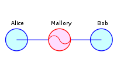

# DNS查询泄漏（经由DNS解析服务器）与MITM #
## DNS查询泄漏的概念 ##
### 什么是DNS泄露 ###
当使用匿名或隐私服务时，计算机的所有流量需要通过匿名网络进行路由。如果流量泄漏，网络连接不安全，任何监控流量的黑客都能够记录用户网络的活动。

DNS（域名解析服务器）用于把域名解析为IP地址，然后使用这个IP地址路由数据包。大多数互联网服务提供商为他们的客户分配一个DNS服务器，它们用于记录用户的互联网活动。

在某些情况下，即使连接到匿名网络，操作系统将继续使用其默认DNS服务器，而不是匿名网络分配给您的计算机的匿名DNS服务器。 DNS泄漏是一个主要的隐私威胁，因为匿名网络可能会在私人数据泄露的同时提供错误的安全感。

----------

### DNS透明代理（Transparent DNS Proxies） ###
一些ISP正在使用一种“透明DNS代理”的技术。使用这种技术，它们将拦截所有DNS查询请求（TCP/UDP端口53），并透明地代理结果。这会导致被迫其DNS服务进行所有DNS查找。

如果你修改了你的DNS设置使用一个诸如Google, Comodo或OpenDNS之类的'开放'DNS服务，你以为你的DNS流量不再被发送到你的互联网接入服务提供商的DNS服务器，你或许会震惊于发现了他们正在使用透明DNS代理。

> 所谓透明代理，就是说虽然你的DNS客户端没有设置使用该代理服务器，但该代理服务器会不以你意志转移的强行代理你的DNS请求。

如果ISP使用的是透明的DNS代理，为了确保连接到VPN时，网络请求没有被拦截，需要参考 https://www.dnsleaktest.com/how-to-fix-a-dns-leak.html 上的方法。

## MITM ##
### 概念 ###

在密码学和计算机安全领域中，**中间人攻击**（英语：**Man-in-the-middle attack**，缩写：**MITM**）是指攻击者与通讯的两端分别建立独立的联系，并交换其所收到的数据，使通讯的两端认为他们正在通过一个私密的连接与对方直接对话，但事实上整个会话都被攻击者完全控制。在中间人攻击中，攻击者可以拦截通讯双方的通话并插入新的内容。在许多情况下这是很简单的（例如，在一个未加密的Wi-Fi 无线接入点的接受范围内的中间人攻击者，可以将自己作为一个中间人插入这个网络）。

一个中间人攻击能成功的前提条件是攻击者能将自己伪装成每一个参与会话的终端，并且不被其他终端识破。中间人攻击是一个（缺乏）相互认证的攻击。大多数的加密协议都专门加入了一些特殊的认证方法以阻止中间人攻击。例如，SSL协议可以验证参与通讯的一方或双方使用的证书是否是由权威的受信任的数字证书认证机构颁发，并且能执行双向身份认证。

### 中间人攻击工具 ###

- dsniff 一个实现SSH和SSL中间人攻击的工具
- Cain and Abel Windows图形界面的工具，它可以执行中间人攻击，嗅探和ARP投毒
- Ettercap 一个基于局域网的中间人攻击工具
- Karma 一个使用802.11 Evil Twin以执行MITM攻击的工具
- AirJack -一个演示802.11 MITM攻击的工具
- SSLStrip一个基于SSL的MITM攻击的工具。
- SSLSniff一个基于SSL的MITM攻击的工具。原本是利用一个在Internet Explorer上缺陷实现的。
- Intercepter-NG -一个有ARP投毒攻击能力的Windows网络密码嗅探器。可以进行包括SSLStrip在内的基于SSL的MITM攻击。
- Mallory 一个透明的TCP和UDP MiTMing代理。扩展到MITM SSL，SSH和许多其他协议。
- wsniff 一个802.11HTTP / HTTPS的基于MITM攻击的工具
- 安装在自动取款机银行卡插槽上的附加读卡器和安装在键盘上的附加密码记录器。

### 分析方式 ###
从被怀疑是中间人攻击的链接中捕捉网络数据包并进行分析可以确定是否存在中间人攻击。在进行网络分析并对可疑的SSL中间人攻击进行取证时，重要的分析证据包括：

- 远程服务器的IP地址
- DNS域名解析服务器
- X.509证书服务器
- 证书是自签名证书吗？
- 证书是由信任的颁发机构颁发的吗？
- 证书是否已被吊销？
- 证书最近被更改过吗？
- 在互联网上的其他的客户端是否也得到了相同的证书？

### 防御方法 ###
#### S / MIME ####
安全/多用途互联网邮件扩展（简称S / MIME）在静止或运输过程中对您的电子邮件进行加密，确保只有预期的收件人才能阅读这些邮件，并且不允许黑客进入并修改邮件。

此外，S / MIME可以让您使用每个人独有的数字证书对您的电子邮件进行数字签名。这将您的虚拟身份与您的电子邮件绑定，并为您的收件人确保他们收到的电子邮件实际上来自您（而不是黑客访问您的邮件服务器）。虽然黑客可以访问公司的邮件服务器，但为了对邮件进行数字签名，他们还需要访问员工私钥，这些私钥通常安全地存储在别处。对数字签名消息进行标准化，并教育收件人只信任贵公司已签名的消息，可以帮助区分合法的电子邮件和被欺骗的电子邮件。

#### 使用CA权威认证证书 ####
不私自将自签发的证书导入到浏览器的信任列表中。电脑定期杀毒，防止恶意程序将自签发的证书导入到浏览器的信任列表中。

#### 使用https ####

确保已禁用SSL2，SSL3和TLS1协议;只有TLS 1.1和1.2应该启用。

#### hsts ####
HSTS防止黑客将https请求转为http请求。还可以防止黑客从您的浏览器cookies中提取信息，有效地防御会话劫持者的网站。

#### 不连接公共wifi ####

## 参考资料 ##

[dnsleaktest](https://www.dnsleaktest.com)

[wiki：Man-in-the-middle_attack](https://en.wikipedia.org/wiki/Man-in-the-middle_attack)

[https://www.globalsign.com/en/blog/what-is-a-man-in-the-middle-attack/](https://www.globalsign.com/en/blog/what-is-a-man-in-the-middle-attack/)