# Port Scanning using Scapy #
## 实现功能 ##
- TCP connect scan
- TCP stealth scan
- TCP XMAS scan
- UDP scan

## 实验环境 ##
- 操作系统：kali linux
- 编程语言：Python 2.7.13
- kali-Gateway扫描kali-1的端口
- kali-Gateway IP:192.168.10.1 (内部网络)
- kali-1 IP:192.168.10.9 (内部网络)

- kali端口
- 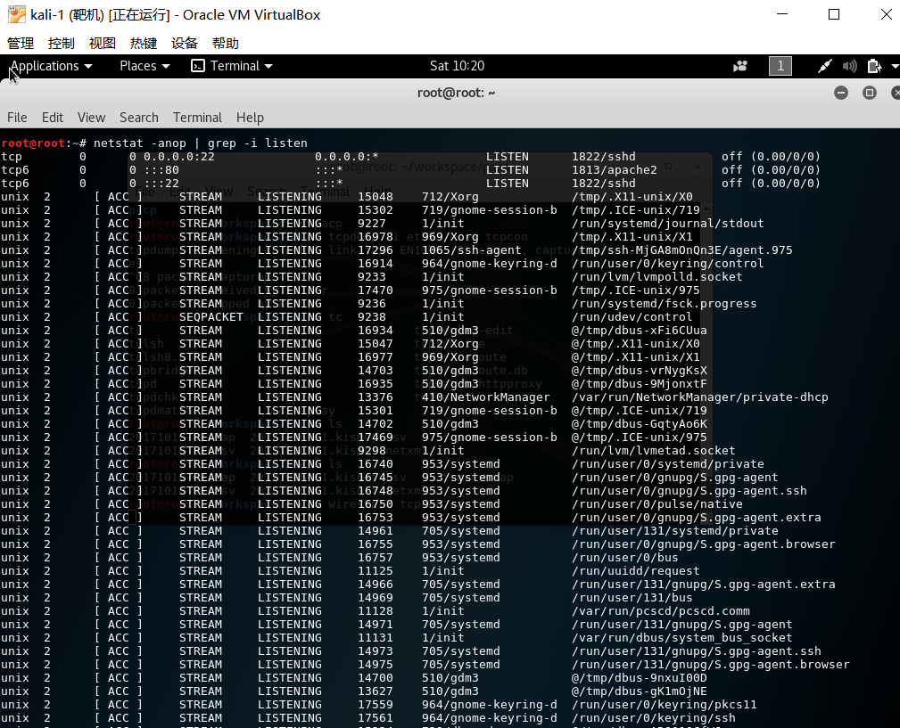
- 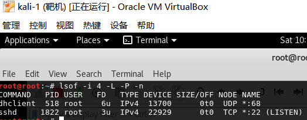
## 相关代码 ##
- TCP connect scan:[tcpconnect.py](tcpconnect.py)
- TCP stealth scan:[tcpstealth.py](tcpstealth.py)
- TCP XMAS scan:[tcpxmas.py](tcpxmas.py)
- UDP scan:[udpscan.py](udpscan.py)

## 实验结果 ##
- TCP connect scan
 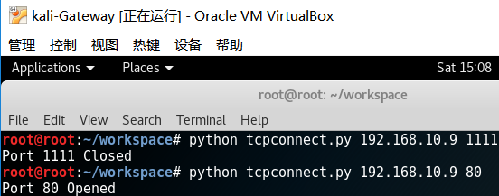
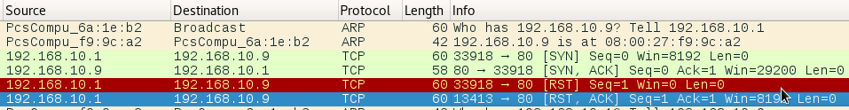

- TCP stealth scan
 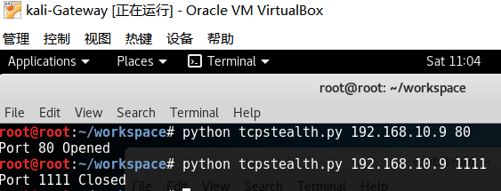
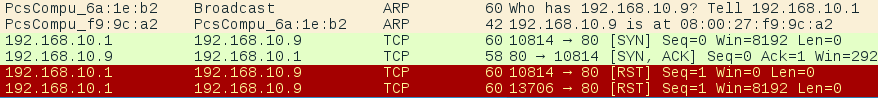
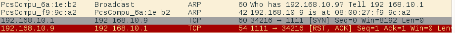
- TCP XMAS scan
 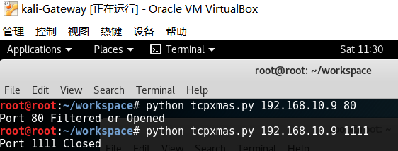
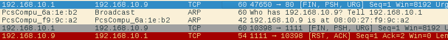
- UDP scan
 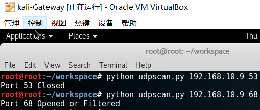
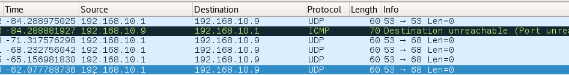

## 参考资料 ##
[http://resources.infosecinstitute.com/port-scanning-using-scapy/](http://resources.infosecinstitute.com/port-scanning-using-scapy/)

