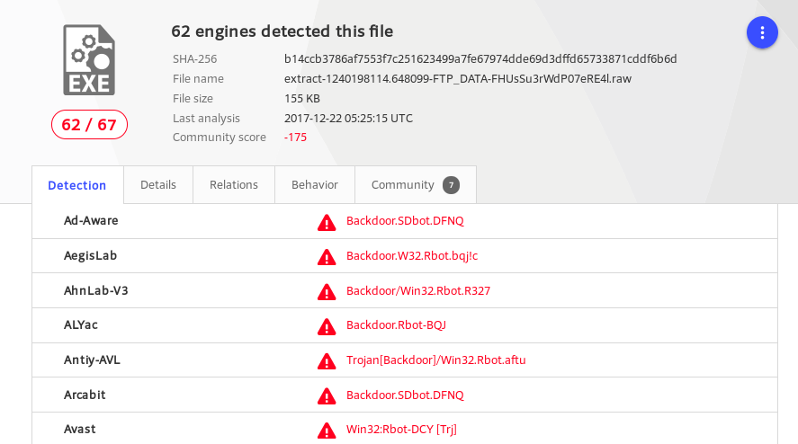

# 使用bro来完成取证分析 #

## 安装bro ##
> apt-get install bro bro-aux

## 实验环境信息 ##

## 编辑bro配置文件 ##

编辑 /etc/bro/site/local.bro ，在文件尾部追加两行新配置代码

> @load frameworks/files/extract-all-files
> 
> @load mytuning.bro

在 /etc/bro/site/ 目录下创建新文件 mytuning.bro ，内容为

## 使用bro自动化分析pcap文件 ##

> bro -r attack-trace.pcap /etc/bro/site/local.bro

如果没有添加 *redef Site::local_nets = { 192.150.11.0/24 };* 到 mytuning.bro ，会出现如下警告：

注意添加和不添加上述一行变量定义除了bro运行过程中是否会产生警告信息的差异，增加这行关于本地网络IP地址范围的定义对于本次实验来说会新增2个日志文件，会报告在当前流量（数据包文件）中发现了本地网络IP和该IP关联的已知服务信息。

在attack-trace.pcap文件的当前目录下会生成一些.log文件和一个extract_files目录，在该目录下我们会发现有一个文件。

将该文件上传到virustotal我们会发现匹配了一个历史扫描报告，该报告表明这是一个已知的后门程序！

至此，基于这个发现就可以进行逆向倒推，寻找入侵线索了。

通过阅读 */usr/share/bro/base/files/extract/main.bro* 的源代码

我们了解到该文件名的最右一个-右侧对应的字符串FHUsSu3rWdP07eRE4l是files.log中的文件唯一标识。

通过查看files.log，发现该文件提取自网络会话标识（bro根据IP五元组计算出的一个会话唯一性散列值）为CPA6y120iKTlgujPf的FTP会话。

该CPA6y120iKTlgujPf会话标识在conn.log中可以找到对应的IP五元组信息。

通过conn.log的会话标识匹配，我们发现该PE文件来自于IPv4地址为：98.114.205.102的主机。

## Bro的一些其他技巧 ##
### SMB协议识别 ###

2.5Beta可以很好的识别出SMB协议流量了

### 使用正确的分隔符进行过滤显示的重要性 ###

### 查看Bro的超长行日志时的横向滚动技巧 ###

### 使用bro-cut（在bro-aux软件包中）更“优雅”的查看日志中关注的数据列 ###

## 参考文献 ##
[Freebuf:基于bro的计算机入侵取证实战分析](http://www.freebuf.com/articles/system/135843.html)

[Frequently Asked Questions from Official Bro WebSite](https://www.bro.org/documentation/faq.html)

[Bro官方推荐的一些辅助工具](https://www.bro.org/community/software.html)