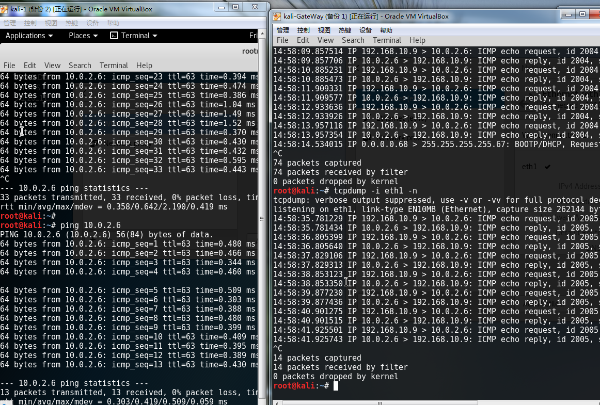
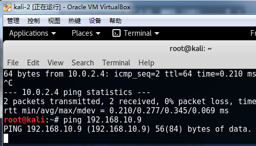
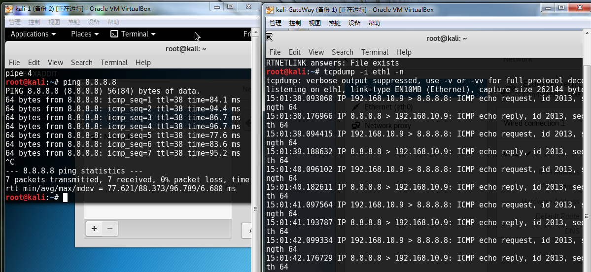
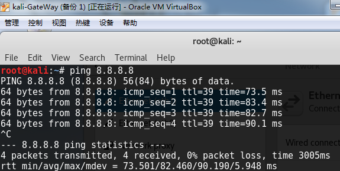
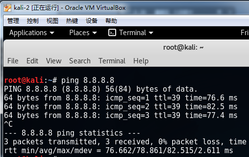
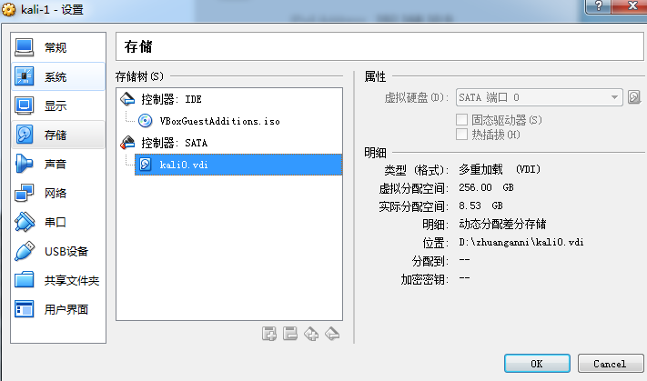
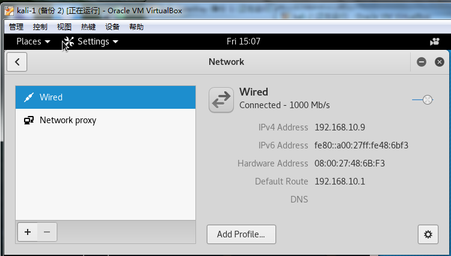
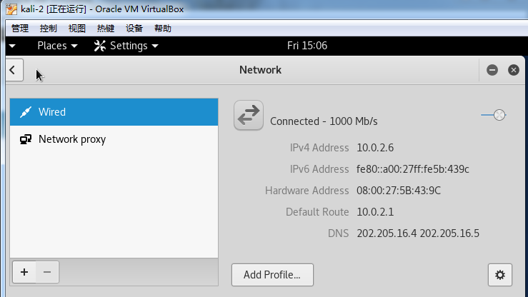

# 基于VirtualBox的网络攻防基础环境搭建实例 #
 

## 要求 ##

* [ ] 节点：靶机、网关、攻击者主机
    * 连通性
        * 靶机可以直接访问攻击者主机
        * 攻击者主机无法直接访问靶机
        * 网关可以直接访问攻击者主机和靶机
        * 靶机的所有对外上下行流量必须经过网关
        * 所有节点均可以访问互联网
    * 其他要求
        * 所有节点制作成基础镜像（多重加载的虚拟硬盘）

## 实验说明 ##
- 靶机：kali-1，内部网络，ip:192.168.10.9
- 攻击机：kali-2，NAT网络,ip:10.0.2.6
- 网关：kali-GateWay，配置NAT网络和内部网络,ip:10.0.2.4,192.168.10.1

## 实现功能 ##
* [ ] 节点：靶机、网关、攻击者主机
    * 连通性
        * 靶机可以直接访问攻击者主机
        * 
        * 攻击者主机无法直接访问靶机
        * 
        * 网关可以直接访问攻击者主机和靶机：网关可以ping通攻击者主机和靶机
        * 靶机的所有对外上下行流量必须经过网关
        * 所有节点均可以访问互联网
        * 
        * 
        * 
    * 其他要求
        * 所有节点制作成基础镜像（多重加载的虚拟硬盘）
        

## 网络配置 ##
### 靶机kali-1 ###
- 内部网络
- 手动设置IP地址
- IPv4地址：192.168.10.9
- 默认网关：192.168.10.1

----------
### 攻击者主机kali-2 ###
- NAT网络
- 通过dhclient获取ip地址

----------
### 网关kali-GateWay ###
- NAT网络，通过"dhclient eth0"获取ip地址
- 内部网络，手动设置IP地址192.168.10.1
- IP转发的相关命令行：
> echo 1 /proc/sys/net/ipv4/ip_forward
> 
> iptables -t nat -A POSTROUTING -s 192.168.10.1/24 -j MASQUERADE

