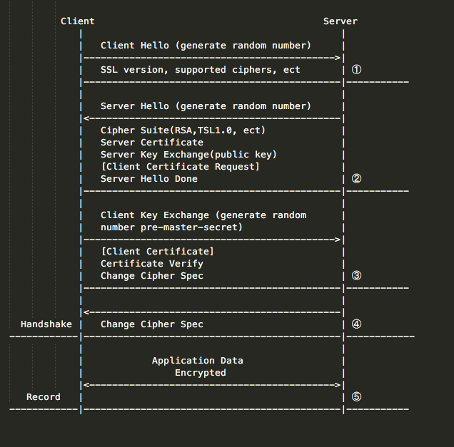
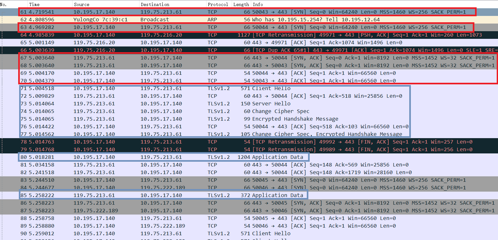
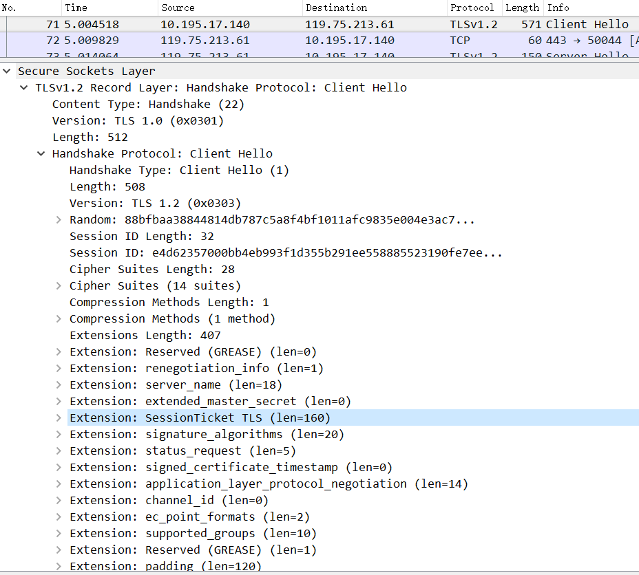
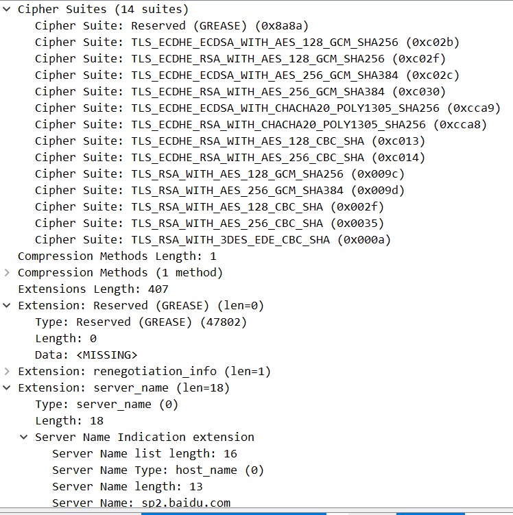
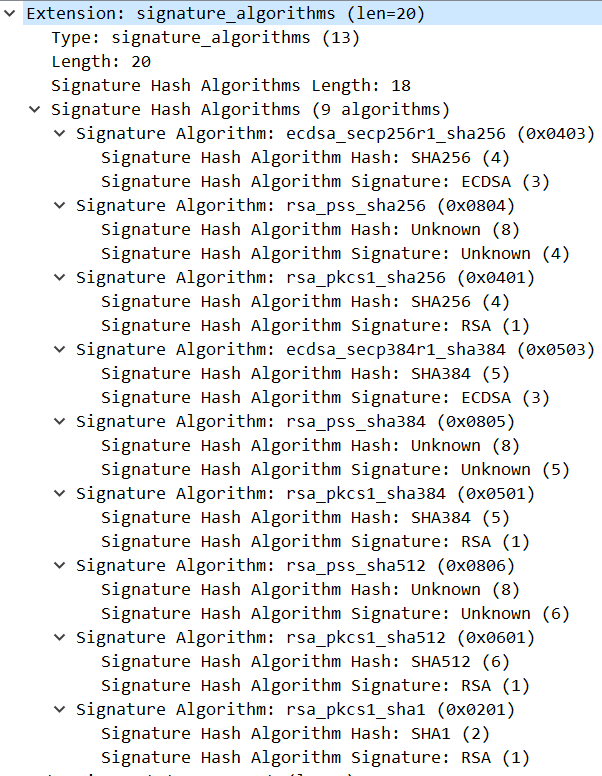
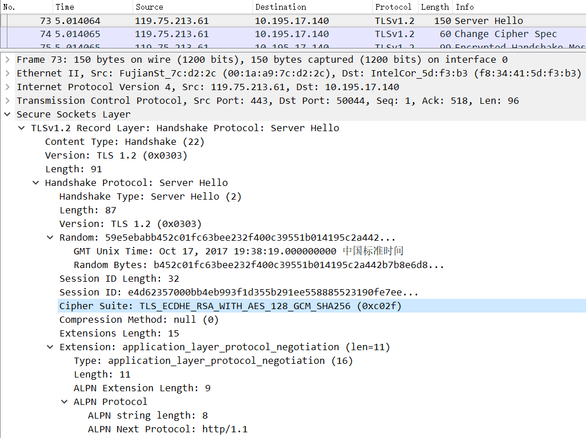
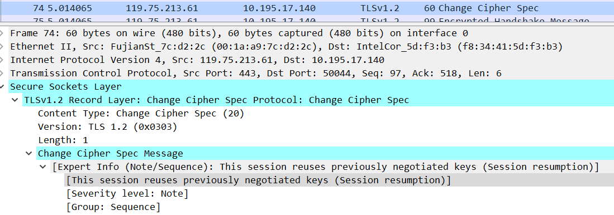
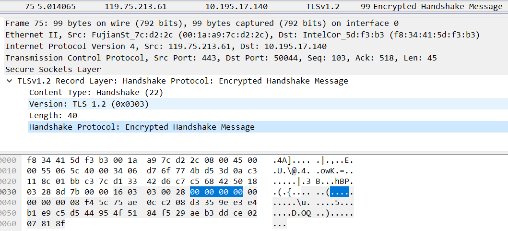
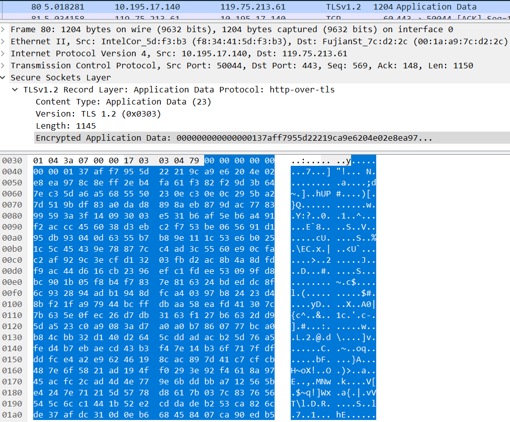

# HTTPS传输过程详解 #

## SSL/TLS运行过程 ##

## 实验抓包 ##
- 访问baidu.com，抓取的数据包，首先客户端和服务器进行TCP的三次握手，接着客户端发送Client Hello与服务器协商，服务器确定加密的算法，然后传送加密的数据。实验数据显示，baidu.com使用的是TLSv1.2。而SSLv2 and SSLv3已经弃用。
- 
- Client Hello数据包，包含cipher Suites和signature Alogrithms等内容，并且会生成随机数Random和Session ID
- 
- 浏览器支持的加密算法及服务器的信息，reserved data是missing状态
- 
- 浏览器支持的签名算法
- 
- Server Hello数据包，包含传输过程使用的加密算法，生成随机数random，Session ID是客户端的Session ID
- 
- 服务器请求change cipher spec message
- 
- Encrypted handshake message
- 
- 被加密传输的数据
- 