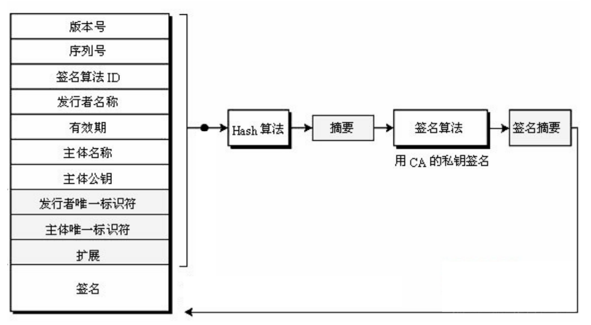
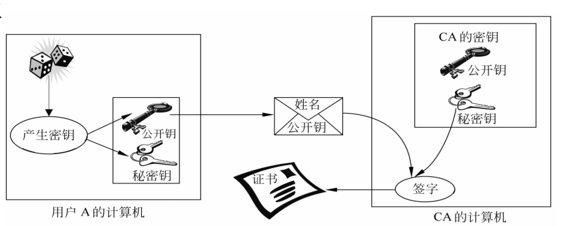

# 伪造证书和合法证书签名的方法 #

## 公钥证书 ##

- 公钥证书按照X. 509标准进行定义，X. 509协议中最核心的内容就是公钥证书，还定义了基于公钥证书的认
证协议。
- 公钥证书中包含了用户的公钥以及一个可信的权威证书颁发机构的数字签名。
- 证书由某个可信的证书发放机构，即认证中心（CA，Certificate Authority）建立，并由CA或用户将其存入目录服务器中，以供其他用户方便地访问。

X.509证书格式 :

 

CA签发的证书具有以下特点：

- 用户可用 CA 的公钥验证证书的有效性；
- 任何拥有 CA 公钥的用户都可以从证书中提取被该CA认证的用户的公钥；
- 除了CA外，任何用户都无法伪造证书或篡改证书的内容；
- 由于证书是不可伪造的，可将证书存放于数据库（即目录服务）中，而无需进行特殊的保护。 

每一证书都有一有效期，然而有些证书还未到截止日期就会被发放该证书的CA吊销，原因可能是： 

- 用户的私钥有可能已被泄露
- 该用户不再由该CA来认证
- CA为该用户签署证书的私钥有可能已泄露。 

为保证安全性和完整性，每一CA还必须维护一个证书吊销列表CRL (Certificate Revocation List)，其中存放所有未到期而被提前吊销的证书，包括该CA发放给用户和其他CA的证书。CRL还必须经该CA签字，然后存放于目录以供他人查询。 

**CA机构**，又称为证书授证（Certificate Authority）中心，作为电子商务交易中受信任的第三方，承担公钥体系中公钥的合法性检验的责任。CA中心为每个使用公开密钥的用户发放一个数字证书，数字证书的作用是证明证书中列出的用户合法拥有证书中列出的公开密钥。CA机构的数字签名使得攻击者不能伪造和篡改证书。它负责产生、分配并管理所有参与网上交易的个体所需的数字证书，因此是安全电子交易的核心环节。由此可见，建设证书授权（CA）中心，是开拓和规范电子商务市场必不可少的一步。为保证用户之间在网上传递信息的安全性、真实性、可靠性、完整性和不可抵赖性，不仅需要对用户的身份真实性进行验证，也需要有一个具有权威性、公正性、唯一性的机构，负责向电子商务的各个主体颁发并管理符合国内、国际安全电子交易协议标准的电子商务安全证书。

WebTrust是由全球两大著名注册会计师协会AICPA（美国注册会计师协会）和CICA（加拿大注册会计师协会）共同制定的安全审计标准，主要对互联网服务商的系统及业务运作逻辑安全性、保密性等共计七项内容进行近乎严苛的审查和鉴证。

只有通过WebTrust国际安全审计认证，根证书才能预置到主流的浏览器而成为一个全球可信的认证机构(CA)。

**CSR**是Cerificate Signing Request的英文缩写，即证书请求文件，也就是证书申请者在申请数字证书时生成私钥的同时也生成证书请求文件，证书申请者只要把CSR文件提交给证书颁发机构后，证书颁发机构CA使用其根证书私钥签名就生成了证书公钥文件，也就是颁发给用户的证书。

## 证书分类 ##

基于数字证书的应用角度分类，数字证书可以分为以下几种：

### 服务器证书 ###

服务器证书被安装于服务器设备上，用来证明服务器的身份和进行通信加密。服务器证书可以用来防止欺诈钓鱼站点。

在服务器上安装服务器证书后，客户端浏览器可以与服务器证书建立SSL连接，在SSL连接上传输的任何数据都会被加密。同时，浏览器会自动验证服务器证书是否有效，验证所访问的站点是否是假冒站点，服务器证书保护的站点多被用来进行密码登录、订单处理、网上银行交易等。全球知名的服务器证书品牌有GlobalSign，Verisign，Thawte，Geotrust等。

SSL证书主要用于服务器(应用)的数据传输链路加密和身份认证，绑定网站域名，不同的产品对于不同价值的数据和要求不同的身份认证。

最新的高端SSL证书产品是扩展验证（EV）SSL证书。在IE7.0、FireFox3.0、Opera 9.5等新一代高安全浏览器下，使用扩展验证VeriSign（EV）SSL证书的网站的浏览器地址栏会自动呈现绿色，从而清晰地告诉用户正在访问的网站是经过严格认证的。

SSL证书还有企业型SSL证书(OVSSL) 及域名型证书（DVSSL）。

### 电子邮件证书 ###

电子邮件证书可以用来证明电子邮件发件人的真实性。它并不证明数字证书上面CN一项所标识的证书所有者姓名的真实性，它只证明邮件地址的真实性。

收到具有有效电子签名的电子邮件，我们除了能相信邮件确实由指定邮箱发出外，还可以确信该邮件从被发出后没有被篡改过。

另外，使用接收的邮件证书，我们还可以向接收方发送加密邮件。该加密邮件可以在非安全网络传输，只有接收方的持有者才可能打开该邮件。

### 个人证书 ###

客户端证书主要被用来进行身份验证和电子签名。

安全的客户端证书被存储于专用的usbkey中。存储于key中的证书不能被导出或复制，且key使用时需要输入key的保护密码。使用该证书需要物理上获得其存储介质usbkey，且需要知道key的保护密码，这也被称为双因子认证。这种认证手段是目前在internet最安全的身份认证手段之一。key的种类有多种，指纹识别、第三键确认，语音报读，以及带显示屏的专用usbkey和普通usbkey等。

数字证书在广义上可分为：个人数字证书、单位数字证书、单位员工数字证书、服务器证书、VPN证书、WAP证书、代码签名证书和表单签名证书。

### 代码签名证书Code Signing SSL  ###
代码签名证书Code Signing SSL为软件开发商提供了一个理想的解决方案，使得软件开发商能对其软件代码进行数字签名。通过对代码的数字签名来标识软件来源以及软件开发者的真实身份，保证代码在签名之后不被恶意篡改。使用户在下载已经签名的代码时，能够有效的验证该代码的可信度。

使用代码签名证书的好处 开发商所发行的代码程序或内容若通过代码签名验证可提升软件的下载、采用率和发行率。 减少代码程序及内容出现错误讯息和安全性警告，建立品牌的信任关系。 防止使用者下载到含有恶意档案的代码程序及内容。 终端使用者透过互联网和行动网络下载、安装代码程序和内容时，由系统跳出开发者的信息，大幅提高安全性。 确保终端用户知道该软件是合法的，且该代码自发行以来没有被篡改过。 代码签名证书可消除 Internet Explorer 以及 Windows 操作系统中弹出的「不明发行商」。

## 伪造证书 ##

### 一、浏览器导入MITM证书 ###
- mitm伪造证书并获取浏览器信任（诱骗用户安装），浏览器和mitm使用假证书通信，mitm再将用户请求转发给服务器通信，完整劫获用户信息。
- 不过这种劫持成本较高，需要用户安装证书，也需要mitm加解密，所以大规模劫持不会这么干。

### 二、SSLStrip ###
用户输入的网址一般会省略"https://"，向服务器发送http的请求。

SSLStrip所能达成的目标是在客户端与服务器建立连接时，在MITM与Server之间形成HTTPS连接，而在Client与MITM之间形成HTTP连接，即将SSL层从原HTTPS连接中“剥离”。这样，既避免了在客户端验证证书时难以避免的弹框问题，又能够劫持HTTP明文数据，并同时保证客户端HTTP数据的传输，达到欺骗服务器与客户端的效果

## 参考资料 ##
- [知乎：https可能被这样劫持吗？](https://www.zhihu.com/question/22795329/answer/22696622 "https://www.zhihu.com/question/22795329/answer/22696622")
- [SSL证书必知必会：数字证书及CA基础知识](http://blog.51cto.com/liuqunying/1664246 "http://blog.51cto.com/liuqunying/1664246")
